> <h1 style="text-align: center;">趋动云实战部署<br/><span style="font-style: italic">ChatGLM3-6B && stable-diffusion</span></h1>
> <div style="text-align: center;">笔记记录人：ZK-Jackie&nbsp;&nbsp;&nbsp;&nbsp;&nbsp;&nbsp;笔记记录时间：2024.3.11</div>

## 目录

- [前言](#前言)
  - [1. ChatGLM 和 ChatGLM3-6B](#1-chatglm-和-chatglm3-6b)
  - [2. stable-diffusion](#2-stable-diffusion)
- [趋动云平台环境准备](#趋动云平台环境准备)
  - [1. 检查算力余额](#1-检查算力余额)
  - [2. 创建项目](#2-创建项目)
  - [3. 进入项目 配置环境](#3-进入项目-配置环境)
- [一、ChatGLM3-6B 模型部署](#一chatglm3-6b-模型部署)
  - [1. 下载官方项目工程](#1-下载官方项目工程)
  - [2. 修改官方工程文件](#2-修改官方工程文件)
  - [3. 添加端口映射](#3-添加端口映射)
  - [4. 项目运行与本地访问](#4-项目运行与本地访问)
- [二、stable-diffusion 部署](#二stable-diffusion-部署)
  - [1. 复制官方模型文件](#1-复制官方模型文件)
  - [2. 添加端口映射](#2-添加端口映射)
  - [3. 项目运行与本地访问](#3-项目运行与本地访问)
  - [4. 总结](#4-总结)
- [参考文章](#参考文章)

## 前言

本次活动是 Datawhale 和趋动云联合举办的一次实践活动，旨在让大家了解 ChatGLM3-6B 模型的部署方法，并且在免费 GPU 上部署自己的
stable-diffusion 模型。

### 1. ChatGLM 和 ChatGLM3-6B

ChatGLM 是清华大学知识工程和数据挖掘小组开发的、一个基于 GLM 模型的对话生成模型。

2023年10月，智谱AI和清华大学 KEG 实验室联合发布了新一代对话预训练模型 ChatGLM3-6B，这也是是 ChatGLM
的第三个版本，继承了前代模型对话流畅、部署门槛低等众多优秀特性，并在此基础上进行了全面的性能提升和创新性功能扩展。具有以下几个特性：

- 更强大的基础模型
- 更完整的功能支持
- 更全面的开源序列

### 2. stable-diffusion

Stable diffusion 是一个基于Latent Diffusion Models（LDMs）实现的的文图生成（text-to-image）模型。
它是AI绘画领域的一个核心模型，能够进行文生图（txt2img）和图生图（img2img）等图像生成任务。

与类似模型Midjourney不同，Stable
Diffusion是一个完全开源的项目（模型、代码、训练数据、论文、生态等全部开源），这使得其能快速构建强大繁荣的上下游生态（AI绘画社区、基于SD的自训练AI绘画模型、丰富的辅助AI绘画工具与插件等），并且吸引了越来越多的AI绘画爱好者加入其中，与AI行业从业者一起推动AIGC领域的发展与普惠。

stable-diffusion 的一个重要特性是它的稳定性。传统的扩散模型可能会在扩散过程中产生不稳定的行为，例如生成的数据可能会有大的波动。而
stable-diffusion 通过一些技术手段，例如使用特定的扩散方程和适当的训练策略，来保证扩散过程的稳定性。此外，stable-diffusion
的另一个优点是生成的数据质量高，且生成过程稳定。


## 趋动云平台环境准备

在本次活动中，我们将使用趋动云平台提供的免费 GPU 进行模型部署。在开始之前，我们需要先准备好趋动云平台的环境。


### 1. 检查算力余额

<div class="image-box" style="text-align: center;">
    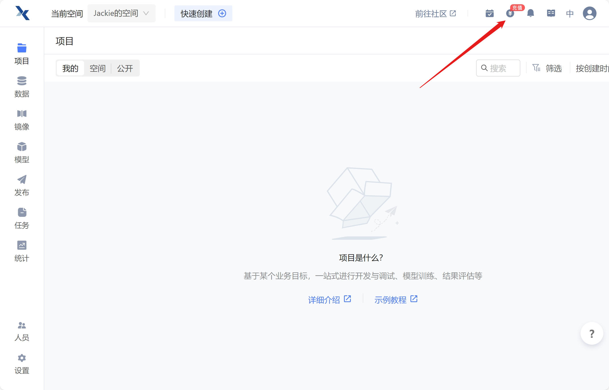
    <br/>
    <div class="caption" style="border-bottom: 1px solid #d9d9d9;
    display: inline-block;
    color: #999;
    padding: 2px;">图 1 趋动云平台</div>
</div>
在趋动云平台的首页右上角点击进入"费用"页面，我们可以看到当前自己的算力余额。在本次活动中，我们将使用免费的算力进行模型部署，因此无需额外购买算力。


<div class="image-box" style="text-align: center;">
    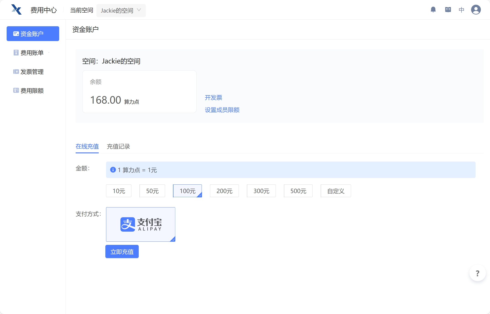
    <br/>
    <div class="caption" style="border-bottom: 1px solid #d9d9d9;
    display: inline-block;
    color: #999;
    padding: 2px;">图 2 检查账户算力余额</div>
</div>
在检查好个人的算力余额后，我们可以开始进行模型部署的准备工作。


### 2. 创建项目

<div class="image-box" style="text-align: center;">
    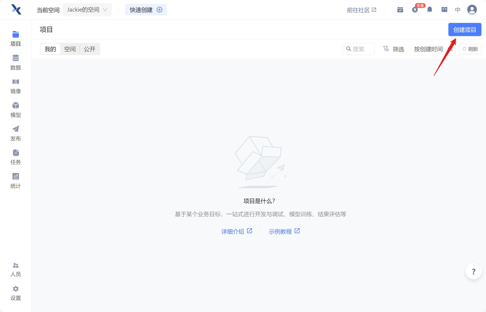
    <br/>
    <div class="caption" style="border-bottom: 1px solid #d9d9d9;
    display: inline-block;
    color: #999;
    padding: 2px;">图 3 创建项目</div>
</div>
返回到工作台，点击右上角的创建项目按钮，可以输入自定义的项目名称和简介。

#### （1）ChatGLM3-6B 模型部署环境选择
部署 ChatGLM 推荐选取的参数为：

- 镜像：CUDA12.2-PyTorch2.1.0-Tensorflow2.15.0（搜索选择）
- 数据：暂不上传
- 模型：ChatGLM3-6B（by`不要葱姜蒜`，`11.63GB`，`公开`模型中搜索选择）
``
<div class="image-box" style="text-align: center;">
    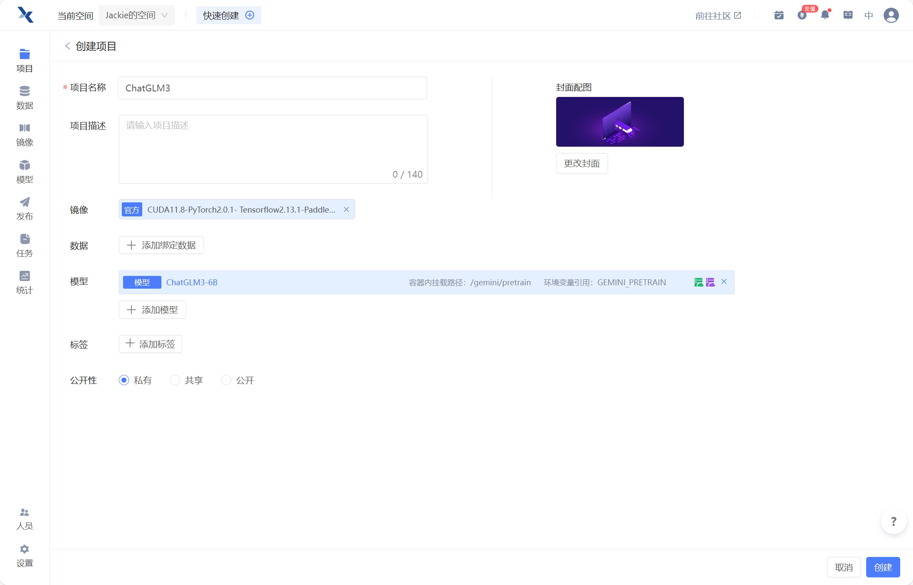
    <br/>
    <div class="caption" style="border-bottom: 1px solid #d9d9d9;
    display: inline-block;
    color: #999;
    padding: 2px;">图 4 ChatGLM3-6B 开发机配置</div>
</div>


随后点击右下角创建按钮，在新一页面中点击右上角的启动按钮后选择资源配置，部署 ChatGLM 推荐选取的参数为：

- B1.large

随后，我个人推荐在选择了页面最下端的最长运行时间为 24 小时后，再点击右下角的启动按钮，即创建项目的虚拟机环境。

<div class="image-box" style="text-align: center;">
    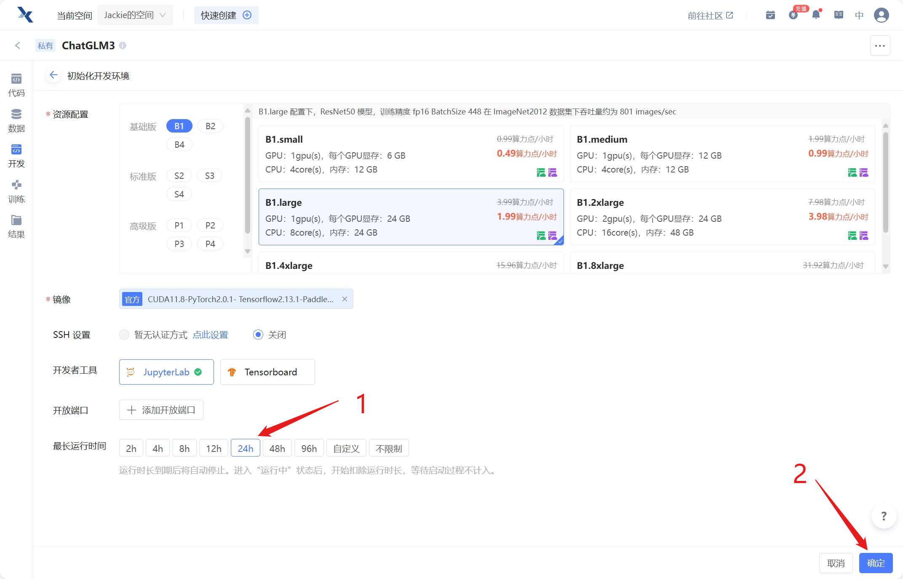
    <br/>
    <div class="caption" style="border-bottom: 1px solid #d9d9d9;
    display: inline-block;
    color: #999;
    padding: 2px;">图 5 创建 ChatGLM3-6B 部署开发机</div>
</div>


#### （2）Stable-diffusion 模型部署环境选择
部署 ChatGLM 推荐选取的参数为：

- 镜像：AUTOMATIC1111/stable-diffusion-webui（by`趋动云小助手`，`10.78GB`，搜索选择）
- 数据：stable-diffusion-models（by`趋动云小助手`，搜索选择）
- 模型：不选

<div class="image-box" style="text-align: center;">
    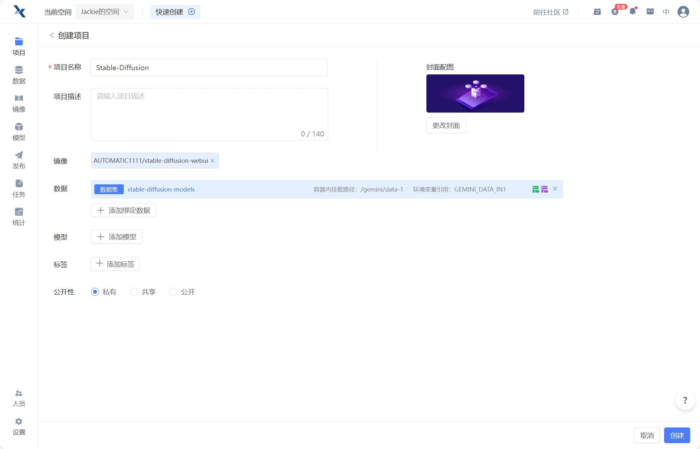
    <br/>
    <div class="caption" style="border-bottom: 1px solid #d9d9d9;
    display: inline-block;
    color: #999;
    padding: 2px;">图 6 Stable-Diffusion 开发机配置</div>
</div>


随后点击右下角创建按钮，在新一页面中点击右上角的启动按钮后选择资源配置，部署 Stable-Diffusion 推荐选取的参数为：

- B1.small

随后同 `（1）ChatGLM3-6B 模型部署环境选择` 中 `图 5` 所示，建议在选择最长运行时间为 24 小时后，再点击右下角的启动按钮，创建项目的虚拟机环境。

<div class="image-box" style="text-align: center;">
    
    <br/>
    <div class="caption" style="border-bottom: 1px solid #d9d9d9;
    display: inline-block;
    color: #999;
    padding: 2px;">图 7 创建 Stable-Diffusion 开发机</div>
</div>


### 3. 进入项目 配置环境

待项目启动完成后，可点击页面右边中部的 "JupyterLab" 进入开发环境。

<div class="image-box" style="text-align: center;">
    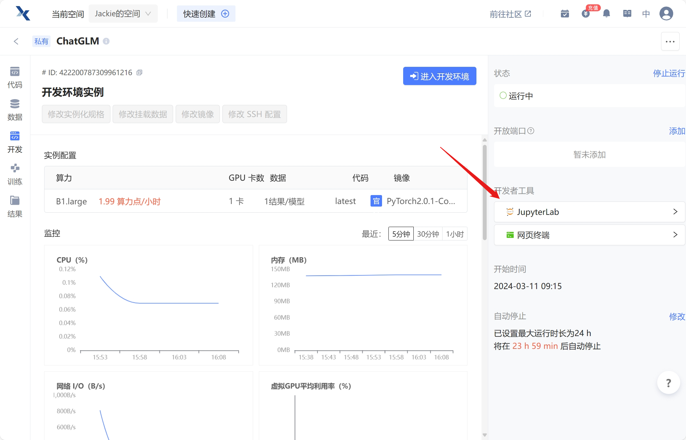
    <br/>
    <div class="caption" style="border-bottom: 1px solid #d9d9d9;
    display: inline-block;
    color: #999;
    padding: 2px;">图 8 进入开发环境</div>
</div>


进入 JupyterLab 后，我们可以看到左侧的文件目录，右侧的文件编辑器，以及下方的终端。在这里，我们可以进行模型部署的相关操作。现在我们选择新建标签页，并进入终端环境。

<div class="image-box" style="text-align: center;">
    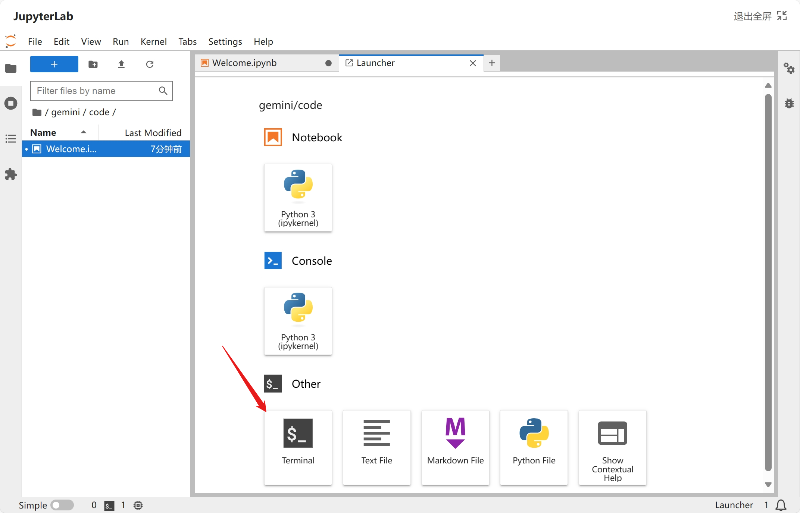
    <br/>
    <div class="caption" style="border-bottom: 1px solid #d9d9d9;
    display: inline-block;
    color: #999;
    padding: 2px;">图 9 进入开发机终端</div>
</div>


#### （1）ChatGLM3-6B 环境配置

在终端中，输入下面的命令升级 apt 、安装 unzip 、升级 pip 并换源

```shell
apt-get update
apt-get install unzip
pip config set global.index-url https://pypi.virtaicloud.com/repository/pypi/simple
python3 -m pip install --upgrade pip
```

#### （2）Stable-diffusion 环境配置

在终端中，输入下面的命令解压数据集、配置文件，做好内网穿透工作


```shell
tar xf /gemini/data-1/stable-diffusion-webui.tar -C /gemini/code/ 

chmod +x /root/miniconda3/lib/python3.10/site-packages/gradio/frpc_linux_amd64_v0.2
```

## 一、ChatGLM3-6B 模型部署

### 1. 下载官方项目工程

在终端中，输入下面的命令下载 ChatGLM3-6B 官方部署工程后进入该目录。

```shell
git clone https://github.com/THUDM/ChatGLM3.git
cd ChatGLM3
```

### 2. 修改官方工程文件

随后运行下面的命令，使用 pip 工具安装该项目所需的依赖包。

```shell
pip install -r requirements.txt
```

一段时间待项目环境下载准备完后，因为本次部署运行主要借助的框架为 streamlit 和 gradio且借助的预训练模型在开发机本地，则修改项目文件夹下 `basic_demo` 文件夹中的 文件和 文件中的有关模型路径和部署相关的内容——

#### 2.1 修改 `web_demo_gradio.py` 文件

```shell
41 - MODEL_PATH = os.environ.get('MODEL_PATH', 'THUDM/chatglm3-6b')
41 + MODEL_PATH = os.environ.get('MODEL_PATH', '/gemini/pretrain')
```

<div class="image-box" style="text-align: center;">
    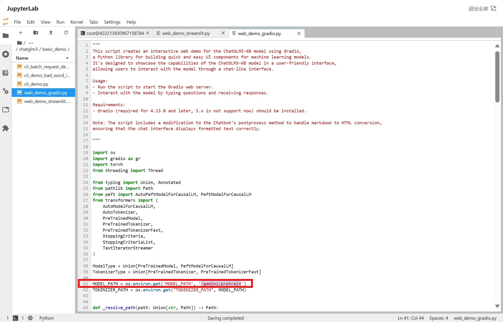
    <br/>
    <div class="caption" style="border-bottom: 1px solid #d9d9d9;
    display: inline-block;
    color: #999;
    padding: 2px;">图 10 修改web_demo_gradio.py模型地址</div>
</div>

---


```shell
177 - demo.launch(server_name="127.0.0.1", server_port=7870, inbrowser=True, share=False)
177 + demo.queue().launch(server_name="0.0.0.0", server_port=7000, share=False)
```

<div class="image-box" style="text-align: center;">
    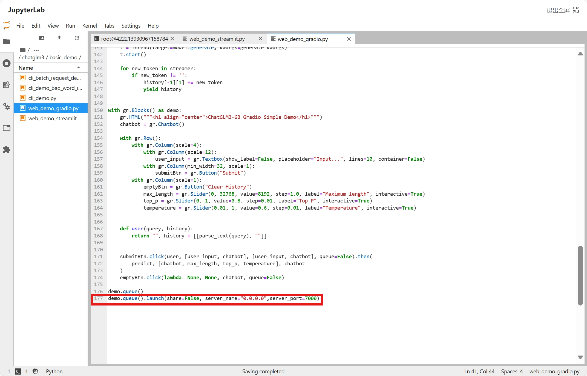
    <br/>
    <div class="caption" style="border-bottom: 1px solid #d9d9d9;
    display: inline-block;
    color: #999;
    padding: 2px;">图 11 修改web_demo_gradio.py启动端口</div>
</div>


#### 2.2 修改 `web_demo_streamlit.py` 文件

```shell
18 - MODEL_PATH = os.environ.get('MODEL_PATH', 'THUDM/chatglm3-6b')
18 + MODEL_PATH = os.environ.get('MODEL_PATH', '/gemini/pretrain')
```

<div class="image-box" style="text-align: center;">
    
    <br/>
    <div class="caption" style="border-bottom: 1px solid #d9d9d9;
    display: inline-block;
    color: #999;
    padding: 2px;">图 12 修改web_demo_streamlit.py模型地址</div>
</div>


### 3. 添加端口映射

在对项目进行一定修改后，还需要为开发机添加外部端口映射，以便于我们在自己的电脑中访问开发机中部署的网页项目。我们可以在趋动云平台的项目页面右端中部 `端口信息` 选项卡中添加端口，可以按照如下配置。

<div class="image-box" style="text-align: center;">
    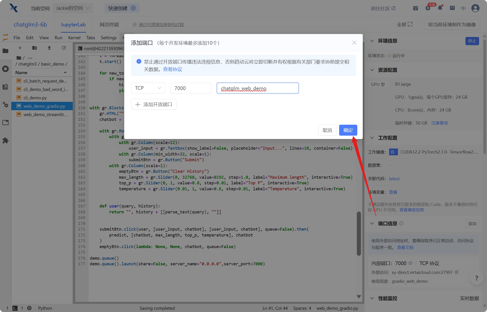
    <br/>
    <div class="caption" style="border-bottom: 1px solid #d9d9d9;
    display: inline-block;
    color: #999;
    padding: 2px;">图 13 添加端口映射</div>
</div>


### 4. 项目运行与本地访问

在完成前面所有的准备工作后，可以依照下面的方法运行项目。

#### 4.1 运行 Gradio 项目

在前面，我们已经修改了 Gradio Web Demo 的运行代码，则可以在控制台中运行下面的命令以启动 Gradio 项目。

```shell
cd basic_demo
python web_demo_gradio.py
```

本地浏览器访问趋动云平台的项目页面右端中部端口信息选项卡中给定的链接，即可进入 ChatGLM3-6B 模型在 Gradio 的部署页面。我们可以在该页面中与ChatGLM3-6B 模型进行对话，则 ChatGLM3-6B 模型在 Gradio 中的部署成功。

<div class="image-box" style="text-align: center;">
    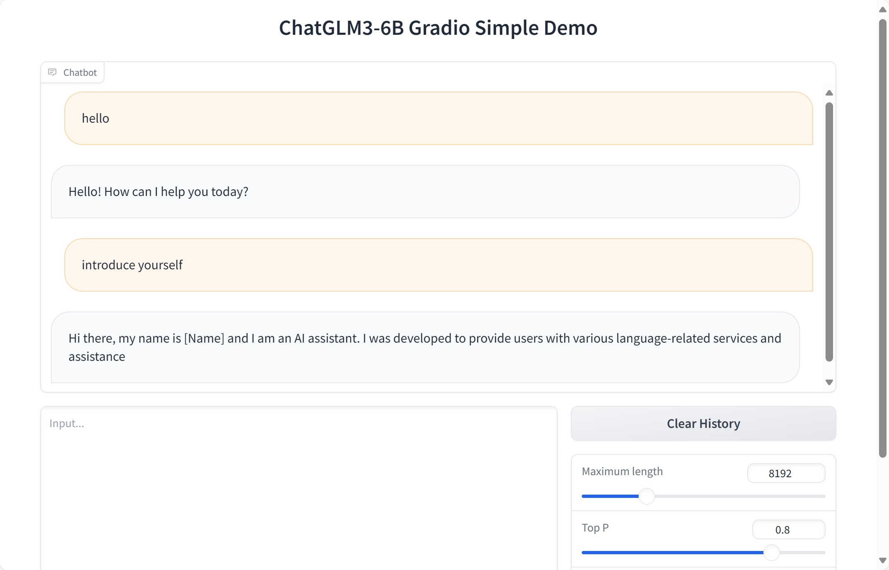
    <br/>
    <div class="caption" style="border-bottom: 1px solid #d9d9d9;
    display: inline-block;
    color: #999;
    padding: 2px;">图 14 Gradio Web Demo项目运行</div>
</div>


#### 4.2 运行 Streamlit 项目

前面我们已经修改了 Streamlit Web Demo 的运行代码，则可以在控制台中运行下面的命令以启动 Streamlit 项目。

```shell
streamlit run web_demo_streamlit.py --server.port 7000
```

刷新 3.1 中打开的网页，或再次访问趋动云平台的项目页面右端中部端口信息选项卡中给定的链接，即可进入 ChatGLM3-6B 模型在
Streamlit 的部署页面。我们可以在该页面中与 ChatGLM3-6B 模型进行对话，则 ChatGLM3-6B 模型在 Streamlit 中的部署成功。

<div class="image-box" style="text-align: center;">
    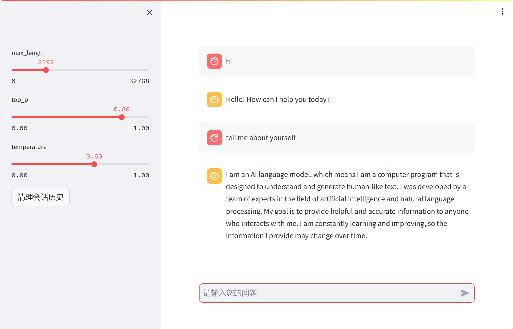
    <br/>
    <div class="caption" style="border-bottom: 1px solid #d9d9d9;
    display: inline-block;
    color: #999;
    padding: 2px;">图 15 Streamlit Web Demo项目运行</div>
</div>


### 4. 总结

通过以上步骤，我们成功部署了 ChatGLM3-6B 模型，并在 Gradio 和 Streamlit 中进行了演示。通过这次机会，我们也可以从这一过程体会到 ChatGLM3-6B模型的强大性能与趋动云平台在大模型部署、开发等方面的便捷性。


## 二、stable-diffusion 部署

### 1. 复制官方模型文件

要使得 stable-diffusion 模型能够在趋动云平台上运行，我们需要先准备好相关模型文件。趋动云平台平台中已经为我们准备好了相关文件；要使得项目能够部署于网页，则还需安装指定版本的 httpx 依赖以助于项目运行。要在终端中执行的相关的模型文件复制和 httpx 更新命令如下：

```shell
cp /gemini/data-1/v1-5-pruned-emaonly.safetensors /gemini/code/stable-diffusion-webui/
pip install httpx==0.24.1
```

### 2. 添加端口映射

与 ChatGLM3-6B 模型部署类似，我们还需要为开发机添加外部端口映射，我们可以在趋动云平台的项目页面右端中部 `端口信息` 选项卡中添加端口，开放 7860 端口，如下图所示：

<div class="image-box" style="text-align: center;">
    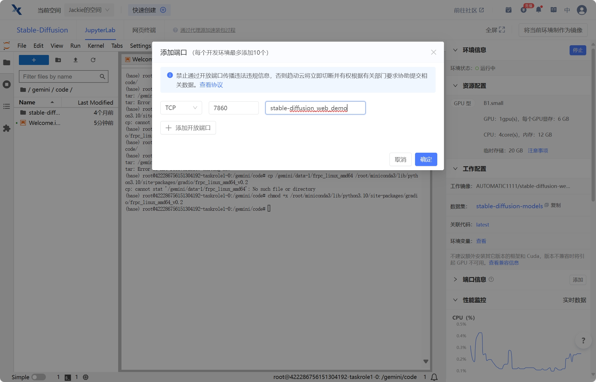
    <br/>
    <div class="caption" style="border-bottom: 1px solid #d9d9d9;
    display: inline-block;
    color: #999;
    padding: 2px;">图 16 添加端口映射</div>
</div>

### 3. 项目运行与本地访问

在完成前面所有的准备工作后，在终端中运行下面的命令以启动 stable-diffusion 项目。

```shell
cd /gemini/code/stable-diffusion-webui && python launch.py --deepdanbooru --share --xformers --listen
```

一段时间后，访问趋动云平台的项目页面右端中部端口信息选项卡中给定的链接，即可进入 stable-diffusion 模型在 Web 的部署页面。我们可以在该页面中进行文生图（txt2img）和图生图（img2img）等图像生成任务，stable-diffusion 模型在 WebUI 中的部署成功。

<div class="image-box" style="text-align: center;">
    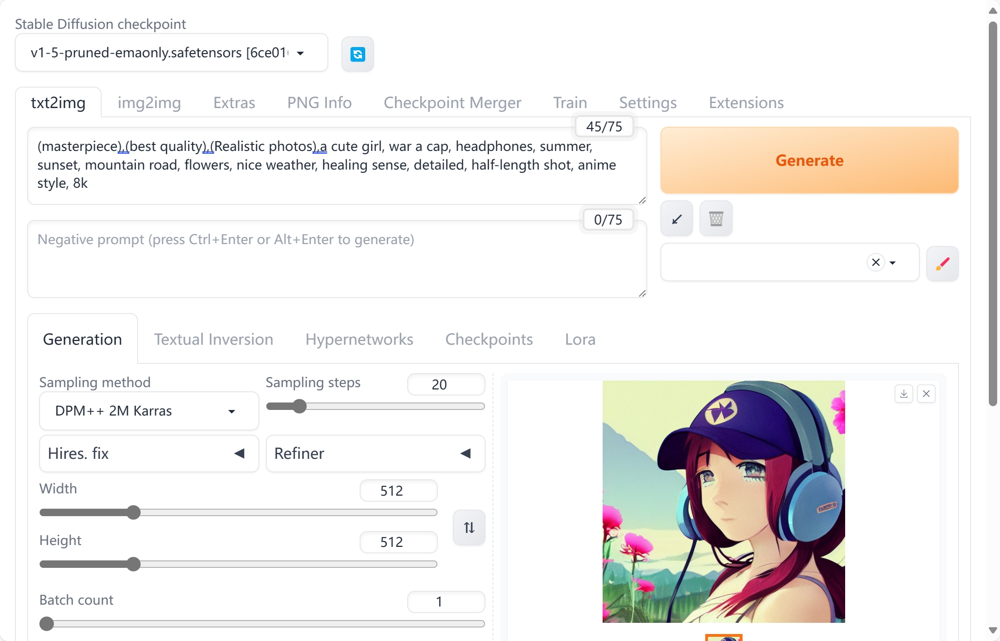
    <br/>
    <div class="caption" style="border-bottom: 1px solid #d9d9d9;
    display: inline-block;
    color: #999;
    padding: 2px;">图 17 stable-diffusion WebUI 项目运行</div>
</div>


### 4. 总结

通过这次机会，我们体验了如何自己构建属于自己的 Stable-Diffusion 模型。我从这一过程中也发现，Stable-Diffusion所需的硬件资源较小，大大地推动了普通消费者体验 Stable-Diffusion的机会。对于相关 Prompt 的编写，也是值得深究的内容，也可以参考下面几篇文章：

[有哪些好的 Stable Diffusion 提示词（Prompt）可以参考？ - 知乎 (zhihu.com)](https://www.zhihu.com/question/598034327/answer/3069903332)

[【Stable Diffusion】Prompt 篇 - 知乎 (zhihu.com)](https://zhuanlan.zhihu.com/p/619247417?utm_id=0)


## 参考文章

- [手把手教大家在本地运行ChatGLM3-6B大模型（一） - 知乎 (zhihu.com)](https://zhuanlan.zhihu.com/p/675322426)
- [ChatGLM3-6B：新一代开源双语对话语言模型，流畅对话与低部署门槛再升级 - 知乎 (zhihu.com)](https://zhuanlan.zhihu.com/p/666927993)
- [深入浅出完整解析Stable Diffusion（SD）核心基础知识 - 知乎 (zhihu.com)](https://zhuanlan.zhihu.com/p/632809634)

- [用免费GPU线上跑chatGLM、SD项目实践 - 飞书云文档 (feishu.cn)](https://datawhaler.feishu.cn/docx/BwjzdQPJRonFh8xeiSOcRUI3n8b)