> # 第一讲 书生·浦语大模型全链路开源体系介绍
> 
主讲人：陈恺
 
笔记记录人：ZK-Jackie
 
笔记记录时间：2024.2.6

## 目录
- **一、当代大模型发展背景**
  - **1.  大模型成为关键热门词**
  - **2. 大模型成为发展通用人工智能的重要途径**
- **二、书生·浦语大模型开源介绍**
  - **1. 书生·浦语大模型开源历程**
  - **2. 模型到实际应用**
  - **3. 书生·浦语大模型全链路开源体系**
    - **数据——书生·万卷 1.0**
    - **预训练——InternLM-Train**
    - **微调—Xtuner**
    - **评测——OpenCompass**
    - **部署——LMDeploy**
    - **应用——Legent、AgentLego**
- **三、总结**

## 一、当代大模型发展背景
### 1.  大模型成为关键热门词

根据综述文献的统计，自2018年以来arXiv发布的论文中，论文标题和摘要中含LL(Large Language)和LLM(Large Language Model)关键词的论文呈指数级上涨，从最初的“无人问津”到如今的上万次关注量；这与ChatGPT的发展与发布有较大关系。

Open AI自2018年起，致力于GPT的发展与研究，从2018年GPT-1至2020年的GPT-3，多年的研究与发展最终令其在全世界人眼中大放异彩。在GPT-4发布的2个月后即月活破亿，热度超过TikTok。

### 2. 大模型成为发展通用人工智能的重要途径
2006年起，有关于人工智能的研究就不断进行着，多年的发展下，通用大模型越来越受到欢迎，从整体上看，人工智能正从原来的的“专用模型”向“通用模型”发展转型。

- 专用模型：特定任务，一个模型，一个问题（如Alpha GO、人脸识别、德州扑克人工智能等）
- 通用模型：一个模型，多种任务，多种模态（如ChatGPT）

典型地，通用大语言模型Chat GPT，在聊天、文字处理、问答、代码编写等方面都有较好的表现，特别是GPT-4.0的发布，也让人们看到了通用大语言模型在图像识别、语音处理方面的潜力，向人们展示了更高阶人工智能的潜在途径、让人们找到了发展未来的可能性。

## 二、书生·浦语大模型开源体系介绍
在大语言模型快速发展的背景下，上海人工智能实验室投入大量研究力量于大语言模型的研发工作中，书生·浦语大模型全链路开源体系由此诞生。

### 1. 书生·浦语大模型开源历程
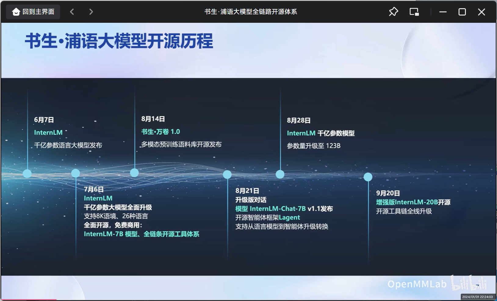

从6月7日InternLM千亿级参数语言大模型的发布，到最近的一次9月20日增强版InternLM-20B开源工具链的全栈升级，短短三个余月，InternLM快速迭代升级，现在，InternLM已形成了覆盖轻量级、中量级和重量级的大模型系列

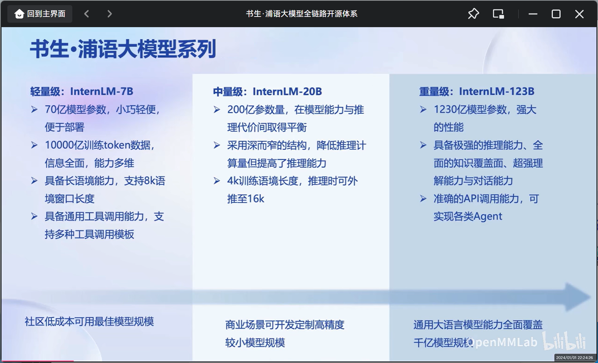

在对书生·浦语20B开源大模型性能进行测试后，书生·浦语20B开源大模型具有以下优势：

- 全面领先相近量级的开源模型
- 仅20B的参数量达到了Llama2-70B的水平

根据OpenCompass的评测评分体系下，书生·浦语20B开源大模型在学科、语言、知识、理解和推理能力方面都“遥遥领先于同行”。

### 2. 模型到实际应用

在模型到实际运用于业务过程中仍有许多步骤需走：

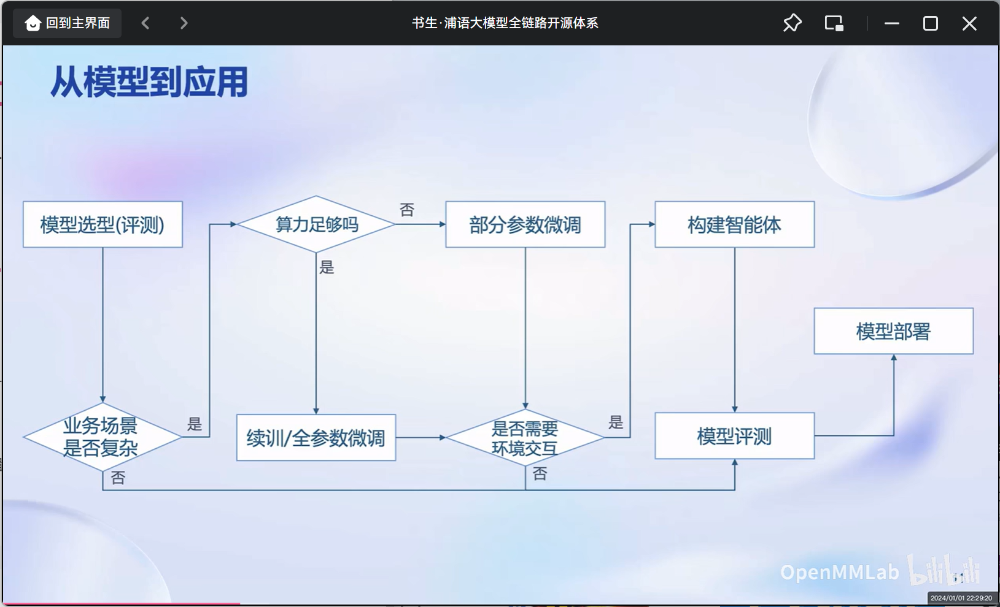

### 3. 书生·浦语大模型全链路开源体系

针对大语言模型从模型选型到应用构建流程的方方面面，书生·浦语大模型全链路开源体系都提供了开源、优秀的解决方案：

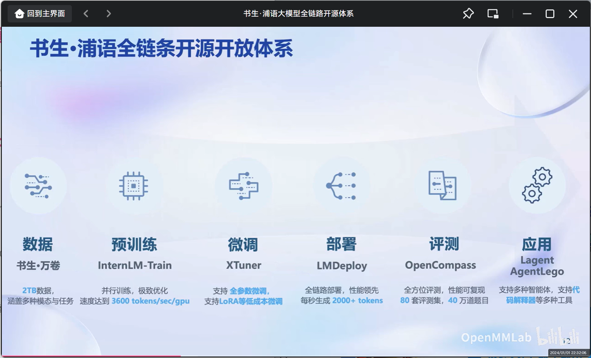

这也是本次实战营的学习内容，即——

- 数据：书生·万卷
- 预训练：InternLM-Train
- 微调：Xtuner
- 部署：LMDeploy
- 评测：OpenCompass
- 应用：Legent、AgentLego

下面将展开叙述每一项开源技术的特点

#### 1. 数据——书生·万卷 1.0

特点——

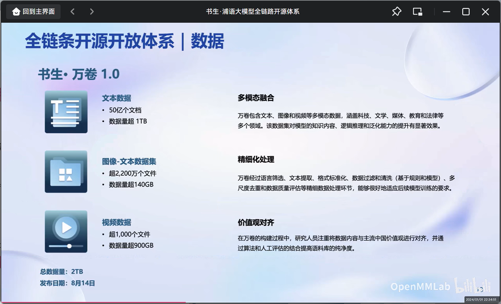
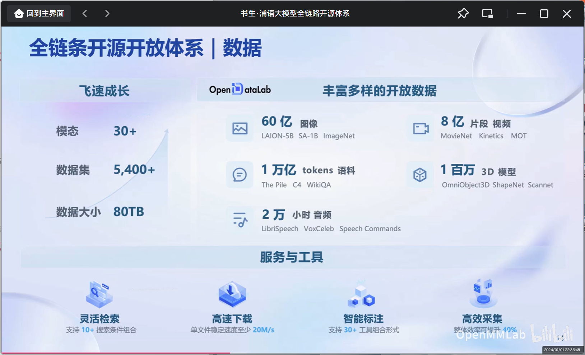

#### 2. 预训练——InternLM-Train

特点——

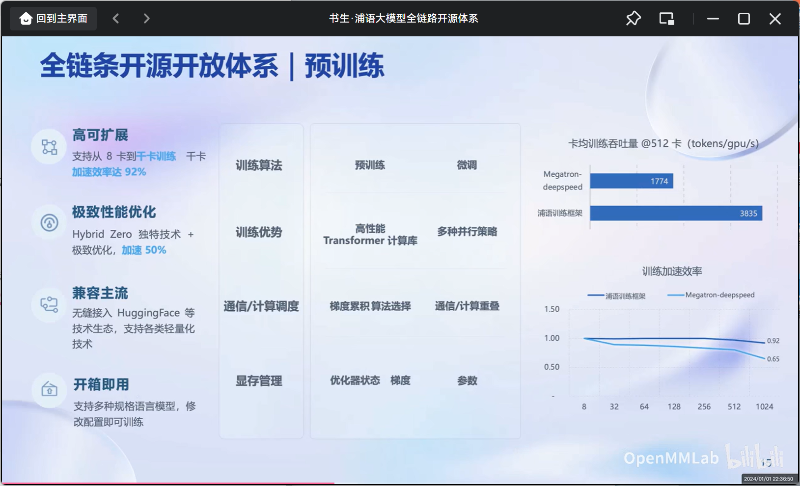

#### 3. 微调—Xtuner
在大模型的下游应用中，增量续训和监督微调是常用的两种方式

- 增量续训
  - 使用场景：让基座模型学习到一些新知识，如某个垂类领域知识
  - 训练数据：文章、书籍、代码等
- 监督微调
  - 使用场景：让模型学会理解和遵循各种指令，或者注入少量领域知识
  - 训练数据：高质量的对话、问答数据

而位于全链条开源开放体系下的微调框架Xtuner则采用了如下技术特点：

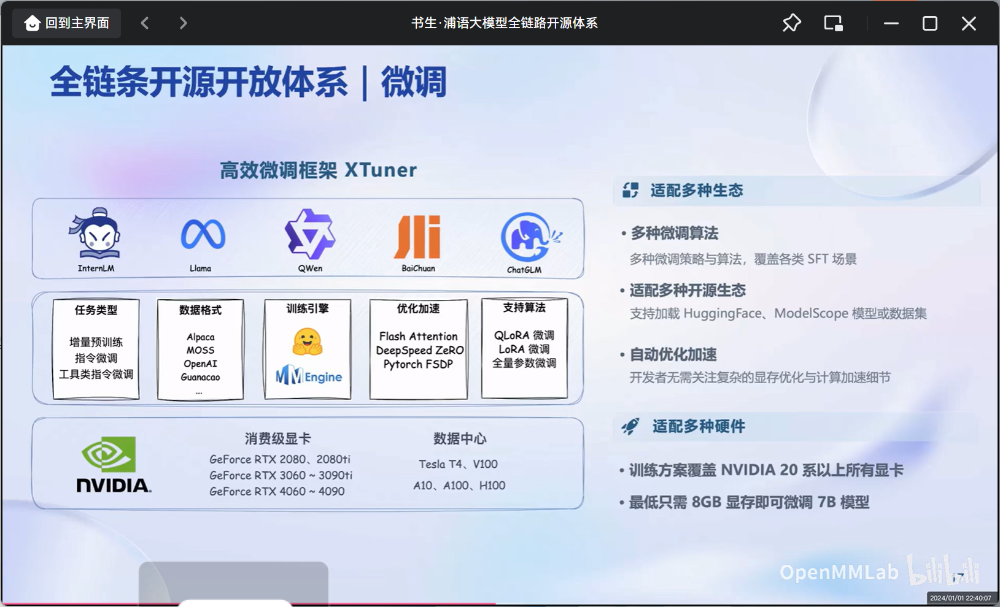

#### 4. 评测——OpenCompass

面对大语言模型和人工智能的快速发展，国内外多家机构都推出了自己的评测体系，各个评测机构在评测类型与量级上都有所差别。

在本全链条开源开放体系中，也提供了开源的评测体系OpenCompass。OpenCompass在不断的发展过程中，用户遍及国内外知名企业与科研机构，也获得了来自复旦大学、微软、Open AI等组织的模型支持，有以下特点——

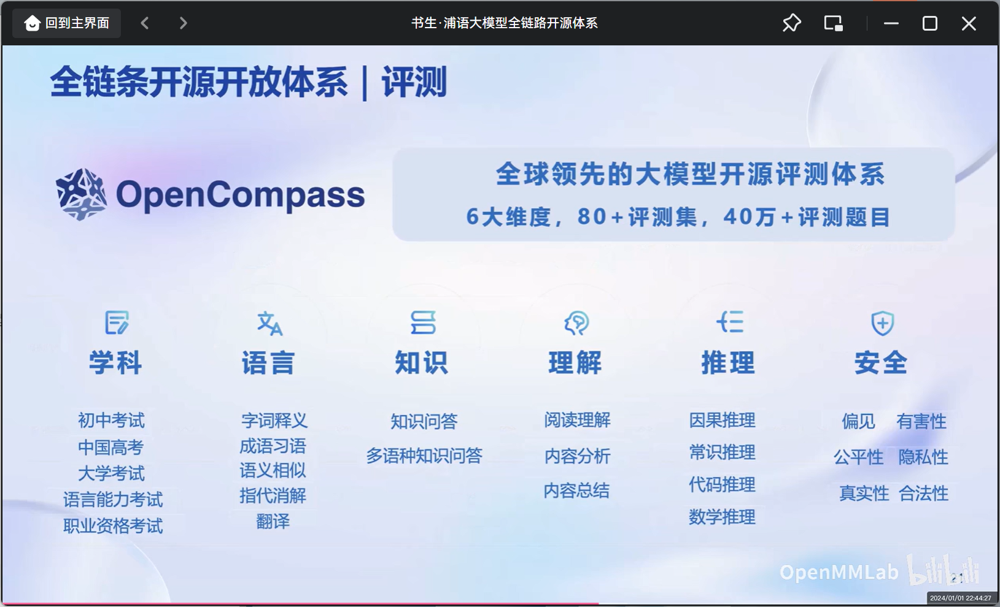
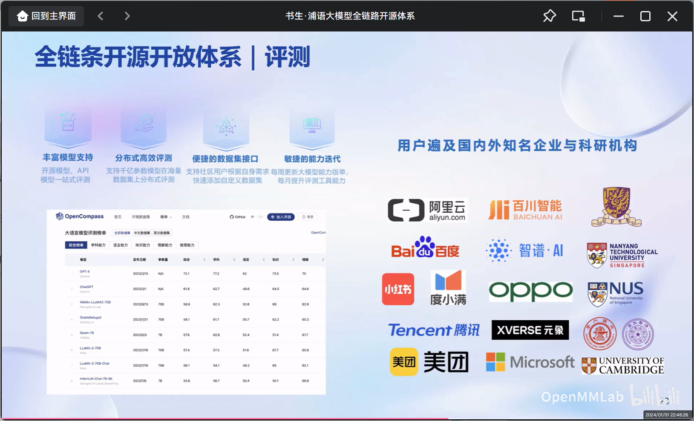

OpenCompass的架构也分为了四个层次，分别是工具层、方法层、能力层和模型层，足以全面、客观的评测一个模型，如下图所示：

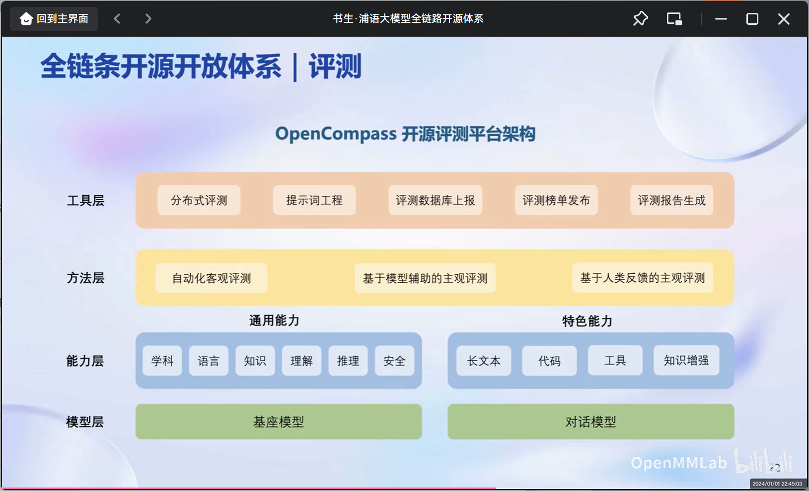

#### 5. 部署——LMDeploy

大模型具有内存开销巨大、动态Shape而模型结构相对简单的特点，它的体量往往难以由低存储设备部署承担，且相关推理、服务相应问题也十分具有挑战性而难以解决。部署大模型则需要一套具有模型并行、低比特量化、Attention优化、计算和访存优化、Continuous Batching的方案。

LMDeploy便是为了解决这些问题，为用户提供完整地部署而生，它具有以下特点：

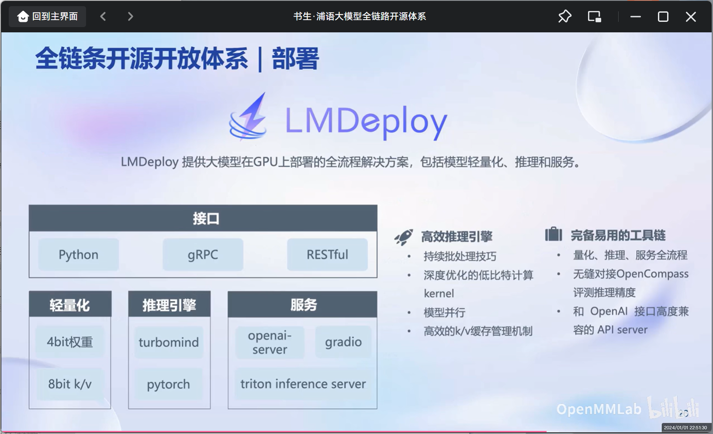

在性能方面优化，LMDeploy的静态推理性能和动态推理性能也优于同行

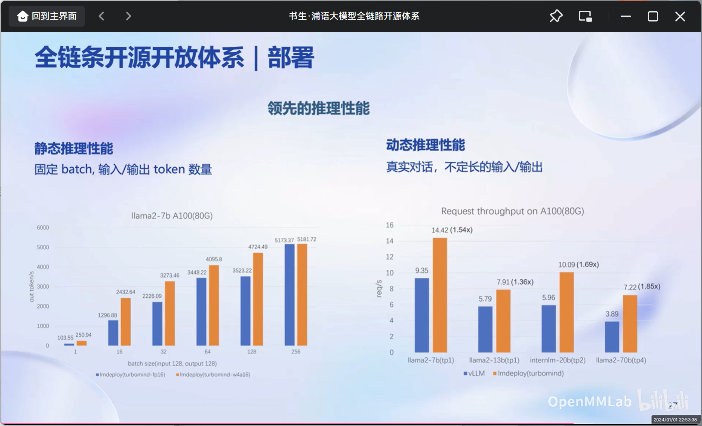

#### 6. 应用——Legent、AgentLego

大语言模型在应用层面的一次服务过程中，需要依赖于最新信息和知识的获取、保证回复的可靠性、实时执行数学计算和使用工具并完成交互，而Legent、AgentLego便能很好的为之赋能：

Legent的架构和特点如下

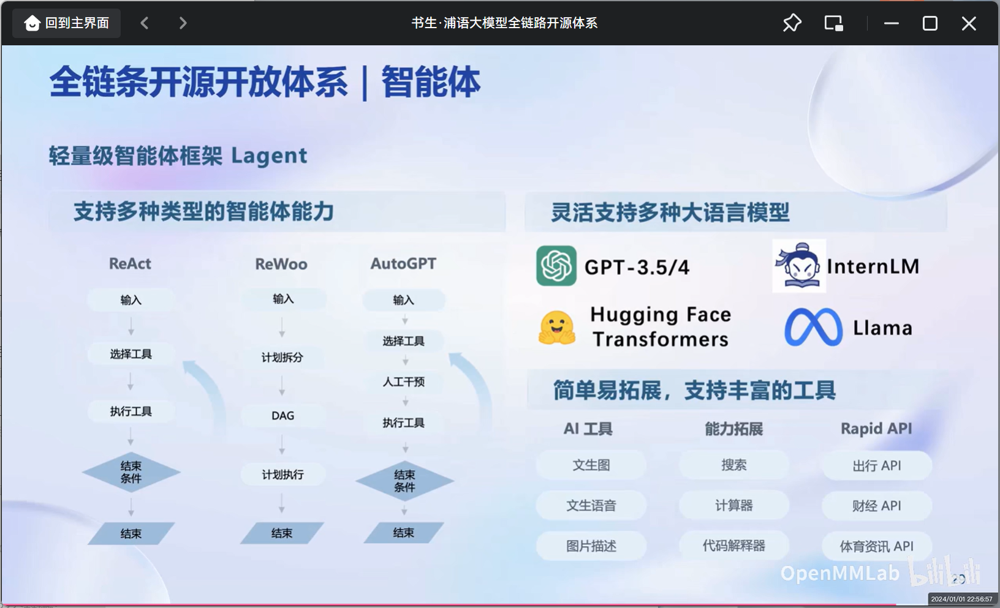

在性能方面优化，LMDeploy的静态推理性能和动态推理性能也优于同行

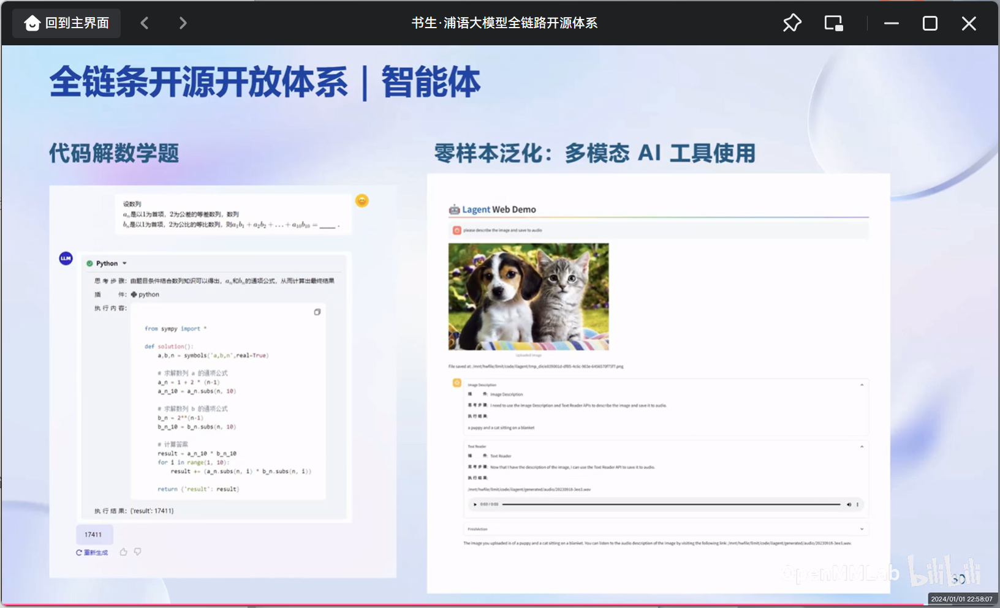

## 三、总结

书生·浦语全链条开源开放体系为大语言模型在中国的发展提供了有利工具，本次课程也为后续的学习明确了流程，相信InternLM能在接下来的发展过程中不断增强，为我国的大模型领域持续增添智慧与力量。

