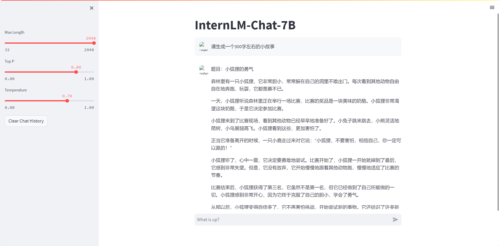
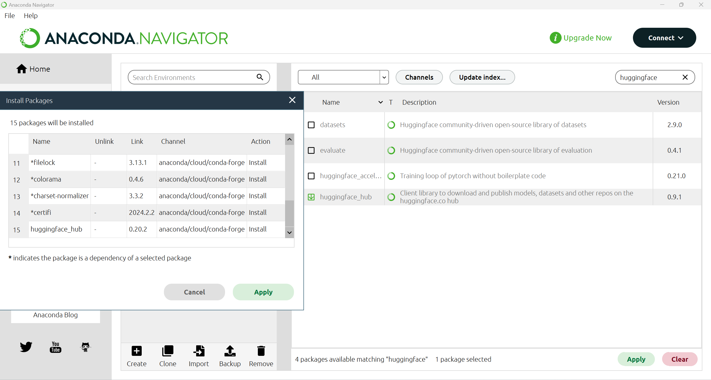
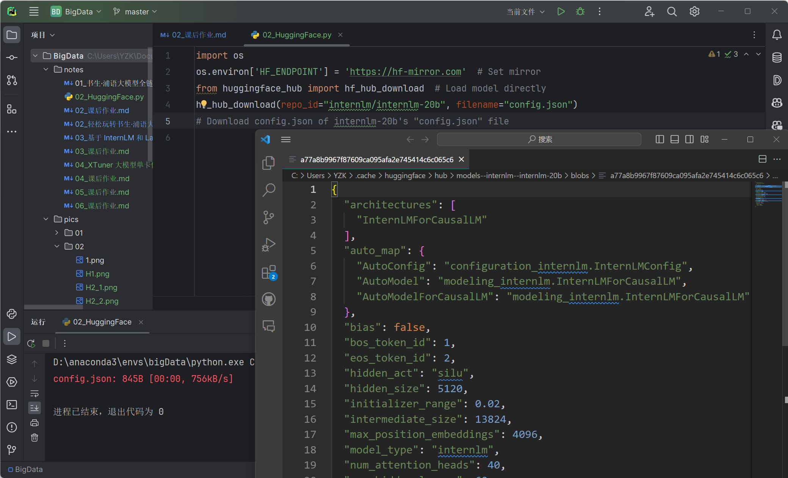
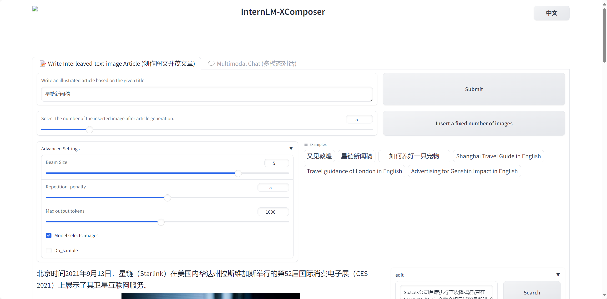
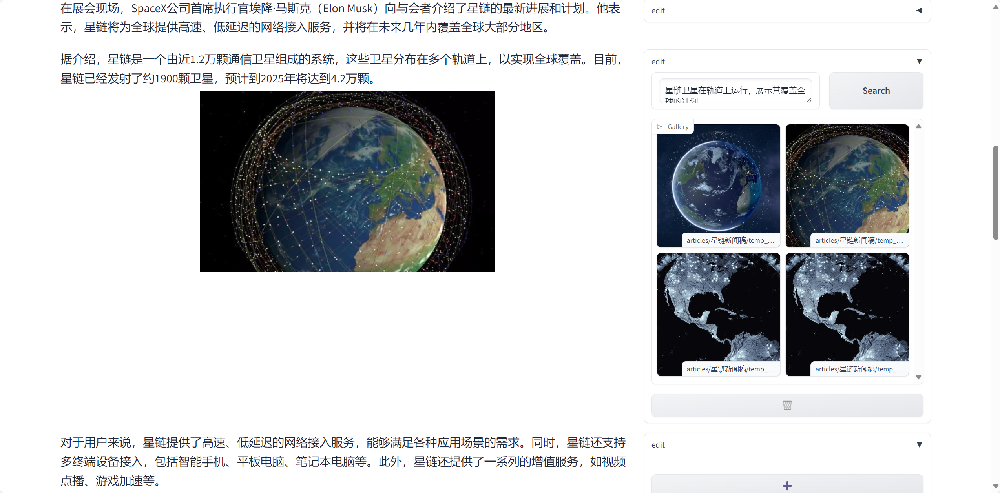
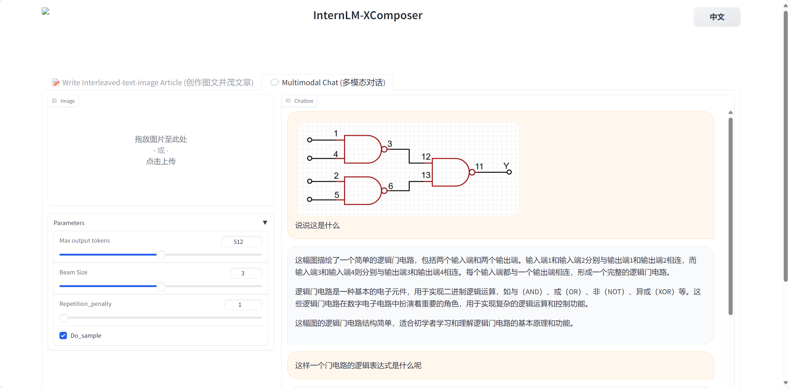

> # 第二讲 轻松玩转书生·浦语大模型趣味Demo 课后作业
> <p> 主讲人：宋志学 </p> <p>作业记录人：ZK-Jackie</p> <p> 作业作答时间：2024.2.8 </p>

## 作业简介
作业与课堂实操内容紧密结合，完成本次作业不仅可以加深对课堂内容的理解，还可以提升实际操作能力，为实战营大作业做好准备，更好地掌握书生·浦语大模型的使用，了解大模型的训练、调用、部署等全流程相关知识。

本次作业主要是练习书生·浦语大模型的使用，包括模型调用、下载、部署等操作，以及对模型的理解和创作。

## 基础作业部分
### 1. 使用 InternLM-Chat-7B 模型生成 300 字的小故事（需截图）
在准备好模型环境后，在开发机中借助Streamlit工具，调用 InternLM-Chat-7B 模型并令其生成一篇300字的小故事，如下图示：



如图所示， InternLM-Chat-7B 模型生成了一篇题目为《小狐狸的勇气》的 300 字小故事。


### 2. 熟悉 hugging face 下载功能，使用 `huggingface_hub` python 包，下载 `InternLM-20B` 的 config.json 文件到本地（需截图下载过程）。
首先，需要在本地准备好 huggingface_hub python 包。我使用的是 Anaconda Navigator 可视化界面下载该 python 包，如下图所示：



然后，编写 python 模块，导入 os 包，在设置了镜像下载链接后再导入 huggingface_hub 包，在 internlm 的 internlm-20b 模型中下载 config.json 文件到本地缓存文件夹中。
下载代码如下：
```python
import os
os.environ['HF_ENDPOINT'] = 'https://hf-mirror.com'  # Set mirror
from huggingface_hub import hf_hub_download  # Load model directly
hf_hub_download(repo_id="internlm/internlm-20b", filename="config.json")
# Download config.json of internlm-20b's "config.json" file
```

本地缓存文件夹中打开的刚下载的 config.json 文件内容如下图所示：




## 进阶作业部分
### 1. 完成浦语·灵笔的图文理解及创作部署（需截图）
依照学习内容，在开发机中部署好相应的模型并设置代理，在本地打开web服务端。打开后，我令其创作有关于星链的新闻稿，如下图所示：



随后，浦语·灵笔创造出了文本与图片相结合的新闻稿内容，其中的图片与文本都可根据用户需求再次修改并加以创作，如下图所示：



此外，浦语·灵笔还支持多模态对话。我在测试过程中上传了一幅逻辑门电路图，它能够对齐有较好的辨认能力，如下图所示：



## 作业总结
在本次课程中，我通过使用InternLM-Chat-7B模型生成了小故事，掌握了如何调用大模型服务进行具体任务的操作流程，这不仅增强了我的技术实操能力，也加深了对模型如何理解和处理自然语言的认识；学习使用huggingface_hub下载模型的配置文件，提升了我获取和管理大模型资源的能力。这对于后续自定义模型参数、优化模型性能有着重要意义；通过浦语·灵笔的图文理解及创作部署实践，我体验到了AI在多模态理解和创作上的强大能力。这不仅拓宽了我的视野，也为我未来可能涉猎的创意工作提供了新的思路和工具。

在完成作业的过程中，我也遇到了一些技术和操作上的难题，如ssh连接和有关hugging face访问问题等，通过查阅资料和反复实验，最终成功解决，这锻炼了我的问题解决能力。

通过本次作业，我不仅巩固和拓展了在课堂上学到的知识，还通过实操体验了大模型技术的前沿应用，这将为我未来的学习和工作奠定坚实的基础。