> # 第三讲 基于 InternLM 和 LangChain 搭建你的知识库 课后作业
> <p>主讲人：邹雨衡</p> <p>作业记录人：ZK-Jackie</p> <p>作业作答时间：2024.2.9</p>

## 作业简介

作业与课堂实操内容紧密结合，完成本次作业不仅可以加深对课堂内容的理解，还可以提升实际操作能力，为实战营大作业做好准备，更好地掌握书生·浦语大模型的使用，了解大模型的训练、调用、部署等全流程相关知识。

本次作业主要是练习基于 InternLM 和 LangChain 搭建知识库的操作，包括模型调用、下载、部署等操作，以及对模型的理解和创作。

## 基础作业部分

### 复现课程知识库助手搭建过程 (需截图)

在课程中，我们学习了如何基于 InternLM 和 LangChain 搭建属于我们自己的知识库助手，总体流程如下：

-
    1. 准备环境：安装所需的环境和工具

    - 开发机配置
    - conda环境配置
    - 模型下载
    - 构建问答链相关环境配置
    - 构建开源词向量环境配置
-
    2. 知识库搭建

    - 搜集语料库并加载
    - 语料文本处理
    - 构建向量数据库
-
    3. InterLM 接入 LangChain

    - 重写 InterLM 的问答接口
    - 构建检索问答链
        - 加载向量数据库
        - 实例化基于 InternLM 自定义的 LLM 对象
        - 构建检索问答链
-
    4. 部署 Web 服务

下面将对各个环节的复现过程进行截图展示：

#### 1. 准备环境

首先，我们需要进入InternStudio并创建一个可供使用的开发机环境，此处，我选择参数为 GPU 为一个 A100(1/4) 的开发机，如下图所示：

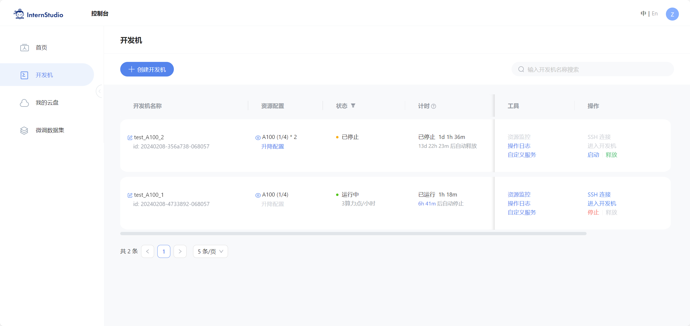

进入开发机后，我们需要配置好 conda 环境并安装好本次作业中需要用到的包并指定可行的版本。利用课程提供的 conda
环境备份文件，我们可以快速地配置好环境，如下图所示：

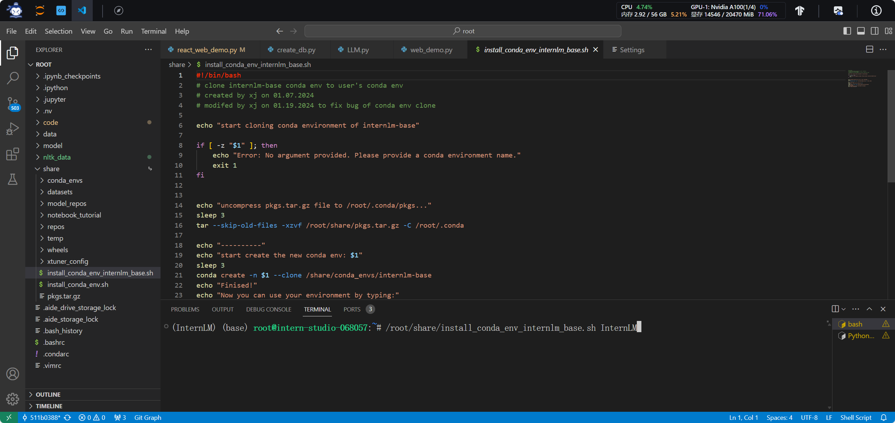

随后便是复制模型文件 InternLM-7b、下载开源词向量模型 Sentence Transformer和有关于本项目的教程文件，如下图所示：

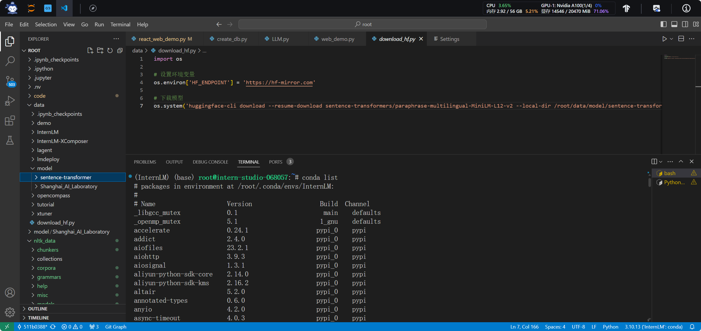

除了下载上述文件以外，为了提高项目执行便捷程度，又下载了运行时所需的NLTK相关资源以便运用。

#### 2. 知识库搭建

在知识库搭建环节，我们需要搜集语料库并加载，然后对语料文本进行处理。在前一个步骤中，我们已经下载了本课程的相关文档作为我们的语料库，随后问我们需要从本课程相关文件中提取出其中的文本文件，相关提取代码如下图所示：


随后，我们加载提取出的文本文件列表，使用LangChain提供的文本分块工具对文本进行处理（本次作业中分块大小为500，文本块的重叠大小为150）；完成分块后，我们使用LangChain提供的向量化工具接口导入开源词向量模型
Sentence Transformer 以对文本进行向量化；最终仅需确定好数据库文件路径、分块文档和向量化模型，就可利用Chroma提供的工具构建可用于LangChain的Chroma向量数据库，相关代码如下图所示：

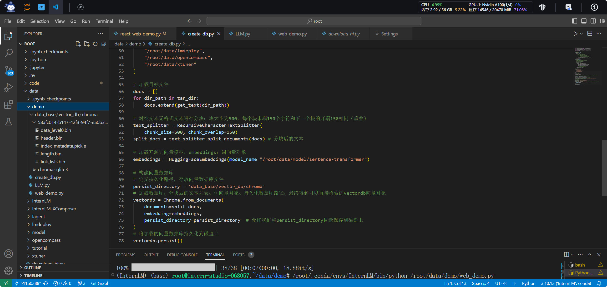

#### 3. InterLM 接入 LangChain

在此环节中，我们首先需要编写自己的LLM类，即InternLM类，令其继承LangChain中的LLM类并重写相关的问答接口。在该类的初始化过程中，需要加载InternLM模型至LangChain中，此处载入的是InternLM-7B模型，随后重写相关调用函数，相关代码如下图所示：

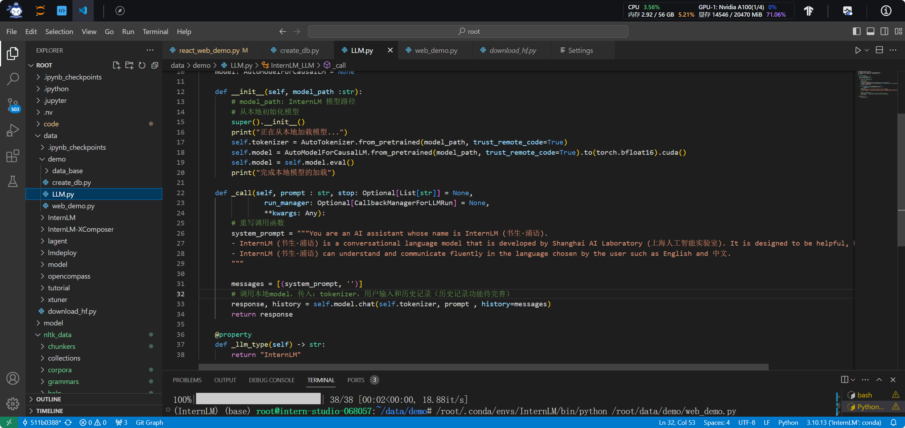

完成接入后，便是构建我们自己的检索问答链。首先，需要加载前文中已经构建好的Chroma向量数据库；随后，实例化集成了LongChain
LLM的InternLM对象；然后，借助LangChain中的工具，构建一个 Prompt Template 对象；相关代码如下图所示：

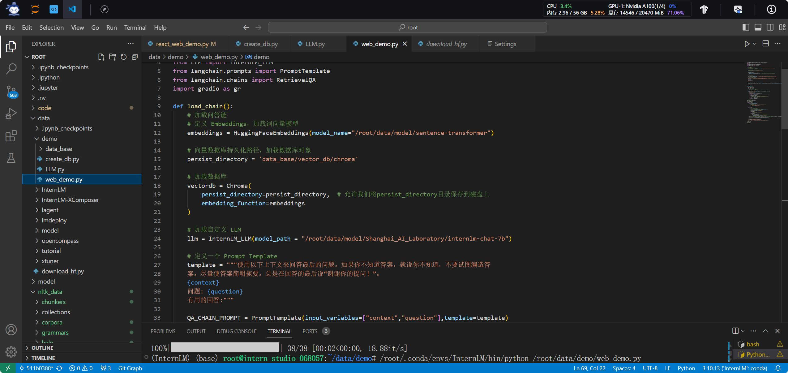

最后，构建检索问答链，将前面准备好的“原料”连成一条Q&A链，供调用使用，相关代码如下图所示：

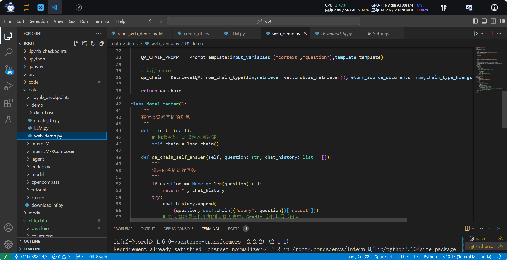

#### 4. 部署 Web 服务

在本次作业中，使用的是Gradio Web服务。在网页中准备好一系列信息交互组件并完成相关配置，本次作业中我采用的是Gradio
Web的默认配置，即运行于网页的 7860 端口，随后令本地与远端的 7860 端口连接便可实现网页的访问。

网页中用户的输入传入前面构建好的问答链中，再将问答链的输出结果返回呈现于网页，便完成了知识库的构建与展现。有关web的相关代码如下图所示：

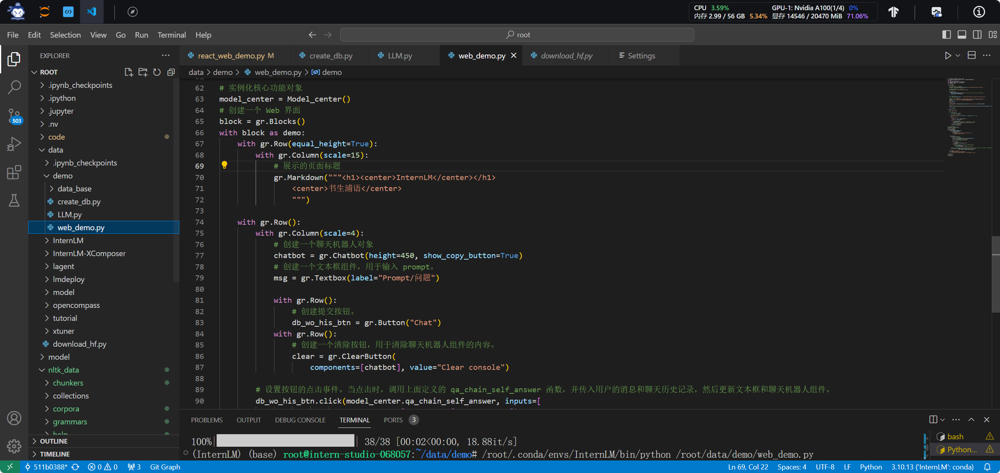

最终网页效果如下图所示：


自此，便完成了基于 InternLM 和 LangChain 的整个知识库助手的搭建过程。

## 进阶作业部分

### 选择一个垂直领域，收集该领域的专业资料构建专业知识库，并搭建专业问答助手，并在 OpenXLab上成功部署（截图，并提供应用地址）

在本次作业中，我选择了一个垂直领域——厨房菜谱，又在openxlab的开放数据集中收集了关于家常菜制作方法相关知识教程，构建专业知识库。“下厨房”菜谱开放数据集下载地址：

[XiaChuFang Recipe Corpus-OpenXLab](https://openxlab.org.cn/datasets/OpenDataLab/XiaChuFang_Recipe_Corpus)

随后下载数据集，相关下载代码如下：
``` python
import openxlab
openxlab.login(ak="your ak", sk="your sk") #进行登录，输入对应的AK/SK
from openxlab.dataset import get
get(dataset_repo='OpenDataLab/XiaChuFang_Recipe_Corpus', target_path='../pics/03') # 下厨房菜谱数据集下载
```

在开发机中下载该数据集后，首先需要进行解压和处理。解压后的文件夹中含一个菜谱大全JSON文件，首先还得将其进行切割后才能加以处理。利用Python，我将其整理成了多个单体容量为300KB左右的 JSON Line 文件，相关切割代码如下：

``` python
import os
import json
import jsonlines

def split_large_json(file_path, output_dir, max_size=1000):
    # 计算最大字节数
    max_bytes = max_size * 1024  # 300KB
    file_count = 0
    output_file = os.path.join(output_dir, f'split_{file_count}.jsonl')
    writer = jsonlines.open(output_file, mode='w')
    current_size = 0

    with jsonlines.open(file_path) as reader:
        for obj in reader:
            obj_str = json.dumps(obj)
            obj_size = len(obj_str)

            # 如果当前文件大小加上新对象的大小超过最大大小，则创建新文件
            if current_size + obj_size > max_bytes:
                writer.close()
                file_count += 1
                output_file = os.path.join(output_dir, f'split_{file_count}.jsonl')
                writer = jsonlines.open(output_file, mode='w')
                current_size = 0

            writer.write(obj)
            current_size += obj_size

    writer.close()
```

切割完成后，将文本载入到程序当中，并构建持久化向量数据库，如下图所示：

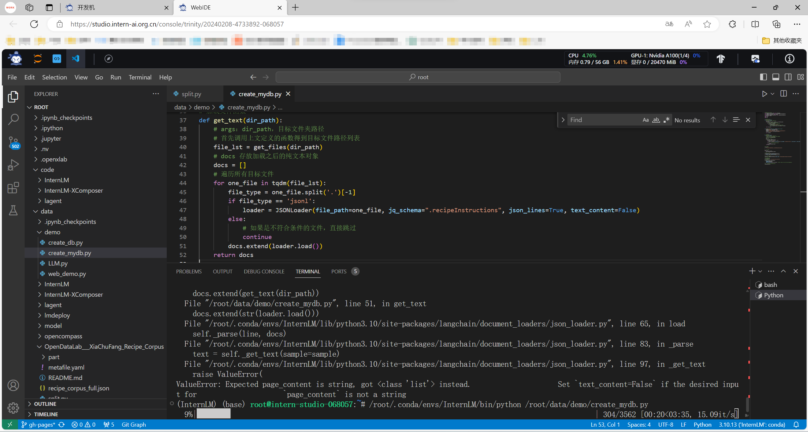

至此，再借助LangChain和InternLM-7b，便可搭建一个能够问答相关菜谱知识的助手，随后部署于本地，效果如下图所示：

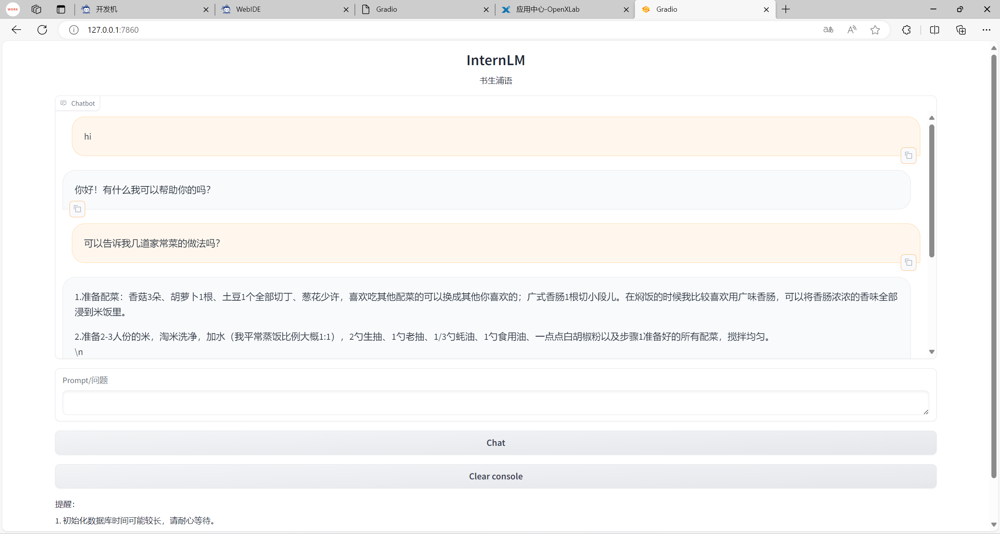

随后，我将训练生成的向量数据库上传至 Hugging Face 平台，并命名为 [RecipeMaster_RAG](https://huggingface.co/jackiey101/RecipeMaster_hf_adapter/tree/main) 如下图所示：

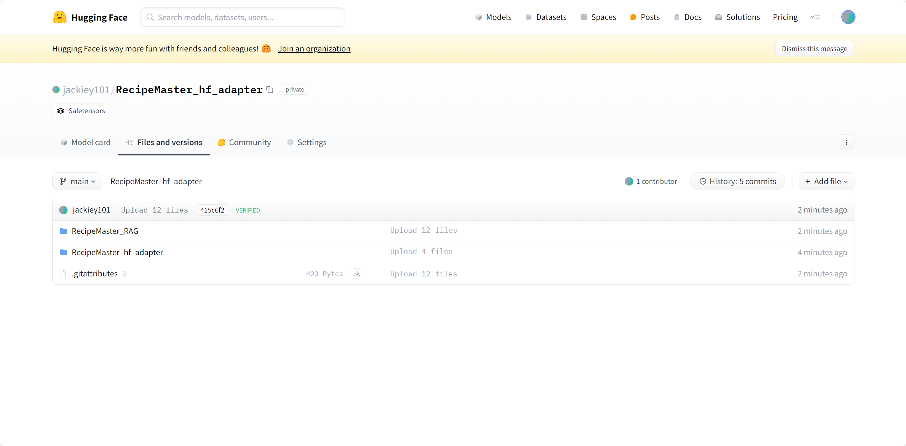

应用部署将结合[下一次的课堂作业](04_2.md)一同进行展示。
