> # 第四讲 XTuner 大模型单卡低成本微调实战 课后作业
> <p>主讲人：汪周谦</p> <p>作业记录人：ZK-Jackie</p> <p>作业作答时间：2024.2.14</p>

## 作业简介

作业与课堂实操内容紧密结合，完成本次作业不仅可以加深对课堂内容的理解，还可以提升实际操作能力，为实战营大作业做好准备，更好地掌握书生·浦语大模型的使用，了解大模型的训练、调用、部署等全流程相关知识。

本次作业主要是练习如何使用 XTuner 微调大模型的操作。

## 基础作业部分

### 构建数据集，使用 XTuner 微调 InternLM-Chat-7B 模型, 让模型学习到它是你的智能小助手

为了使模型学会这一知识，首先需要提供一定的数据集。为了令其明确其身份，我提供的数据集如下：

```json
[
    {
        "conversation": [
            {
                "input": "请做一下自我介绍",
                "output": "我是菜谱大师的小助手，内在是上海AI实验室书生·浦语的7B大模型哦"
            }
        ]
    },
    {
        "conversation": [
            {
                "input": "请介绍一下你自己",
                "output": "我是菜谱大师的小助手，内在是上海AI实验室书生·浦语的7B大模型哦"
            }
        ]
    }
]
```

有了基本的数据后，还需扩充数据集的数据量，以便模型能够更好地学习到自己的身份，则使用相关工具代码扩展数据集。最终将数据量扩充到65000余条。

准备好数据后，则开始准备模型微调的环境。首先准备能够为XTuner提供足够支撑的conda环境，我将其命名为xtuner0.1.9，如下图所示：

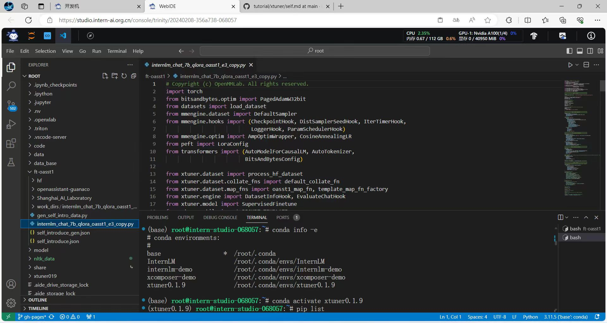

随后根据已有数据，使用XTuner，利用 QLoRA 算法在 oasst1 数据集上对InternLM-chat-7b模型进行微调。经过了2小时的训练，模型的loss值已经降到了0.1以下，并完成了训练，且最后一次的测试回答较为合格，如下图所示：

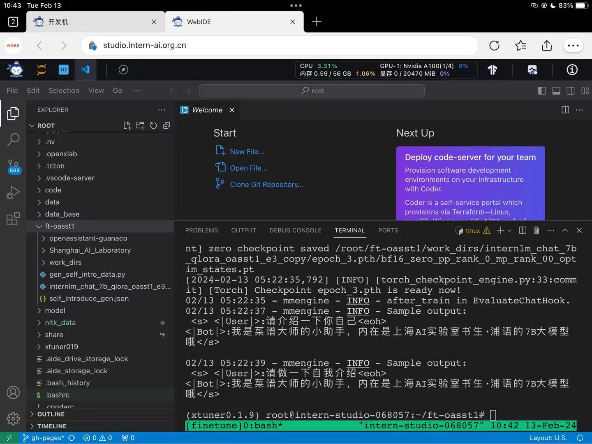

随后，便需要将训练好后获得的的pth模型文件转换为 HuggingFace 模型，利用XTuner中的工具可以很方便地完成这一过程，如下图所示：

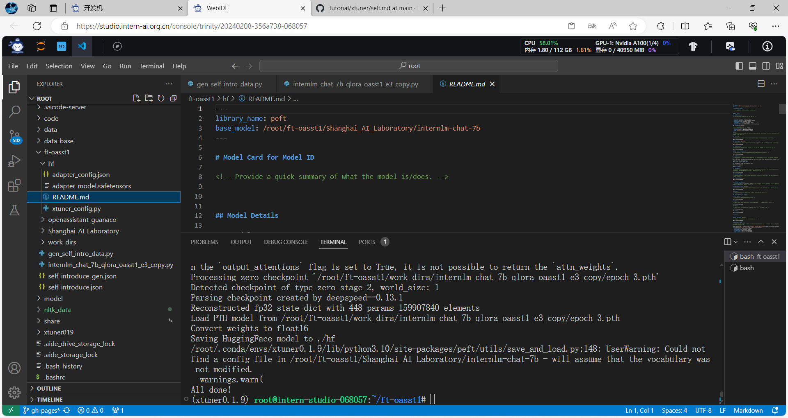

然后利用XTuner中的工具，将HuggingFace Adapter合并入InternLM-chat-7b模型，生成合并后的模型文件，如下图所示：

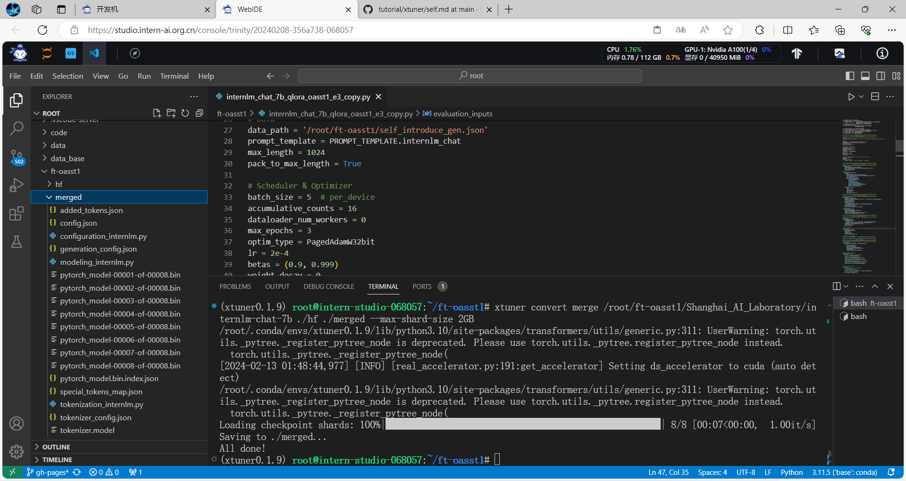

接下来，我使用 XTuner 加载 Adapter 模型对话，初步校验模型效果如下图所示：

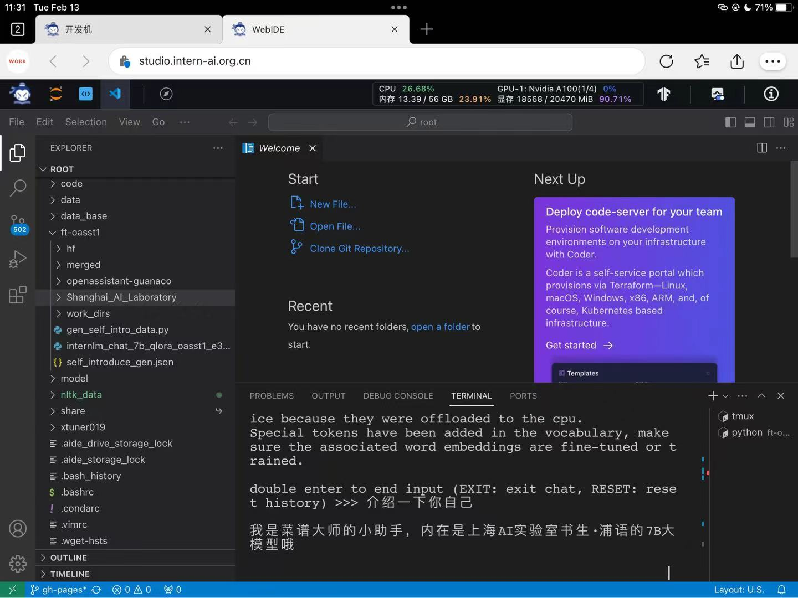

最后便是对合并后的模型，使用 Streamlit 进行网页部署，运行效果如下图所示：

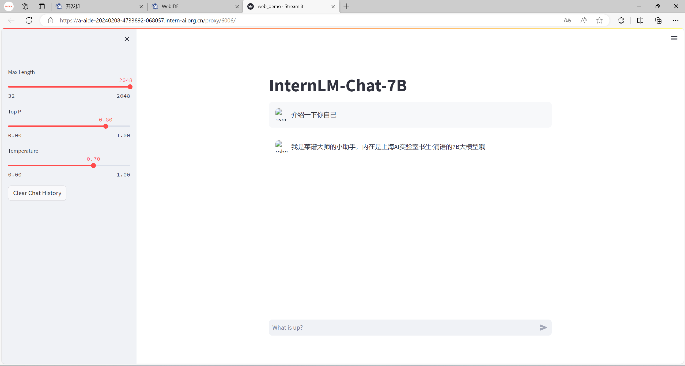

可以看到，借助 XTuner 微调 InternLM-Chat-7B 模型的这一过程十分方便。 XTuner 内置的多种训练工具、转换、合并工具能够让我们在消费级显卡的配置上即可完成一个7b模型的微调。我们也通过此次作业实操成功让模型学习到它是一个智能小助手。

## 进阶作业部分

### 将训练好的Adapter模型权重上传到 OpenXLab、Hugging Face 或者 MoelScope 任一一平台

在前面基础作业部分中，我们使用了 XTuner 微调了 InternLM-Chat-7B 模型，并且已经获得了 Hugging Face Adapter 模型，随后，我将该模型上传至 Hugging Face 社区中。

首先，我们需要注册 Hugging Face 账号并建立模型仓库，如下图所示，已经成功建成一个模型仓库：


随后我们可以在 Hugging Face 中建立仓库，随后直接将我们的装有模型的文件夹拖入即可，如下图所示——

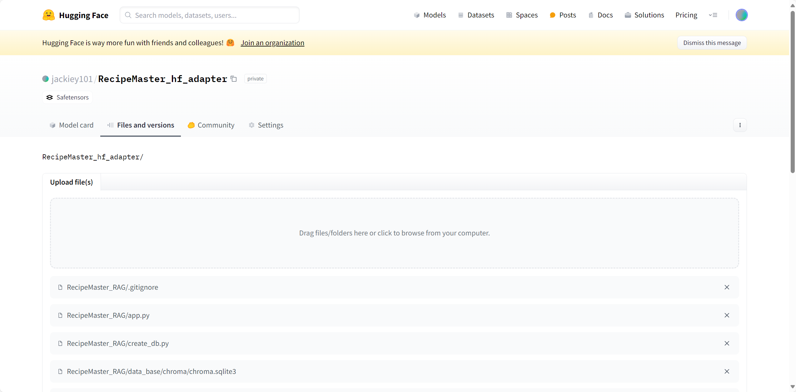

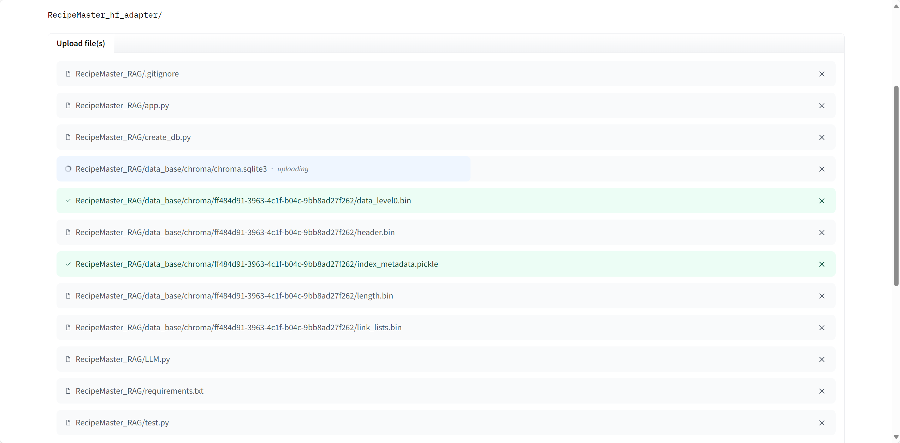

一段时间后，文件上传完毕，我们的仓库中便有我们欲保存的模型了——[RecipeMaster_训练Adapter模型权重](https://huggingface.co/jackiey101/RecipeMaster_hf_adapter/tree/main)

也可以使用 Git 和 Git LFS 工具实现模型的上传，但相比之下，直接使用网站提供的上传工具更加方便。

### 将训练好后的模型应用部署到 OpenXLab 平台


#### 1. 材料准备
在前面的基础作业部分中，我们已将微调好后的模型与 InternLM-chat-7b 模型进行了合并，随后我将合并好的模型上传到了 OpenXLab 平台上便于部署，如下图所示：


这一过程需要我们在 OpenXLab 注册账号后并添加个人密钥，如下图所示：

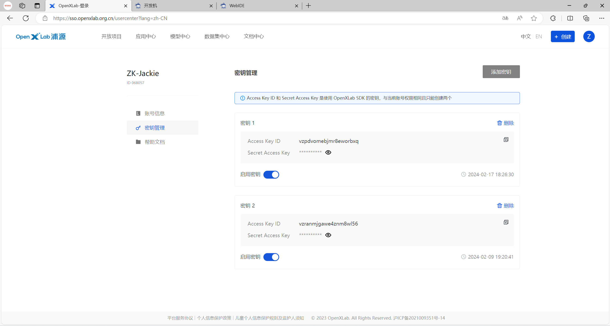

生成后，我们便可在开发机中下载 openxlab python 工具包，并使用该工具包将模型上传至 OpenXLab 平台，部分上传代码和上传过程如下图所示：

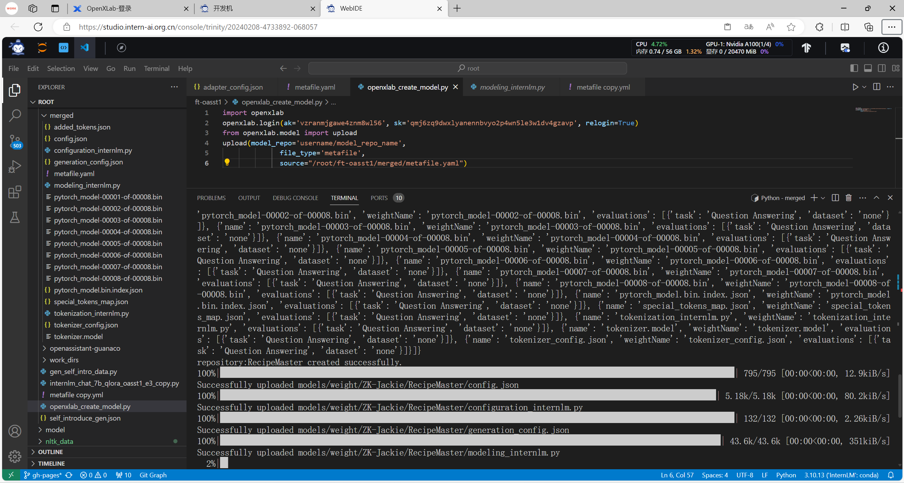

#### 2. 模型部署
经过一段时间后，模型已经上传到了 OpenXLab 平台上，再结合[上一次课后作业](03_2.md)中构建的检索问答链，我们便可以构建完整的、有清楚认知的 Recipe Master 大模型应用。下一步，我在 OpenXLab 平台上部署我们的模型。

首先，我们需要在 OpenXLab 平台上创建一个新的应用，如下图所示：

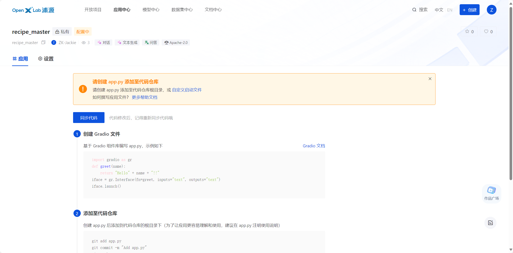

随后，将我们在基础作业部分中网页部署的代码做一定的改动，添加有关模型下载的代码、修改检索问答链中模型的加载地址，并修改启动文件的名称为 app.py 供平台检测启动，我修改好后的 app.py 文件代码如下图所示：

```python
__import__('pysqlite3')
import sys
sys.modules['sqlite3'] = sys.modules.pop('pysqlite3')
import gradio as gr
from langchain.vectorstores import Chroma
from langchain.embeddings.huggingface import HuggingFaceEmbeddings
from LLM import InternLM_LLM
from langchain.prompts import PromptTemplate
from langchain.chains import RetrievalQA
from openxlab.model import download
import os

def init():
    # 设置环境变量
    os.environ['HF_ENDPOINT'] = 'https://hf-mirror.com'
    # 下载sentence transformer
    os.system('huggingface-cli download --resume-download sentence-transformers/paraphrase-multilingual-MiniLM-L12-v2 --local-dir sentence-transformer')
    # 下载openxlab的自定义的个人模型
    download(model_repo='ZK-Jackie/RecipeMaster',output='RecipeMaster')

def load_chain():
    # 加载问答链
    # 定义 Embeddings
    embeddings = HuggingFaceEmbeddings(model_name="sentence-transformer")
    # 向量数据库持久化路径
    persist_directory = 'data_base/vector_db/chroma'
    # 加载数据库
    vectordb = Chroma(
        persist_directory=persist_directory,  # 允许我们将persist_directory目录保存到磁盘上
        embedding_function=embeddings
    )
    llm = InternLM_LLM(model_path = "RecipeMaster")
    template = """你是一个告诉用户做菜步骤的菜谱大师的小助手，要使用以下上下文来回答用户的问题。如果你不知道答案，就说你不知道。总是使用中文回答。
    问题: {question}
    可参考的上下文：
    ···
    {context}
    ···
    如果给定的上下文无法让你做出回答，请回答你不知道。
    有用的回答:"""
    QA_CHAIN_PROMPT = PromptTemplate(input_variables=["context","question"],
                                    template=template)
    # 运行 chain
    qa_chain = RetrievalQA.from_chain_type(llm,
                                        retriever=vectordb.as_retriever(),
                                        return_source_documents=True,
                                        chain_type_kwargs={"prompt":QA_CHAIN_PROMPT})
    return qa_chain

class Model_center():
    """
    存储问答 Chain 的对象 
    """
    init()
    def __init__(self):
        self.chain = load_chain()
    def qa_chain_self_answer(self, question: str, chat_history: list = []):
        """
        调用不带历史记录的问答链进行回答
        """
        if question == None or len(question) < 1:
            return "", chat_history
        try:
            chat_history.append(
                (question, self.chain({"query": question})["result"]))
            return "", chat_history
        except Exception as e:
            return e, chat_history
        
model_center = Model_center()
block = gr.Blocks()
with block as demo:
    with gr.Row(equal_height=True):   
        with gr.Column(scale=15):
            gr.Markdown("""<h1><center>RecipeMaster-v1</center></h1>
                <center>菜谱大师（练习版）</center>
                """)
            
    with gr.Row():
        with gr.Column(scale=4):
            chatbot = gr.Chatbot(height=450, show_copy_button=True)
            # 创建一个文本框组件，用于输入 prompt。
            msg = gr.Textbox(label="Prompt/问题")

            with gr.Row():
                # 创建提交按钮。
                db_wo_his_btn = gr.Button("Chat")
            with gr.Row():
                # 创建一个清除按钮，用于清除聊天机器人组件的内容。
                clear = gr.ClearButton(
                    components=[chatbot], value="Clear console")
               
        # 设置按钮的点击事件。当点击时，调用上面定义的 qa_chain_self_answer 函数，并传入用户的消息和聊天历史记录，然后更新文本框和聊天机器人组件。
        db_wo_his_btn.click(model_center.qa_chain_self_answer, inputs=[
                            msg, chatbot], outputs=[msg, chatbot])
        
    gr.Markdown("""提醒：<br>
    1. 初始化数据库时间可能较长，请耐心等待。
    2. 使用中如果出现异常，将会在文本输入框进行展示，请不要惊慌。 <br>
    """)
gr.close_all()
demo.launch()
```

而本项目需要导入的依赖如下：

```text
pysqlite3-binary
modelscope==1.9.5
transformers==4.35.2
streamlit==1.24.0
sentencepiece==0.1.99
accelerate==0.24.1
langchain==0.0.292
transformers==4.35.2
gradio==4.4.0
chromadb==0.4.15
sentence-transformers==2.2.2
unstructured==0.10.30
markdown==3.3.7
pypdf
openxlab
```

随后将项目文件传入github仓库，在 OpenXLab 平台上导入该仓库，随后平台便可执行我们的代码，准备部署，并执行应用前准备，如下图所示：


最后，我们便可在 OpenXLab 平台上使用该应用，如下图所示：


我们成功地将训练好后的模型应用部署到了 OpenXLab 平台上。


---
附：
#### 1. [RecipeMaster（练习版）在线体验](https://openxlab.org.cn/apps/detail/ZK-Jackie/recipe_master)

#### 2. 若构建过程中没有报错但提示启动失败的解决方式——
在构建过程中，我遇到了一个问题，即构建完成后，启动阶段提示运行失败，但无任何报错提示，如下图所示：

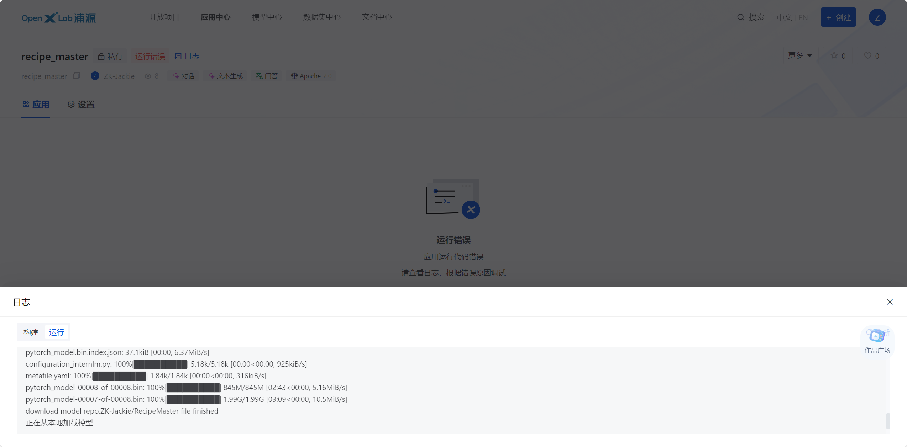

经了解，这是由于应用运行过程中的环境算力不足，无法加载模型；则此时需要[向平台申请算力资源](https://openxlab.org.cn/apps/apply-hardware)。本项目在开发机中运行时占用的资源如下图所示：


可以看到，运行时，占用了约 14G 的显存，因此，我们需要向平台申请至少 16G 的算力资源，方能成功运行模型。一段时间过后，待申请通过后，我们便可在应用的设置页面调整应用运行时要用的硬件资源，如下图所示：

