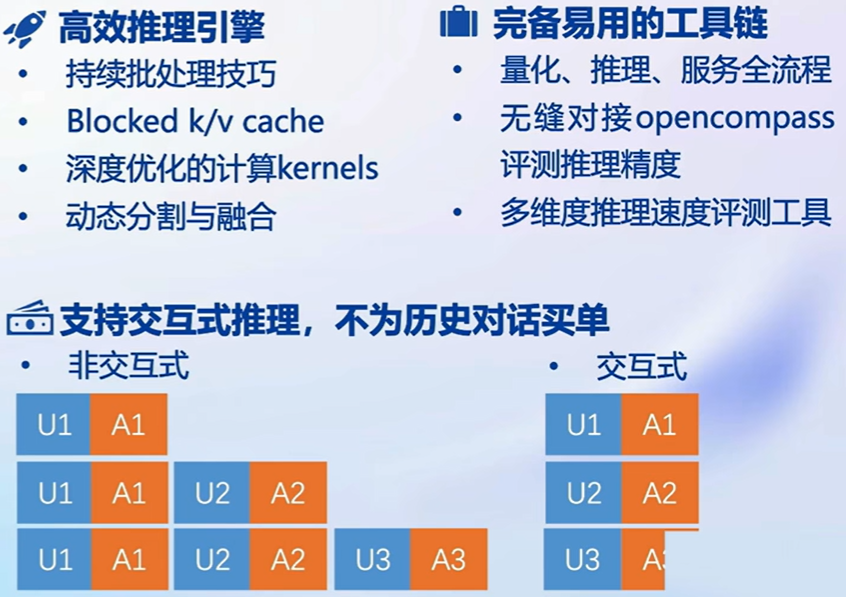
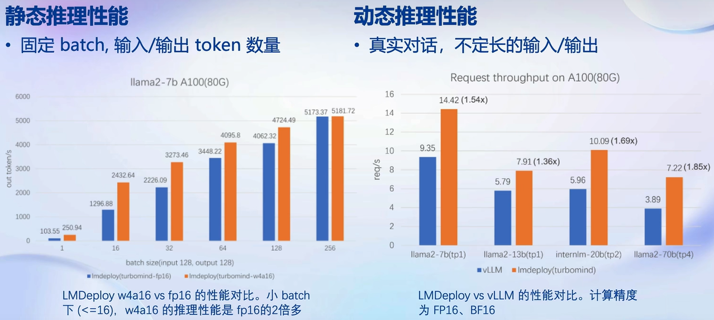
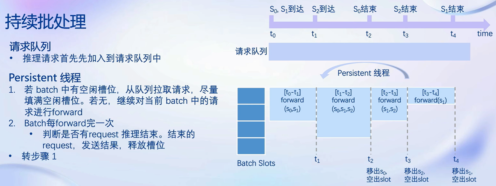
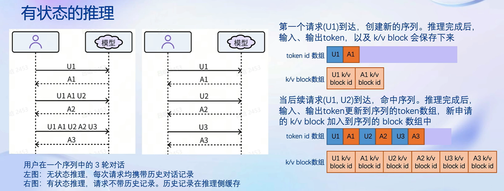
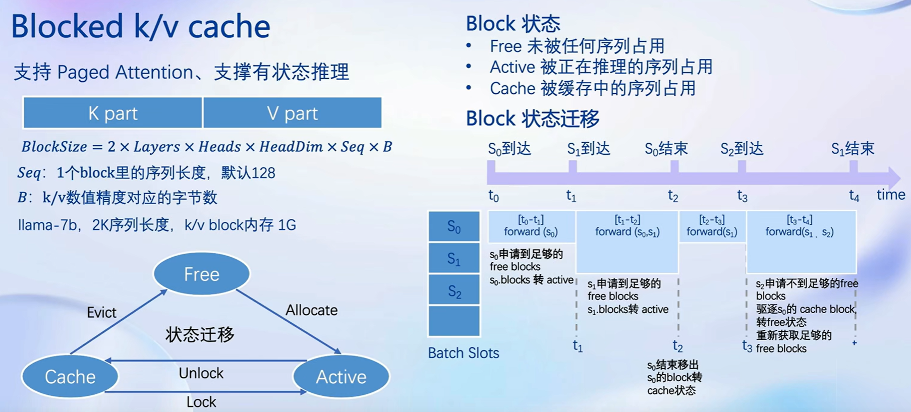
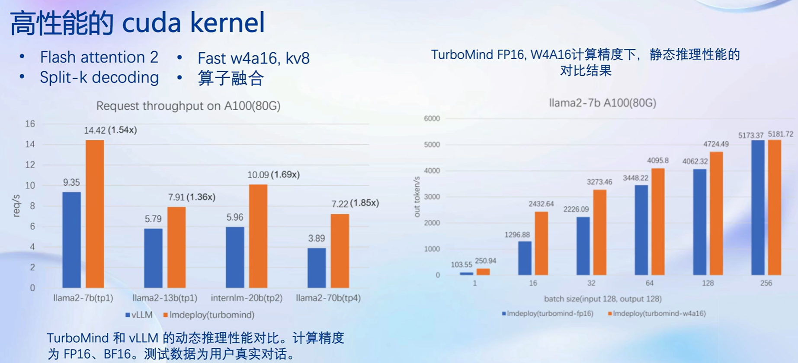

> # 第五讲 LMDeploy大模型量化部署实践
> 
主讲人：长琴
 
笔记记录人：ZK-Jackie
 
笔记记录时间：2024.2.14

## 目录
- **一、大模型部署背景**
  - **1. 模型部署**
  - **2. 大模型特点**
- **二、LMDeploy简介**
  - **1. 核心功能——量化**
  - **2. 核心功能——推理引擎**
  - **3. 核心功能——推理服务**
- **三、总结**
- **四、课后作业**

## 一、大模型部署背景

### 1. 模型部署
模型部署是指将训练好的模型在特定软硬件环境中启动的过程，使模型能够接收输入并返回预测结果。模型部署是模型应用的最后一步，是模型从实验室走向生产环境的关键一步。为了满足性能和效率的需求，常常需要对模型进行优化，例如模型压缩和硬件加速。

这一过程中需要运用一系列的计算设备，如CPU、GPU、TPU等，以及一系列的软件工具，如TensorRT、OpenVINO等。它最终向用户提供的产品形态有云端、边缘端、移动端等。

则这一过程中面临着一些列的挑战——
- 对于设备
  - 如何应对巨大的存储问题?低存储设备(消 费级显卡、手机等)如何部署?
- 对于模型的推理
  - 如何加速 token 的生成速度
  - 如何解决动态shape，让推理可以不间断
  - 如何有效管理和利用内存
- 对于模型提供的服务
  - 如何提升系统整体吞吐量?
  - 对于个体用户，如何降低响应时间?

当下，大模型部署的需求日益增长，因此，大模型部署的技术也日益成熟，如何解决上述问题，是大模型部署的核心问题；现在也有诸多部署方案——
- 从技术点上
  - 模型并行
  - 低比特量化
  - Page Attention 
  - transformer 计算和访存优化
  - Continuous Batch等
- 从部署方案上
  - huggingface transformers
  - 专门的推理加速框架
  - 云端部署方案
    - IMDeploy
    - vllm
    - tensorrt-llm
    - deepspeed等
  - 移动端部署方案
    - llama.cpp
    - mlc-llm等

### 2. 大模型特点
从模型部署的概念中，我们也容易知道大模型有如下几种特点：

- 内存开销大
  - 庞大的参数量。 78 模型仅权重就需要 14+G 内存
  - 采用自回归生成 token，需要缓存 Attention 的 k/v, 带来巨大的内存开销
- 动态shape
  - 请求数不固定
  - Token 逐个生成，且数量不定
- 相对视觉模型，LLM结构简单
  - Transformers 结构，大部分是 decoder-only

## 二、LMDeploy 简介
LMDeploy 是 LLM 在英伟达设备上部署的全流程解决方案。包括模型轻量化、推理和服务——
- 轻量化：支持 4bit 权重量化和 8bit k/v 量化
- 推理引擎：支持 turbomind 和pytorch
- 服务：支持 api server、gradio和triton interface server

除此以外，LMDeploy也提供了较为完善的接口，如python、gRPC和RESTful等。高效推理引擎、完备易用的工具链和“支持交互式推理，不为历史对话买单”的特点更为其增添不少优势，如下图所示：

推理是 LMDeploy 的核心竞争力，其性能表现如下图所示：

### 1. 核心功能——量化
量化是 LMDeploy 的核心功能之一，其主要目的是为了减小模型的体积，提高模型的推理速度。LMDeploy 是一种 Weight Only 量化的方案，主要是考虑到常见的 LLM 模型是 Decoder Only 架构。推理时大部分时间消耗在逐Token 生成阶段(Decoding 阶段)，是典型的访存密集型场景。

而Weight Only 量化一举多得——
- 4bit Weight Only 量化，将 FP16 的模型权重量化为 INT4，访存量直接降为 FP16 模型的 1/4，大幅降低了访 存成本，提高了 Decoding 的速度。
- 加速的同时还节省了显存，同样的设备能够支持更大的模型以及更长的对话长度。

LMDeploy 使用 MIT HAN LAB 开源的 AWQ 算法，量化为 4bit 模型。推理时，先把 4bit 权重，反量化回 FP16(在 Kernel 内部进行，从Global Memory 读取时仍是 4bit)，依旧使用的是 FP16 计算。

相较于社区使用比较多的 GPTQ 算法，AWQ 的推理速度更快，量化的时间更短，且推理性能更好。根据相关统计研究，相同模型下，AWQ 算法性能明显优于其他算法。

### 2. 核心功能——推理引擎
为了获得更好的推理性能，LMDeploy 使用自研的TurboMind推理引擎，并在性能上作出了大量优化。主要有以下几个特点——
- 持续批处理
  - 请求可以及时加入batch中推理Batch中已经完成推的请求及时退出

大致原理过程如下图所示：

- 有状态的推理
  - 对话 token 被缓存在推理侧用户侧请求无需带上历史对话记录

原理如下图所示：

- Blocked k/v cache
  - Attention 支持不连续的 k/v block (Paged Attention)

原理如下图所示：

- 高性能 cuda kernel
  - 采用Flash Attention 2、Split-K decoding和高效的w4a16, kv8 反量化 kernel设计

原理如下图所示：

### 3. 核心功能——推理服务
LMDeploy已经预先内置了一定的api接口服务，通过swagger ui可以快速查阅相关接口文档，保持了与市面上主流的大模型api接口的类似性，快速地帮助用户上手调用。

## 三、总结
通过学习本次课程，我对大模型部署背景、挑战以及解决方案有了更深入的了解。我了解到模型部署不仅涉及到模型本身的优化和轻量化，还需要考虑到硬件资源的管理、推理效率的提升以及服务性能的优化等方面。在学习LMDeploy的过程中，我认识到量化、推理引擎和推理服务是大模型部署中的关键环节，而LMDeploy提供了一整套解决方案，能够有效地应对这些挑战。

在完成作业的过程中，我深入了解了LMDeploy的核心功能，包括量化技术、推理引擎设计以及服务接口等方面。通过对这些内容的学习和实践，我对大模型部署的流程和技术有了更清晰的认识，并且提升了自己的技术能力。

未来，我希望能够进一步深入研究大模型部署领域，不断学习和掌握新的技术和方法，为解决实际问题提供更好的解决方案。我也期待能够在团队中应用所学知识，为项目的顺利实施和优化做出贡献。通过不断的学习和实践，我相信我能够在大模型部署领域取得更进一步的进展，并为行业的发展做出自己的贡献。

## [四、课后作业](05_2.md)