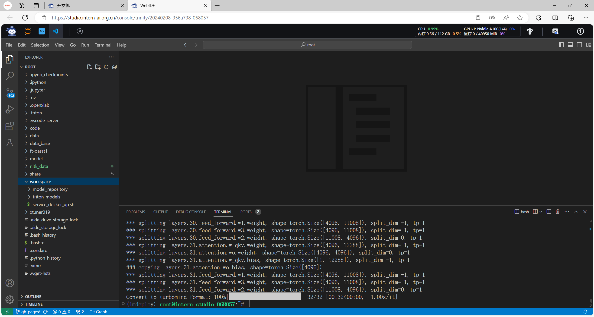
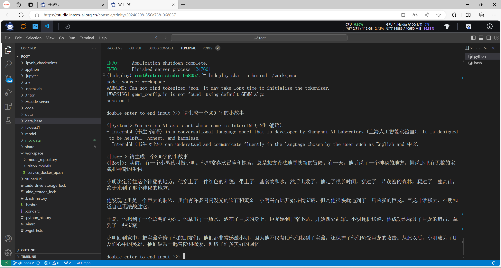
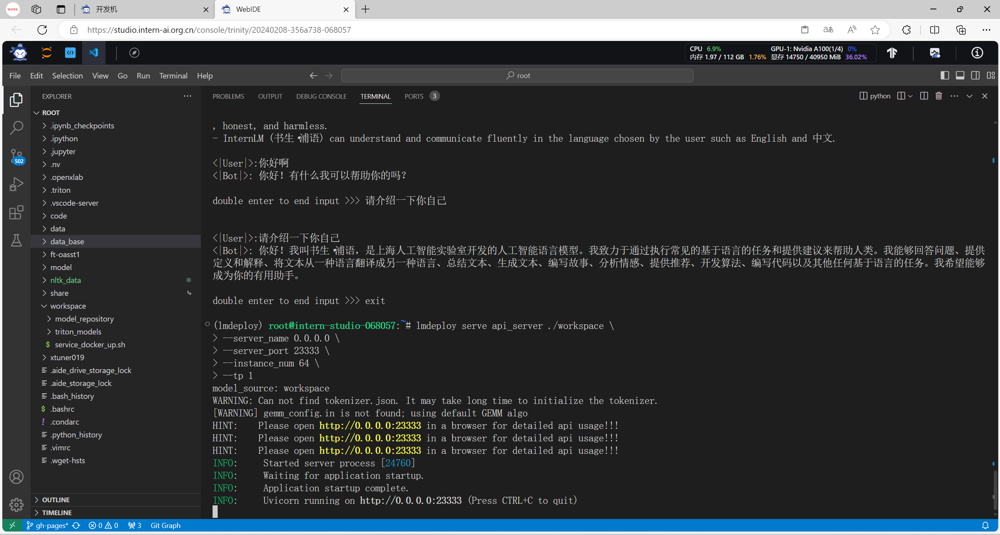
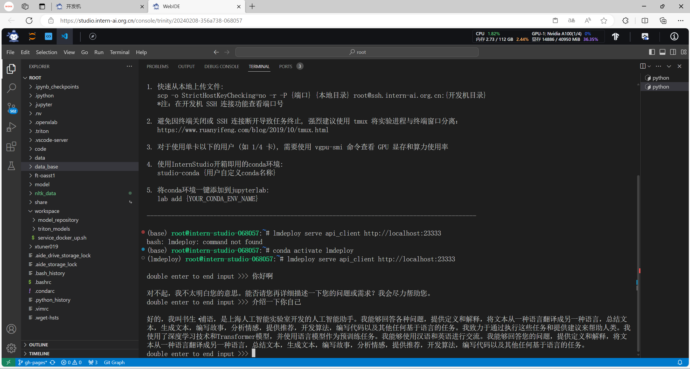
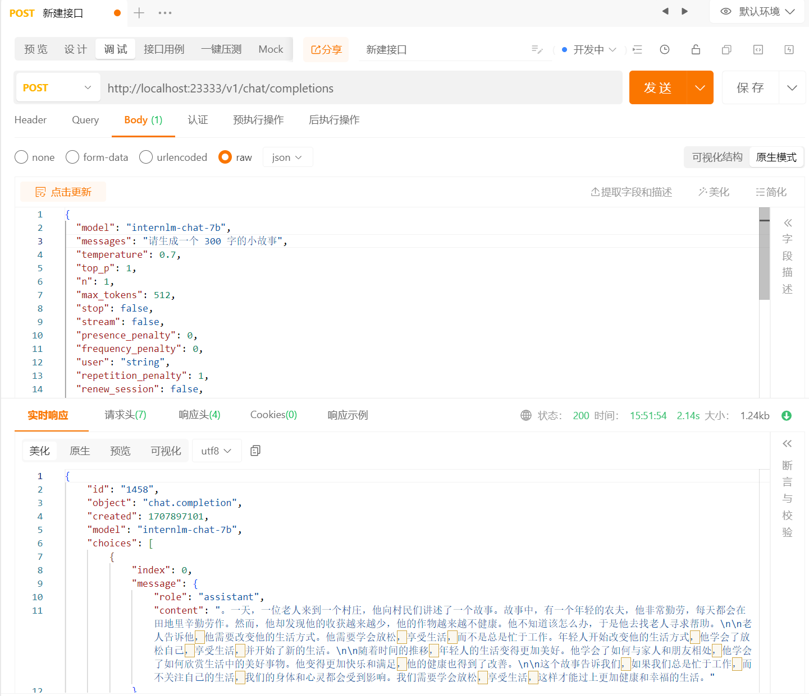
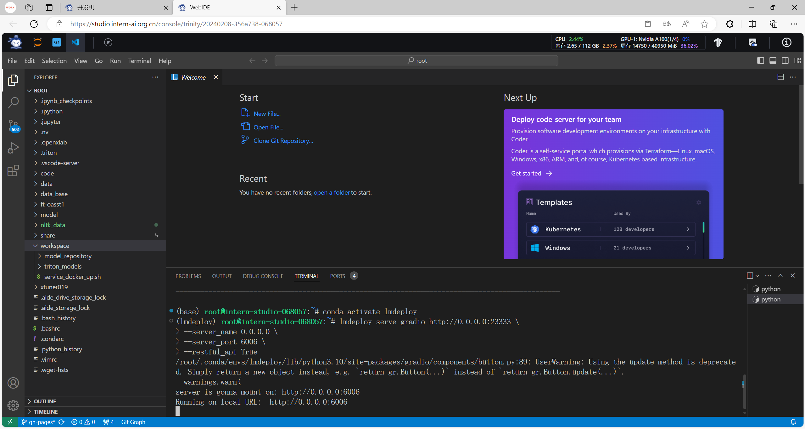
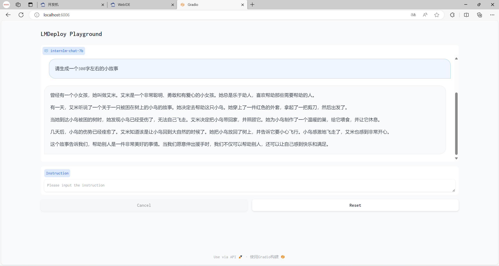
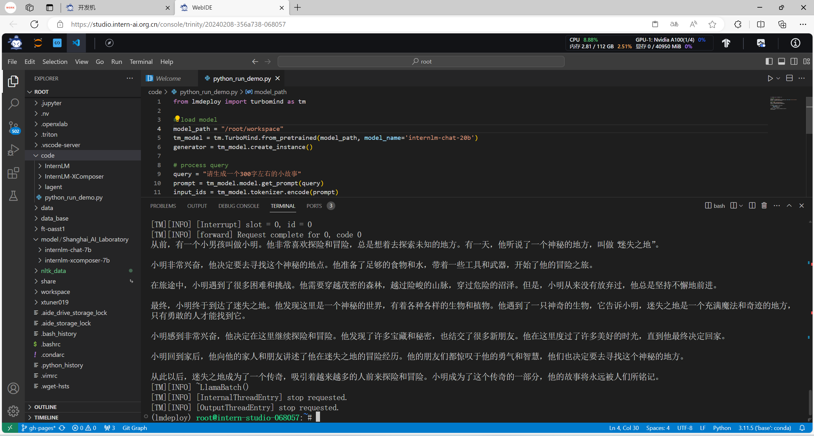

> # 第五讲 LMDeploy大模型量化部署实践 课后作业
> <p>主讲人：长琴</p> <p>作业记录人：ZK-Jackie</p> <p>作业作答时间：2024.2.14</p>

## 作业简介

作业与课堂实操内容紧密结合，完成本次作业不仅可以加深对课堂内容的理解，还可以提升实际操作能力，为实战营大作业做好准备，更好地掌握书生·浦语大模型的使用，了解大模型的训练、调用、部署等全流程相关知识。

本次作业主要是练习如何使用 LMDeploy 部署高效地大模型的操作。

## 基础作业部分

### 使用 LMDeploy 以本地对话、网页Gradio、API服务中的一种方式部署 InternLM-Chat-7B 模型，生成 300 字的小故事（需截图）

总的来说，使用LMDeploy对模型进行部署主要有四种不同的方案，分别是本地对话、API服务、网页Gradio直接对接和Python 代码集成四种方式，下面我将对这四种方式的实现进行实践。

开始之前，需要使用 TurboMind 推理模型需要先将模型转化为 TurboMind 的格式，这里我采用离线转换的方式以提高效率，转换命令如下：

```shell
lmdeploy convert internlm-chat-7b  /root/share/temp/model_repos/internlm-chat-7b/
```

在conda环境执行该命令后，根目录中即可获得转换后的模型文件，如下图所示：



随后便可利用转换后的模型文件进行部署操作。

#### 1. 本地对话

本地对话是指在本地环境中，使用命令行或者其他工具进行对话，可以直接使用 LMDeploy 内部工具进行这一过程，在执行了相关命令后进行对话，并让它生成了一个小故事，如下图所示：



#### 2. API服务

API服务是指将模型部署为一个API服务，可以通过HTTP请求的方式进行对话，这里我使用了LMDeploy提供的API服务工具进行部署，并将其挂载至23333端口，如下图所示：



随后，我们可以选择使用LMDeploy中的工具与只连接进行对话，如下图所示：



在本地电脑上与工程机进行ssh连接，随后使用API调试工具向其发送POST请求，获取到了一个小故事，如下图所示：



#### 3. 网页Gradio

网页Gradio是指将模型部署为一个网页服务，可以通过浏览器的方式进行对话，这里我使用了LMDeploy提供的Gradio工具进行部署。利用 2. API服务 中开启的API端口服务，可以利用其并结合LMDeploy提供的Gradio工具挂载网页。启用这两个工具，并将网页挂载至本地的6006端口，如下图所示。



在本地电脑上与工程机进行ssh连接，随后本地访问网页，并令其生成小故事，效果如下图所示：



除此以外，也可以直接使用LMDeploy中的工具，直接根据TurboMind挂载Gradio网页服务进行模型的对话，此处不再展示。

#### 4. Python 代码集成

除了上面几种方式，我们也可以使用TurboMind提供的python方法接口与模型进行对话交流，只需将载入模型的路径改为本地 TurboMind 的格式的模型地址即可。令其生成故事，如下图所示：

