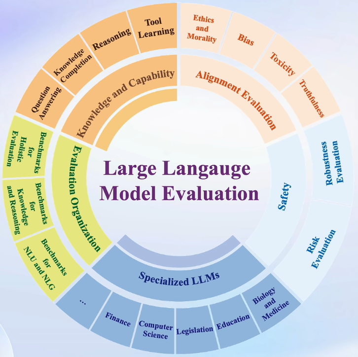
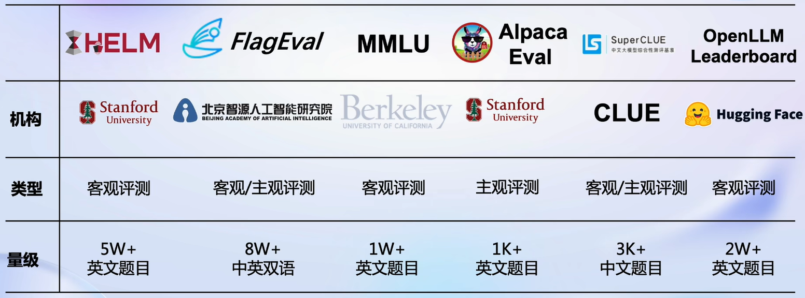
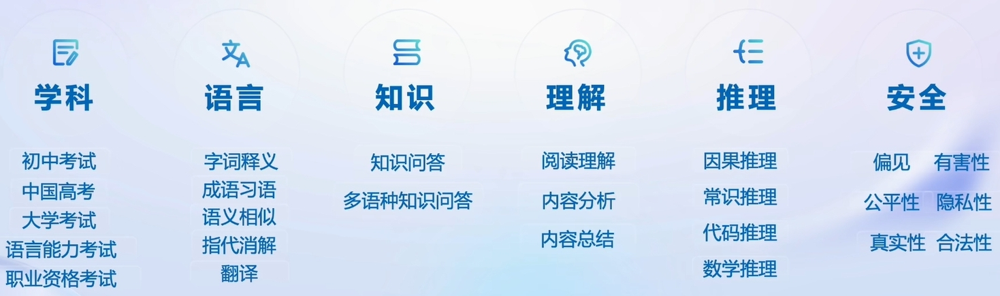
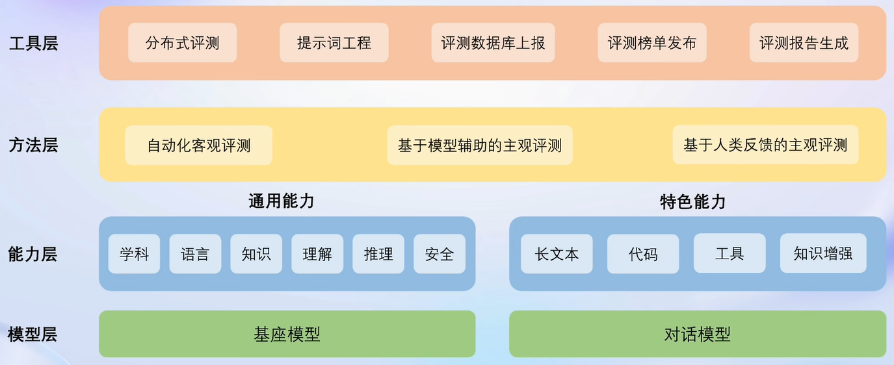
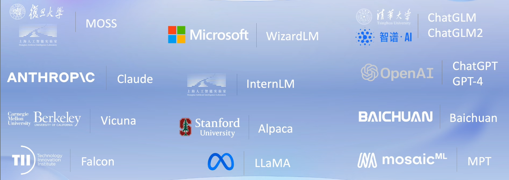
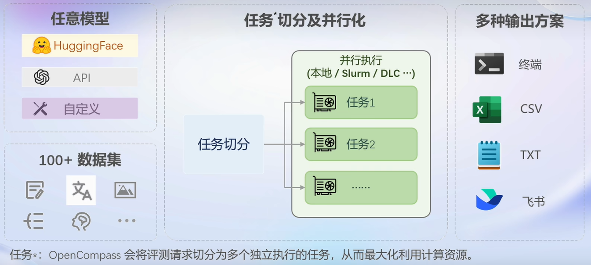

> # 第六讲 OpenCompass大模型评测
> 
主讲人：曹茂松
 
笔记记录人：ZK-Jackie
 
笔记记录时间：2024.2.14

## 目录
- **一、大模型评测的必要性**
- **二、大模型评测的基本方法**
- **三、OpenCompass评测框架介绍**
  - **1. 平台架构**
  - **2. 模型支持**
  - **3. 流水线设计**
  - **4. 模型榜单**
- **四、总结**
- **五、课后作业**

## 一、大模型评测的必要性
在当下大模型技术不断发展、各大组织不断推出自己的大模型的背景下，如何评定一个大模型的水准、如何横向对比多个大模型的能力成为了一个重要的问题。大模型评测在此便有了必要性。对于不同用户而言，大模型评测都有其存在的价值：

- 对于普通用户：了解模型的特色能力和实际效果
- 对于开发者：监控模型能力变化，指导优化模型生产
- 对于管理机构：减少大模型带来的社会风险
- 对于产业界：找出最适合产业应用的模型，赋能真实场景

## 二、大模型评测的基本方法
面对当下纷繁复杂的时代，对于大模型的评测要求的方面自然也越多，如下图所示：

则这些内容在测试过程中都需要被考虑到。

一般的大模型都具有两种类型，一种是基座模型，另一种是经过微调和指令跟随的应用模型。对于不同类别的模型自然需要有不同的评测内容和方法。普遍而言，主要有一下几种形式：

- 客观评测
  - 问答题
  - 多选题
  - 判断题
  - 分类题
  - ……
- 主观评测
  - 人工评价
  - 模型评价
  - ……
- Prompt Engineering（提示词工程）
  - 生成式评测
  - ……

## 三、OpenCompass评测框架介绍
当下，已有众多大模型评测框架，如下图所示：

这些框架在各个领域都各有所长、各有特色，而OpenCompass能力框架则是“集百家之长”，致力于打造全球领先的大模型开源评测体系，在各个方面都极具实力，如下图所示：

OpenCompass的实力也成功令其用户遍及国内外知名企业与科研机构，成为Meta官方推荐的唯一由国内开发的大模型评测体系，与HuggingFace、stanford 和 Google推出的评测体系齐名。

下面将对OpenCompass进行简要介绍：

### 1. 平台架构

### 2. 模型支持
OpenCompass与国内外多种知名模型都有较好的支持，如下图所示：

此外，用户也可以自行上传自己的模型进行评测。

### 3. 流水线设计

### 4. 模型榜单
对于提交了测评的模型，OpenCompass平台也会提供榜单，以便用户了解模型的实际水平。

## 四、总结
大模型评测在当今日益发展的人工智能领域中具有重要意义，不仅可以帮助用户了解模型的特色能力和实际效果，还可以引导开发者优化模型生产，减少社会风险，以及为产业界提供最适合的模型应用。针对大模型评测，通常涉及客观评测、主观评测和Prompt Engineering等多个方面，需要综合考虑。

在众多大模型评测框架中，OpenCompass能力框架脱颖而出，致力于构建全球领先的大模型开源评测体系。其平台架构完善，模型支持广泛，流水线设计科学，同时提供模型榜单，帮助用户全面了解模型的实际水平。当前OpenCompass已取得了一定的成绩，但当下也存在着一定的问题：

- 缺少高质量中文评测集
- 难以准确提取答案
- 能力维度不足
- 测试集混入训练集
- 测试标准各异
- 人工测试成本高昂

未来，OpenCompass团队将继续努力解决这些问题，同时积极探索多模态、法律领域、医疗领域等方面，努力将评测框架发展得更加客观、完整。通过持续改进和创新，OpenCompass有望成为更加权威和可靠的大模型评测平台，为人工智能领域的发展贡献力量。

## [五、课后作业](06_2.md)
