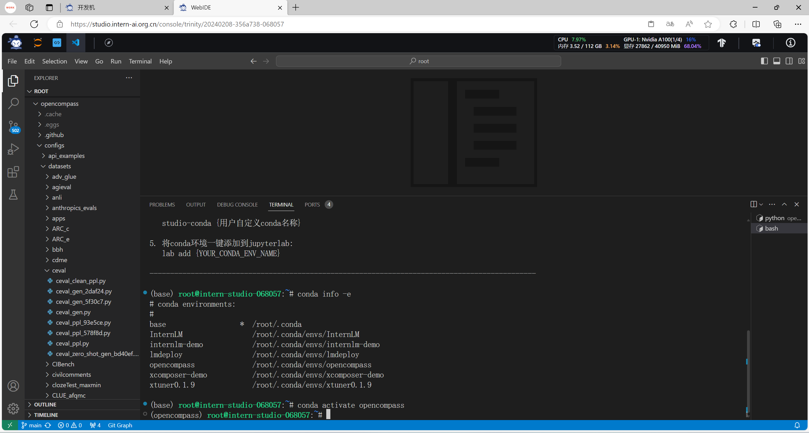
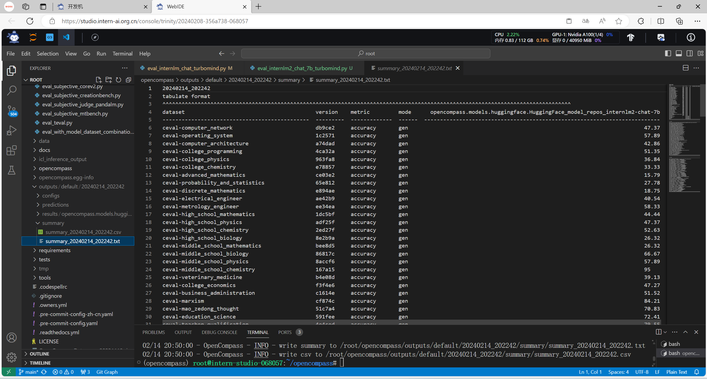
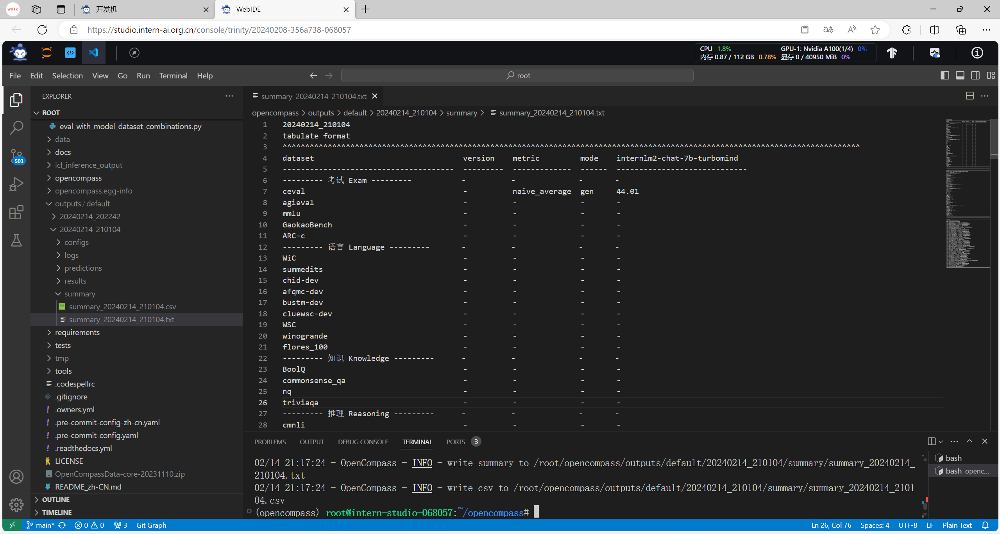

> # 第六讲 OpenCompass大模型评测 课后作业
> <p>主讲人：曹茂松</p> <p>作业记录人：ZK-Jackie</p> <p>作业作答时间：2024.2.14</p>

## 作业简介

作业与课堂实操内容紧密结合，完成本次作业不仅可以加深对课堂内容的理解，还可以提升实际操作能力，为实战营大作业做好准备，更好地掌握书生·浦语大模型的使用，了解大模型的训练、调用、部署等全流程相关知识。

本次作业主要是练习如何使用 OpenCompass 评测 InternLM2-Chat-7B 模型在 C-Eval 数据集上的性能。

## 基础作业部分

### 使用 OpenCompass 评测 InternLM2-Chat-7B 模型在 C-Eval 数据集上的性能

#### 1. 环境准备

要使用 OpenCompass 工具，首先需要准备好相应的环境以支持运行 OpenCompass 工具。如下图所示，已依照官方文档准备好相应的conda环境，并准备好相关评测工具和数据集。



#### 2. 启动测评

在准备好环境后，便可以使用 OpenCompass 工具对模型进行评测。在执行评测前，我们需要明确评测使用的数据集、参与此次评测的 HuggingFace 模型及其路径、HuggingFace tokenizer 路径、构建 tokenizer 的参数、构建模型的参数及其他一系列参数。其中可用的评测数据集也可从工具目录中查看到。

这些参数可以以命令行参数的形式传入，也可以以配置文件的形式传入。如下图所示，已使用 OpenCompass 工具对 InternLM2-Chat-7B 模型在 C-Eval 数据集上进行了评测，获得了输出的测评结果文件。



## 进阶作业部分

### 使用 OpenCompass 评测 InternLM2-Chat-7B 模型使用 LMDeploy 0.2.0 部署后在 C-Eval 数据集上的性能

OpenCompass 对 LMDeploy 生成的 TurboMind 模型也提供支持。参照 OpenCompass 的官方文档，我们可以导入类为 TurboMindModel 的模型并提供相应的模型路径，相关配置代码如下：

```python
from mmengine.config import read_base
from opencompass.models.turbomind import TurboMindModel

with read_base():
    from .datasets.ceval.ceval_gen_5f30c7 import ceval_datasets

datasets = [*ceval_datasets]

internlm2_chat_7b = dict(
        type=TurboMindModel,
        abbr='internlm2-chat-7b-turbomind',
        path="/root/workspace",
        engine_config=dict(session_len=2048,
                           max_batch_size=8,
                           rope_scaling_factor=1.0),
        gen_config=dict(top_k=1, top_p=0.8,
                        temperature=1.0,
                        max_new_tokens=100),
        max_out_len=100,
        max_seq_len=2048,
        batch_size=8,
        concurrency=8,
        run_cfg=dict(num_gpus=1, num_procs=1),
        end_str='<eoa>'
    )

models = [internlm2_chat_7b]
```

将配置好的文件作为参数提交给 OpenCompass 的 run.py 文件，即：

```shell
python run.py configs/eval_internlm2_chat_7b_turbomind.py --debug
```

一段时间过后，我们可以获得使用 OpenCompass 工具对 LMDeploy 生成的 InternLM2-Chat-7B TurboMind 模型在 C-Eval 数据集上进行评测的评测结果。测评结果如下图所示：


