<div style="border-bottom: 4px solid black; width: 100%; box-sizing: border-box; text-align: center; padding-top: 0.1rem; color: rgb(99,108,118)" align="center">
    <h1>书生大模型实战营「第3期」学员笔记<br/><span style="font-style: italic">入门岛 - Linux 基础知识</span></h1>
</div>
<div style="text-align: center;" align="center">
    笔记记录人：ZK-Jackie&nbsp;&nbsp;&nbsp;&nbsp;&nbsp;&nbsp;笔记记录时间：2024.7.12
</div>


## 目录

- 前言
  1. 什么是Linux
  2. Linux开发
- 闯关任务
  1. 完成SSH连接与端口映射并运行hello_world.py
  2. VSCode远程开发及conda环境配置
  3. 创建并运行test.sh文件
- 总结
- 参考资料


## 前言
### 1. 什么是Linux
Linux是一种自由和开放源代码的类Unix操作系统，是一个基于POSIX和UNIX的多用户、多任务、支持多线程和多CPU的操作系统。Linux的内核最初是由芬兰人林纳斯·托瓦兹（Linus Torvalds）在1991年10月5日首次发布。Linux也是自由软件和开放源代码软件发展中最著名的例子。只要遵循GNU通用公共许可证，任何个人和机构都可以免费使用Linux的所有底层源代码，也可以自由地修改和再发布。

### 2. Linux开发
Linux开发是指在Linux系统上进行软件开发的过程。Linux系统是一个开放源代码的操作系统，因此在Linux系统上进行软件开发的过程也是开放源代码的。Linux开发的过程包括软件的设计、编码、调试、测试、部署等环节。Linux开发的过程中需要使用一些开发工具，如编译器、调试器、版本控制工具等。Linux开发的过程中还需要遵循一些开发规范，如代码规范、文档规范等。

## 闯关任务

### 1. 完成SSH连接与端口映射并运行hello_world.py

> - 任务描述：使用SSH连接到Linux服务器，并完成端口映射，运行hello_world.py文件。
> - 任务步骤：
>  1. 创建远程开发机并创建一个 Python 文件 hello_world.py
>  2. 配置SSH Key
>  3. 使用SSH连接到Linux服务器
>  4. 运行hello_world.py文件并完成端口映射
>  5. 分析并记录运行结果

下文将详细讲述完成该任务应当执行的步骤。

#### （1）创建远程开发机并创建一个 Python 文件 hello_world.py

在进行本地与远程的连接、执行代码程序前，应当先在 InternStudio 上创建一个远程开发机。

进入并登录 InterStudio，在左侧 `开发机` 栏目中点击 `创建开发机`，并填写相关信息。选取资源时，应当按照实际需求选择以节省开发资源。本人创建的开发机信息如下：
- 开发机名称：`LinuxBasic`
- 镜像：`Cuda12.2-conda`
- 资源配置：`10% A100 * 1`
- 运行时长：`1小时0分钟`

随后，便消耗了一定的账户算力点，创建了一个开发机。静待一段时间后，开发机完成初始化，`SSH连接`与`进入开发机`操作按键变为可点击状态，则表示开发机创建成功，如`图 1`所示。

<div class="image-box" style="text-align: center;" align="center">
    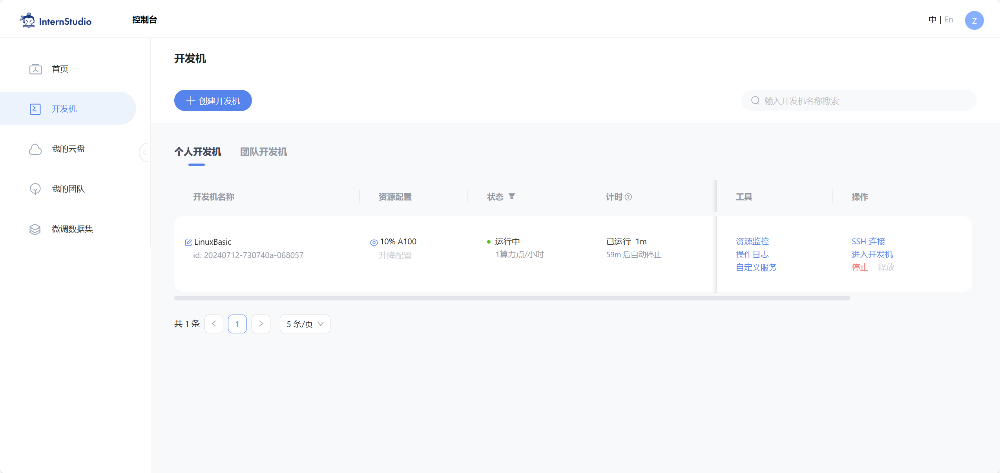
    <br/>
    <div class="caption" style="border-bottom: 1px solid #d9d9d9;
    display: inline-block;
    color: #999;
    padding: 2px;">图 1 创建开发机</div>
</div>

接着，点击 `进入开发机`，我们就能够进入 Web IDE，对开发机进行操作。开发机左上方为我们准备了三种不同的开发环境，从左到右依次为 `JupyterLab`、`Terminal`、`VSCode`。我们可以根据实际需求选择不同的开发环境。 此处我选择使用`VSCode`进行开发，如`图 2`所示。

<div class="image-box" style="text-align: center;" align="center">
    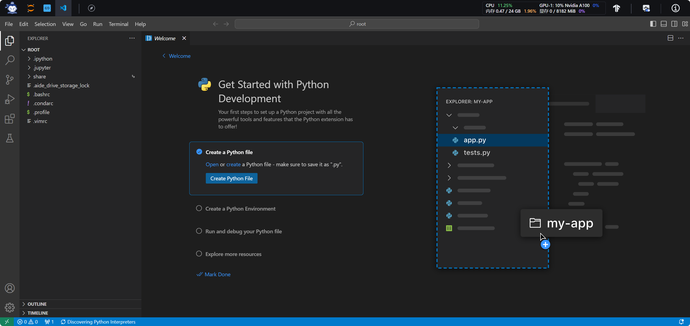
    <br/>
    <div class="caption" style="border-bottom: 1px solid #d9d9d9;
    display: inline-block;
    color: #999;
    padding: 2px;">图 2 进入开发机</div>
</div>

在`VSCode`中，我们可以在左侧的资源管理器中定位到根目录下，点击根目录左侧的 `New File`按钮，新建一个名为 `hello_world.py` 的文件，并编写代码，如`图 3`所示。代码如下：

<div class="image-box" style="text-align: center;" align="center">
    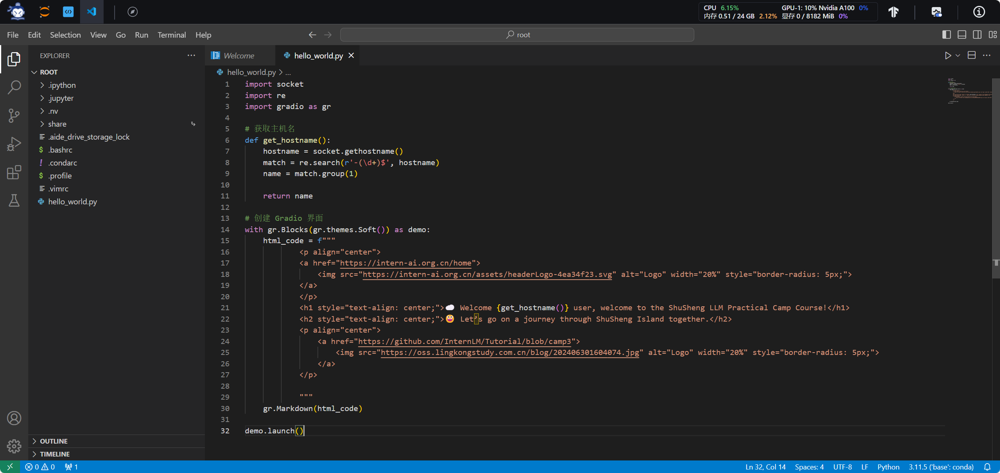
    <br/>
    <div class="caption" style="border-bottom: 1px solid #d9d9d9;
    display: inline-block;
    color: #999;
    padding: 2px;">图 3 新建文件</div>
</div>

```python
import socket
import re
import gradio as gr
 
# 获取主机名
def get_hostname():
    hostname = socket.gethostname()
    match = re.search(r'-(\d+)$', hostname)
    name = match.group(1)
    
    return name
 
# 创建 Gradio 界面
with gr.Blocks(gr.themes.Soft()) as demo:
    html_code = f"""
            <p align="center">
            <a href="https://intern-ai.org.cn/home">
                
            </a>
            </p>
            <h1 style="text-align: center;">☁️ Welcome {get_hostname()} user, welcome to the ShuSheng LLM Practical Camp Course!</h1>
            <h2 style="text-align: center;">😀 Let’s go on a journey through ShuSheng Island together.</h2>
            <p align="center">
                <a href="https://github.com/InternLM/Tutorial/blob/camp3">
                    
                </a>
            </p>

            """
    gr.Markdown(html_code)

demo.launch()
```

这份代码的功能是获取主机名，并在 Gradio 界面中展示欢迎词。在代码中，我们使用了 `socket`、`re`、`gradio` 等库，其中 `gradio` 是一个用于构建交互式机器学习界面的库。在代码的最后，我们使用 `demo.launch()` 方法启动 Gradio 界面，在后面，我们将会创建的界面的显示效果。

#### （2）配置SSH Key

在进行 SSH 连接之前，我们首先需要配置本地 SSH Key。打开本地个人电脑的终端，输入以下命令，生成 SSH Key。

```bash
ssh-keygen -t rsa
```

在生成 SSH Key 的过程中，我们可以选择是否设置密码，如果设置密码，那么在连接远程服务器时，需要输入密码。生成 SSH Key 后，我们可以在 `~/.ssh` 目录下找到生成的 SSH Key，其中 `id_rsa` 是私钥，`id_rsa.pub` 是公钥。 接着，我们通过以下命令查看公钥内容。

```bash
cat ~/.ssh/id_rsa.pub
```

创建 SSH Key 并查看到公钥如下`图 4`所示。

<div class="image-box" style="text-align: center;" align="center">
    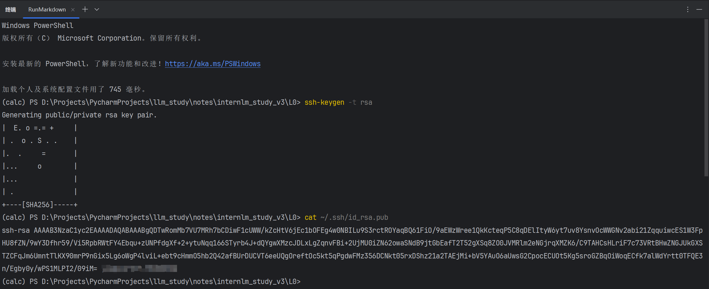
    <br/>
    <div class="caption" style="border-bottom: 1px solid #d9d9d9;
    display: inline-block;
    color: #999;
    padding: 2px;">图 4 生成SSH Key并查看公钥</div>
</div>

将公钥复制至剪切板，接着，我们需要将公钥添加至 InternStudio 的 SSH Key 中。在 InternStudio 中，点击左侧 `首页`，在首页中选择 `配置 SSH Key`，点击 `添加 SSH 公钥`，将刚刚复制的公钥粘贴至 `公钥` 一栏中，点击 `立即添加`，即可添加成功。

随后我们可以在 `SSH 公钥管理` 中看到我们刚刚添加的 SSH Key，如`图 5`所示。

<div class="image-box" style="text-align: center;" align="center">
    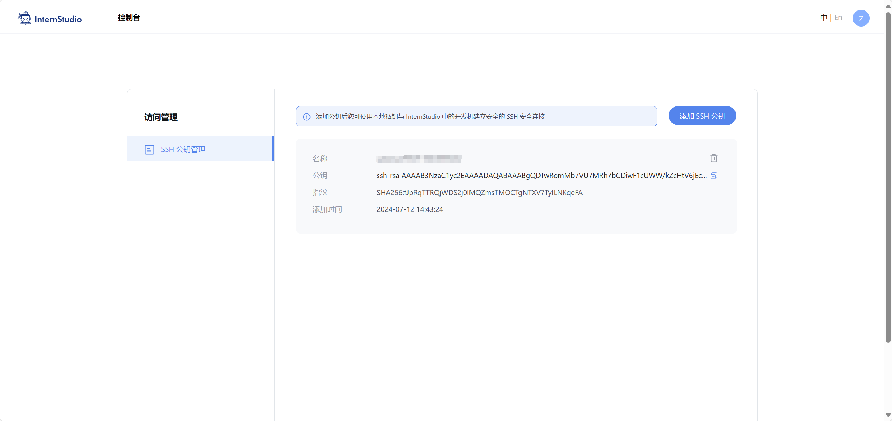
    <br/>
    <div class="caption" style="border-bottom: 1px solid #d9d9d9;
    display: inline-block;
    color: #999;
    padding: 2px;">图 5 添加SSH Key</div>
</div>

这样，我们就可以在本地电脑上使用 SSH Key 连接到 Linux 服务器了。

#### （3）使用SSH连接到Linux服务器

在本地电脑的终端中，输入以下命令，使用 SSH 连接到 Linux 服务器。

```bash
ssh -p {port} root@ssh.intern-ai.org.cn -o StrictHostKeyChecking=no -o UserKnownHostsFile=/dev/null
```

其中，`{port}` 是我们在 InternStudio 中创建的开发机的端口号，该端口号可在平台的开发机页面中的 `SSH 连接` 窗口中看到，如`图 6`所示。

<div class="image-box" style="text-align: center;" align="center">
    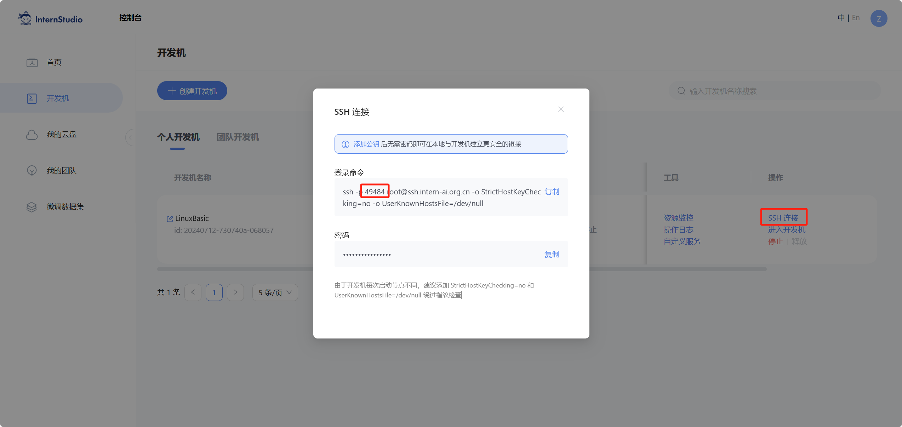
    <br/>
    <div class="caption" style="border-bottom: 1px solid #d9d9d9;
    display: inline-block;
    color: #999;
    padding: 2px;">图 6 查看端口号</div>
</div>


随后，我们便能够成功连接到 Linux 服务器，如`图 7`所示。

<div class="image-box" style="text-align: center;" align="center">
    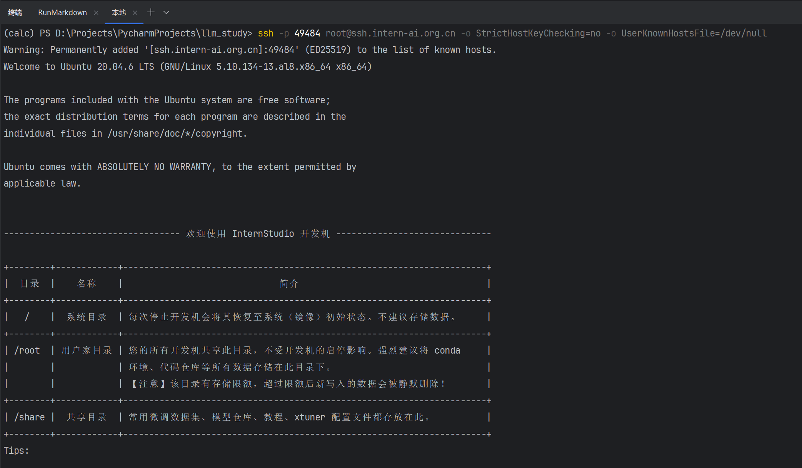
    <br/>
    <div class="caption" style="border-bottom: 1px solid #d9d9d9;
    display: inline-block;
    color: #999;
    padding: 2px;">图 7 SSH连接到Linux服务器</div>
</div>

#### （4）运行hello_world.py文件并完成端口映射

在连接到 Linux 服务器后，我们可以使用 `ls` 命令查看当前目录下的文件，使用 `cd` 命令切换目录。在本次任务中，我们需要运行 `hello_world.py` 文件，并完成端口映射。正常情况下，我们通过 `ls` 命令即可看到在根目录下创建的 `hello_world.py` 文件，则再使用以下命令完成相关配置并运行该文件，如所示。

```bash
pip install --upgrade pip && pip install gradio && python hello_world.py
```

一段时间以后，命令运行完成，我们可以看到输出的信息，如`图 8`所示。

<div class="image-box" style="text-align: center;" align="center">
    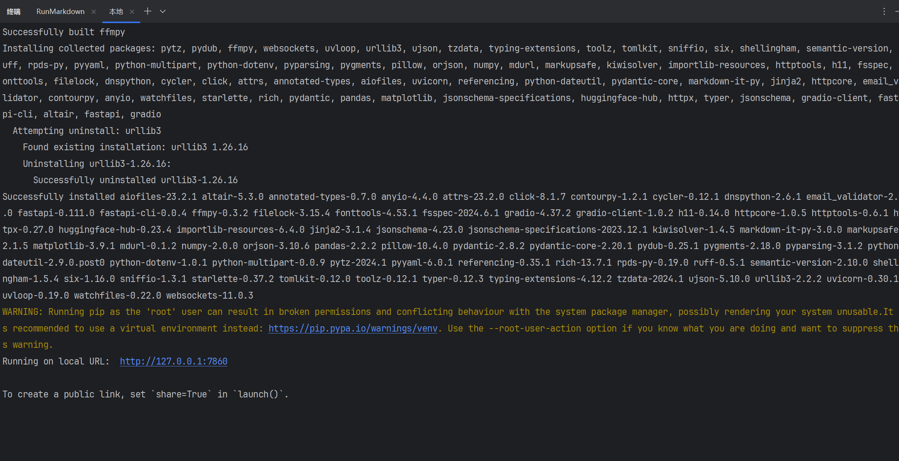
    <br/>
    <div class="caption" style="border-bottom: 1px solid #d9d9d9;
    display: inline-block;
    color: #999;
    padding: 2px;">图 8 安装hello_world.py依赖并运行</div>
</div>

接着，我们需要完成端口映射。打开本地电脑另一个终端，在终端中输入以下命令，使用 SSH 连接到 Linux 服务器。

```bash
ssh -p {port} root@ssh.intern-ai.org.cn -CNg -L 7860:127.0.0.1:7860 -o StrictHostKeyChecking=no
```

其中，`{port}` 是我们在 InternStudio 中创建的开发机的端口号。在本次任务中，我们需要将 Linux 服务器的 `7860` 端口映射到本地电脑的 `7860` 端口。运行命令后，本地的控制台将不产生任何输出，这时我们可以在本地浏览器中输入 `http://127.0.0.1:7860`，即可看到 Gradio 界面，如`图 9`所示。

<div class="image-box" style="text-align: center;" align="center">
    
    <br/>
    <div class="caption" style="border-bottom: 1px solid #d9d9d9;
    display: inline-block;
    color: #999;
    padding: 2px;">图 9 完成端口映射</div>
</div>

直接关闭本地终端即可停止SSH连接、端口映射。

本任务完成

---

### 2. 使用VSCode远程开发，创建并执行sh文件及conda环境配置

> - 任务描述：使用VSCode远程开发功能连接到Linux服务器，并配置conda环境。
> - 任务步骤：
>   1. 安装VSCode插件Remote - SSH
>   2. 配置SSH连接
>   3. 创建并运行conda换源test.sh文件
>   4. 配置conda环境
>   5. 分析并记录配置过程

VSCode是一款由微软开发的开源代码编辑器，支持 Windows、macOS 和 Linux 等操作系统。VSCode具有丰富的插件生态系统，可以满足不同用户的需求。VSCode还支持远程开发功能，可以通过SSH连接到远程服务器进行开发。在本次任务中，我们将使用VSCode远程开发功能连接到Linux服务器，并配置conda环境。

#### （1）安装VSCode插件Remote - SSH

首先我们在本地电脑上打开VSCode，点击左侧的扩展按钮，搜索 `Remote - SSH` 插件并安装，一段时间后安装完成，如`图 10`所示。

<div class="image-box" style="text-align: center;" align="center">
    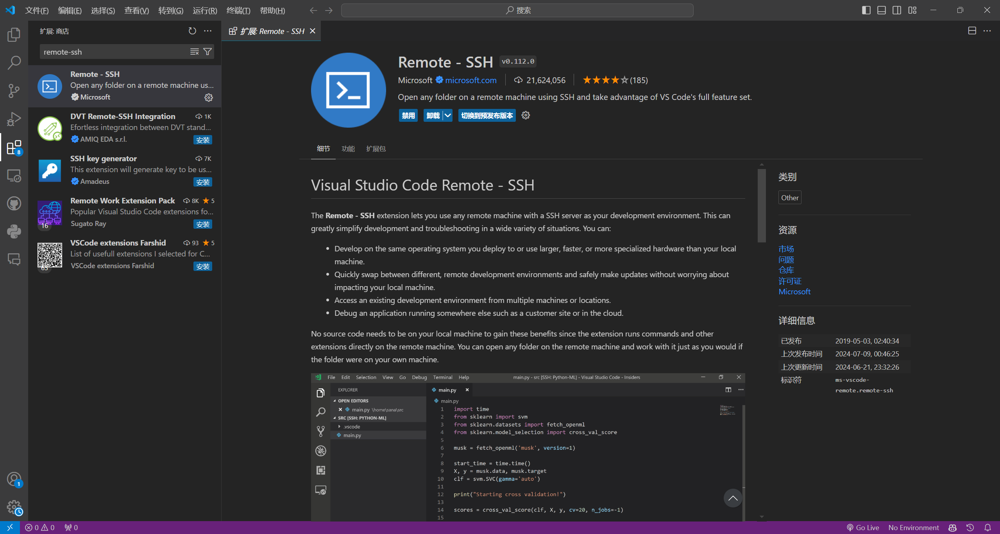
    <br/>
    <div class="caption" style="border-bottom: 1px solid #d9d9d9;
    display: inline-block;
    color: #999;
    padding: 2px;">图 10 安装Remote - SSH插件</div>
</div>

#### （2）配置SSH连接

接着，我们点击左侧的 `Remote Explorer（远程资源管理器）`，点击 `+` 按钮，选择 `Add New SSH Host（新建远程）`，在页面上方弹出的输入框中输入以下命令：

```bash
ssh -p {port} root@ssh.intern-ai.org.cn -o StrictHostKeyChecking=no -o UserKnownHostsFile=/dev/null
```

其中，`{port}` 是我们在 InternStudio 中创建的开发机的端口号。输入完成后按下键盘上的 `Enter` 键，并选择要更新的配置文件（以默认的第一个配置文件为例），随后便添加成功，在左侧的 `Remote Explorer（远程资源管理器）` 中可以看到我们刚刚添加的远程连接，如`图 11`所示。

<div class="image-box" style="text-align: center;" align="center">
    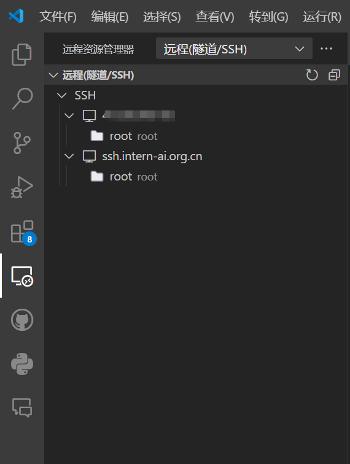
    <br/>
    <div class="caption" style="border-bottom: 1px solid #d9d9d9;
    display: inline-block;
    color: #999;
    padding: 2px;">图 11 添加远程连接</div>
</div>

选中刚刚添加的远程连接，点击 `Connect to Host（在当前窗口中连接）`，VSCode 将会自动连接到远程服务器。初次链接时，会在开发机中下载远程连接所需的缓存应用文件，此后再次连接时无须再次下载。连接成功后，我们可以在左下角的状态栏中看到当前连接的主机名，也能在左侧的资源管理器中看到开发机的文件目录，如`图 12`所示。

<div class="image-box" style="text-align: center;" align="center">
    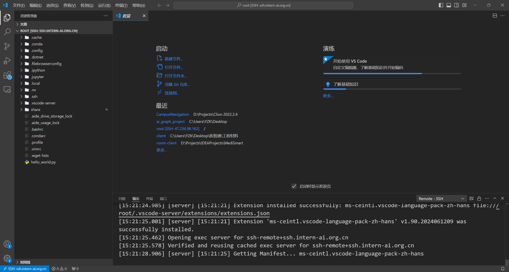
    <br/>
    <div class="caption" style="border-bottom: 1px solid #d9d9d9;
    display: inline-block;
    color: #999;
    padding: 2px;">图 12 连接到远程服务器</div>
</div>

#### （3）配置conda环境

接着，我们需要配置conda环境。在当前连接了远程开发机的VSCode中，点击顶部导航栏 `Terminal（终端）`，选择 `New Terminal（新建终端）`，在终端中输入以下命令，创建一个新的、基于 python3.10 的，名为 LinuxBasic 的 conda 环境。

```bash
conda create -n LinuxBasic python=3.10
```

确认环境创建，一段时间后，环境创建完成，如`图 13`所示。

<div class="image-box" style="text-align: center;" align="center">
    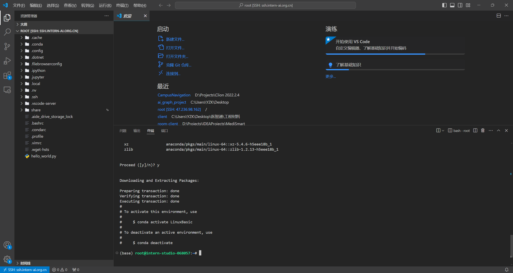
    <br/>
    <div class="caption" style="border-bottom: 1px solid #d9d9d9;
    display: inline-block;
    color: #999;
    padding: 2px;">图 13 创建conda环境</div>
</div>

接着，我们需要激活该环境，输入以下命令。

```bash
conda activate LinuxBasic
```

激活环境后，我们可以在终端中看到环境名前的 `(LinuxBasic)`，表示环境已经激活，如`图 14`所示。

<div class="image-box" style="text-align: center;" align="center">
    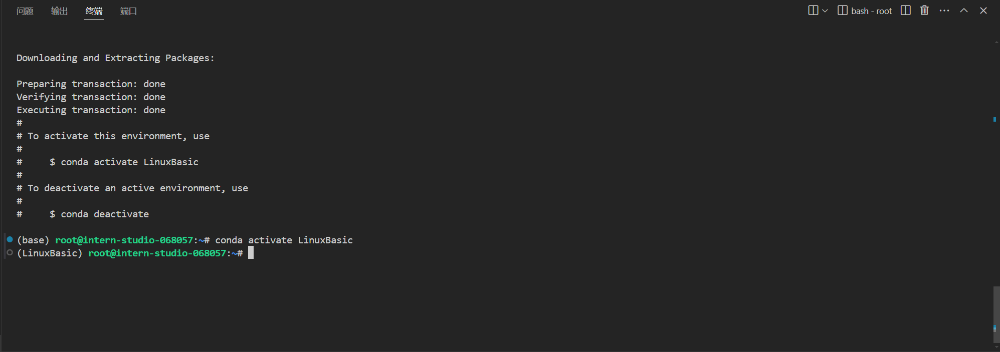
    <br/>
    <div class="caption" style="border-bottom: 1px solid #d9d9d9;
    display: inline-block;
    color: #999;
    padding: 2px;">图 14 激活conda环境</div>
</div>

至此，我们已经成功使用VSCode远程开发功能连接到Linux服务器，并配置了conda环境。

本任务完成

---

### 3. 创建并运行test.sh文件

> - 任务描述：在Linux服务器上创建一个名为test.sh的Shell脚本文件，并运行该文件。
> - 任务步骤：
>   1. 创建test.sh文件
>   2. 编写Shell脚本
>   3. 运行test.sh文件
>   4. 分析并记录运行结果

sh文件是一种文本文件，其中包含一系列的命令，可以在Linux系统中运行。在本次任务中，我们需要在Linux服务器上创建一个名为test.sh的Shell脚本文件，并运行该文件。下文将详细讲述完成该任务应当执行的步骤。

在本次任务中，我们需要在 Linux 服务器上创建一个名为 `test.sh` 的 Shell 脚本文件，并运行该文件。在 VSCode 中连接到远程服务器后，我们需要创建一个名为 `test.sh` 的 Shell 脚本文件，用于更换 conda 源。在 VSCode 中，点击左侧的资源管理器，选择根目录，点击根目录左侧的 `New File（新建文件）` 按钮，新建一个名为 `change_conda_source.sh` 的文件，并编写以下内容。

```bash
#设置清华镜像
conda config --add channels https://mirrors.tuna.tsinghua.edu.cn/anaconda/pkgs/main
conda config --add channels https://mirrors.tuna.tsinghua.edu.cn/anaconda/pkgs/free
conda config --add channels https://mirrors.tuna.tsinghua.edu.cn/anaconda/pkgs/r
conda config --add channels https://mirrors.tuna.tsinghua.edu.cn/anaconda/pkgs/pro
conda config --add channels https://mirrors.tuna.tsinghua.edu.cn/anaconda/pkgs/msys2
conda config --set show_channel_urls yes
conda config --show
```

在文件中，我们使用 `conda config` 命令更换 conda 源为清华镜像。在文件编写完成后，我们需要保存文件。点击顶部导航栏的 `File（文件）`，选择 `Save（保存）`，保存文件；也可以通过键盘快捷键 `Ctrl + S` 保存文件。保存文件后，我们需要在终端中运行该文件。在终端中输入以下命令，运行 `test.sh` 文件。

```bash
bash test.sh
```

一段时间后程序运行完成，并在终端中输出了换源结果，如`图 15`所示。

<div class="image-box" style="text-align: center;" align="center">
    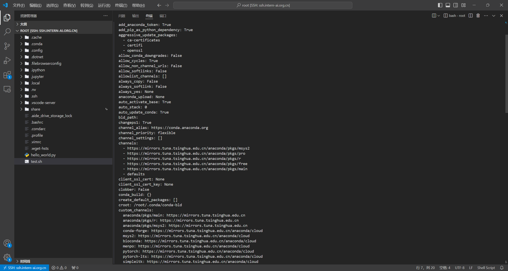
    <br/>
    <div class="caption" style="border-bottom: 1px solid #d9d9d9;
    display: inline-block;
    color: #999;
    padding: 2px;">图 15 运行test.sh文件</div>
</div>

至此，我们已经成功创建并运行了 `test.sh` 文件。

本任务完成

---

## 总结

本次实战营的学习内容主要包括了 Linux 基础知识，以及在 Linux 服务器上的操作。在本次实战营中，我们学习了如何使用 SSH 连接到 Linux 服务器，如何使用 VSCode 远程开发功能连接到 Linux 服务器，以及如何在 Linux 服务器上创建并运行 Shell 脚本文件。通过本次实战营的学习，我们对 Linux 系统有了更深入的了解，也掌握了一些在 Linux 服务器上的操作技巧。

## 参考资料

- [书生大模型实战营「第3期」学员闯关手册 - 飞书云文档](https://aicarrier.feishu.cn/wiki/XBO6wpQcSibO1okrChhcBkQjnsf)
- [书生大模型实战营「第3期」第1关 Linux 基础知识任务](https://github.com/InternLM/Tutorial/blob/camp3/docs/L0/Linux/task.md)
- [书生大模型实战营「第3期」第1关 Linux 基础知识文档](https://github.com/InternLM/Tutorial/blob/camp3/docs/L0/Linux/readme.md)
