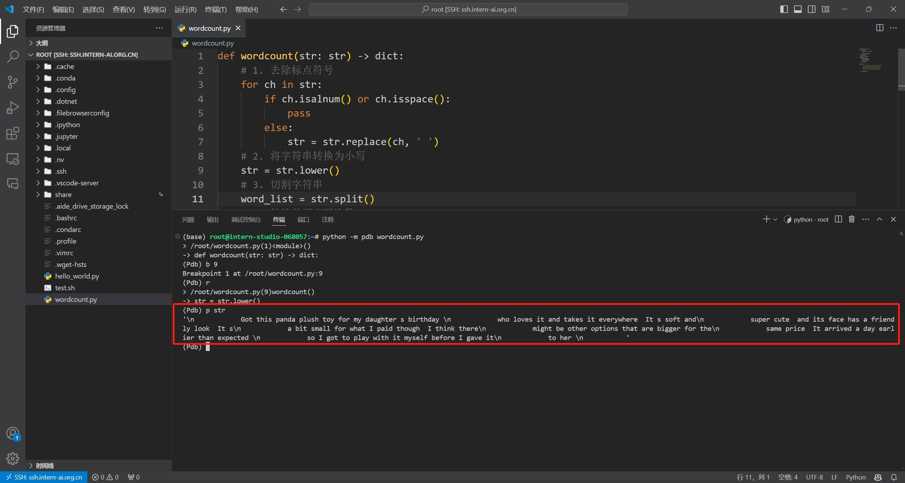
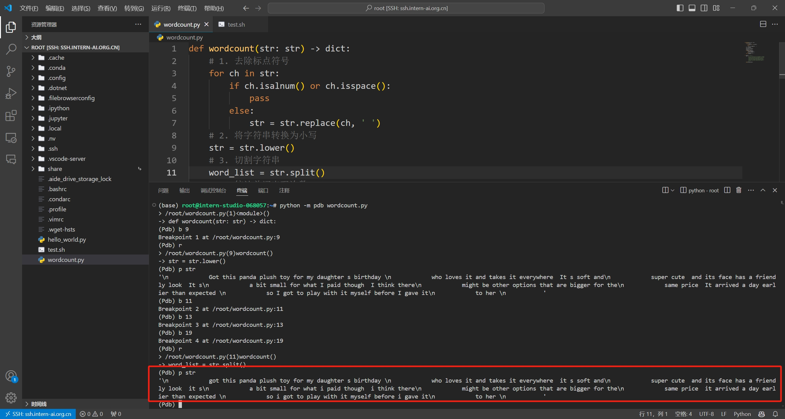
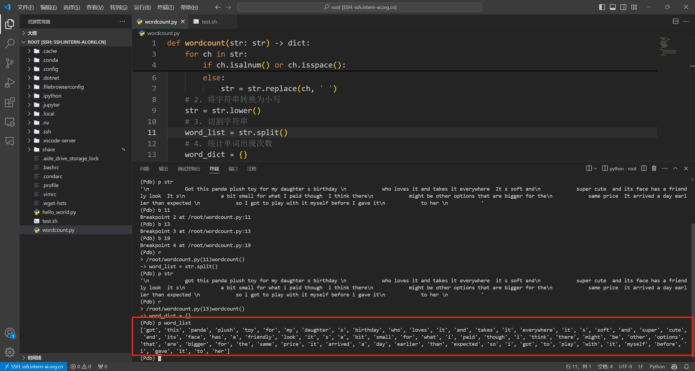
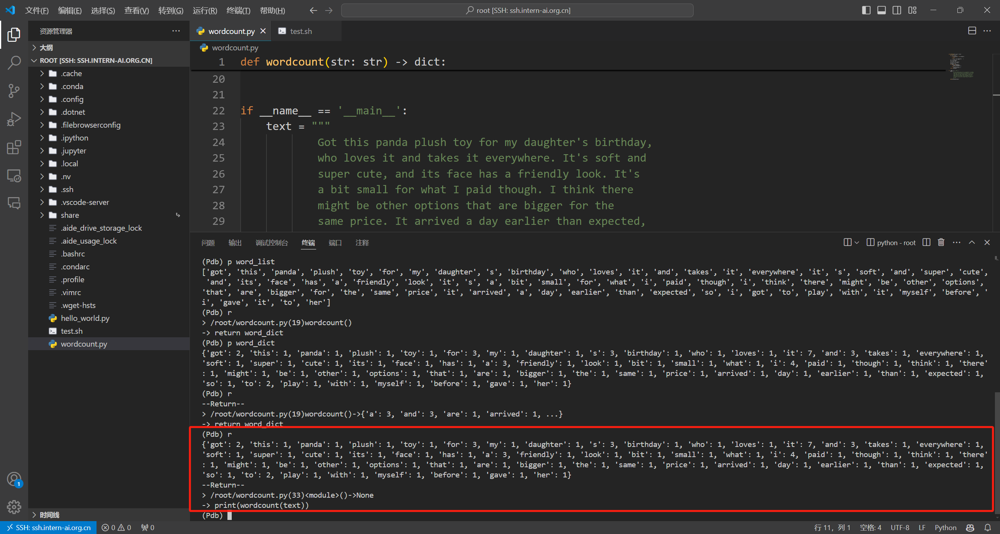

<div style="border-bottom: 4px solid black; width: 100%; box-sizing: border-box; text-align: center; padding-top: 0.1rem; color: rgb(99,108,118)" align="center">
    <h1>书生大模型实战营「第3期」学员笔记<br/><span style="font-style: italic">入门岛 - Python 基础知识</span></h1>
</div>
<div style="text-align: center;" align="center">
    笔记记录人：ZK-Jackie&nbsp;&nbsp;&nbsp;&nbsp;&nbsp;&nbsp;笔记记录时间：2024.7.12
</div>

## 目录

- 前言
  1. python
  2. python 特点与前景
- 闯关任务
  1. Python 实现 wordcount
  2. VSCode 连接 InternStudio debug 笔记
- 总结
- 参考资料

## 前言

### 1. python

Python 是一种广泛使用的高级编程语言，以其清晰的语法和代码可读性而闻名。它由 Guido van Rossum 于 1989 年发明，并于 1991 年发布了第一个版本。Python 设计哲学强调代码的简洁性和可读性，支持多种编程范式，包括面向对象、命令式、函数式和过程式编程。

Python 自 1991 年发布的 Python 1.x 至今已有二十余年，当下最新的、最主要的版本为 2008 年首次发布的 Python 3.x。Python 3.x 不完全向后兼容以前的版本，引入了许多重大改进和新特性，如改进的字符串处理、新的语法特性（例如函数注解）、改进的整数除法等，其的目标是使 Python 语言更加一致和清晰。

Python 的设计和发展受到了其社区的强烈支持。Python 软件基金会（Python Software Foundation, PSF）是一个领导 Python 开发和社区活动的非营利组织。随着时间的推移，Python 已经成为了世界上最受欢迎的编程语言之一，广泛应用于 Web 开发、数据科学、人工智能、科学计算、自动化脚本等多个领域。

### 2. python特点与前景

Python 语言简洁明了，代码可读性强，使得开发者能够用更少的代码实现功能强大的应用；且具有强大的跨平台性，可以在多种操作系统上运行，如 Windows、Linux 和 Mac OS 等，具有很好的移植性；它作为一种解释型语言，无需编译即可直接运行，有利于快速开发；Python 是动态类型语言，变量无需显式声明类型，在运行时会自动确定类型；Python 还拥有庞大的标准库和第三方库，涵盖网络、文件、GUI、数据库、文本处理等多个领域，极大地丰富了 Python 的应用场景；Python 既支持面向对象编程，也支持过程式和函数式编程，使得 Python 在不同的应用场景下都能够灵活应用。

Python在大型语言模型（LLM）的发展中扮演着至关重要的角色，其快速原型开发能力、强大的数据处理能力、深度学习框架支持、活跃的社区和生态以及跨领域应用的特性，使得Python成为LLM研究和开发的首选语言。特别是NumPy、Pandas等库的支持，为LLM的数据预处理和分析提供了极大的便利，而TensorFlow、PyTorch等深度学习框架的广泛应用，则进一步推动了LLM技术的快速进步和广泛应用。

## 闯关任务

### 1. Python实现wordcount

> - 任务描述：实现一个wordcount函数，统计英文字符串中每个单词出现的次数。返回一个字典，key为单词，value为对应单词出现的次数。
> - 示例输入：
> ```python
> """Hello world!  
> This is an example.  
> Word count is fun.  
> Is it fun to count words?  
> Yes, it is fun!"""
> ``` 
> - 示例输出：
> ```python
> {'hello': 1,'world!': 1,'this': 1,'is': 3,'an': 1,'example': 1,'word': 1, 
> 'count': 2,'fun': 1,'Is': 1,'it': 2,'to': 1,'words': 1,'Yes': 1,'fun': 1  }
> ```
> - 实现提示：记得先去掉标点符号，然后把每个单词转换成小写。不需要考虑特别多的标点符号，只需要考虑实例输入中存在的就可以。

通过分析需要实现的效果，程序主要需要按顺序实现以下几点：

1. 替换字符串中的标点符号
2. 将字符串中的每个字符转换成小写
3. 根据空格或空白字符分隔字符串
4. 统计每个单词出现频次

对于字符串中的标点符号，可使用循环语句，遍历字符串中的每一个字符，利用字符串的 `isalnum()` 方法，判断当前字符是否为标点符号，若是则将当前字符替换为空格，代码如下：

```python
for ch in text:
    if ch.isalnum() or ch.isspace():
        pass
    else:
        text = text.replace(ch, ' ')
```

对于字符串中的字符，可使用字符串的 `lower()` 方法将每个字符都转换成小写，代码如下：

```python
text = text.lower()
```

对于字符串的分隔，可使用字符串的 `split()` 方法。`split()` 方法默认就按照空格或空白字符分隔字符串，则无须提供额外参数，代码如下：

```python
words = text.split()
```

最后便可进行词频统计。对于统计单词频次，可使用字典存储单词和频次——遍历分隔后的单词列表，若当前字典中含该单词，则对应的计数值加一；若不含，则将该单词添入到字典中，并置其值为一，从而实现每个单词出现次数的统计，代码如下：

```python
word_dict = {}
for word in words:
    if word in word_dict:
        word_dict[word] += 1
    else:
        word_dict[word] = 1
```

最后，将记录了统计结果的字典返回，输出，便能得所求结果。整体代码如下：
```python
def wordcount(str: str) -> dict:
    # 1. 去除标点符号
    for ch in str:
        if ch.isalnum() or ch.isspace():
            pass
        else:
            str = str.replace(ch, ' ')
    # 2. 将字符串转换为小写
    str = str.lower()
    # 3. 切割字符串
    word_list = str.split()
    # 4. 统计单词出现次数
    word_dict = {}
    for word in word_list:
        if word in word_dict:
            word_dict[word] += 1
        else:
            word_dict[word] = 1
    return word_dict


if __name__ == '__main__':
    text = """
            Got this panda plush toy for my daughter's birthday,
            who loves it and takes it everywhere. It's soft and
            super cute, and its face has a friendly look. It's
            a bit small for what I paid though. I think there
            might be other options that are bigger for the
            same price. It arrived a day earlier than expected,
            so I got to play with it myself before I gave it
            to her.
           """
    print(wordcount(text))
```

创建 python 文件，将上述代码输入到文件中，在同一路径下打开终端，输入下面的命令运行程序，即可得到输出结果：

```bash
python wordcount.py
```

本次任务完成。

---

### 2. VSCode连接InternStudio debug笔记

> - 任务描述：使用本地VSCode连接远程开发机，将上面你写的wordcount函数在开发机上进行debug，体验debug的全流程，并完成一份debug笔记(需要截图)。
> - 任务步骤：
>   1. 在本地VSCode中使用 Remote-SSH 插件，连接远程开发机；
>   2. 在远程开发机中编写测试写的带有 wordcount 函数的 python 程序；

打开本地电脑的 VSCode，利用 Remote - SSH 插件连接远程开发机（详细步骤可参考 [入门岛 - Linux 基础知识](./1.md)），在远程开发机中创建一个新的 python 文件，将[1. Python实现wordcount](#1-python实现wordcount)中实现的内容复制到该文件中，并在终端中输入以下命令，调试该文件：

```bash
python -m pdb wordcount.py
```

在调试过程中，可以使用 `l` 命令查看当前代码的位置，使用 `n` 命令执行下一行代码，使用 `c` 命令继续执行代码，使用 `q` 命令退出调试，使用 `p` 命令打印变量的值，使用 `b` 命令设置断点，使用 `s` 命令逐步执行代码等，以便更好地调试代码。

每一关键环节的相关变量的调试结果如下所示：

1. 替换字符串中的标点符号：

<div class="image-box" style="text-align: center;" align="center">
    
    <br/>
    <div class="caption" style="border-bottom: 1px solid #d9d9d9;
    display: inline-block;
    color: #999;
    padding: 2px;">图 1 替换字符串中的标点符号</div>
</div>

2. 将字符串中的每个字符转换成小写：

<div class="image-box" style="text-align: center;" align="center">
    
    <br/>
    <div class="caption" style="border-bottom: 1px solid #d9d9d9;
    display: inline-block;
    color: #999;
    padding: 2px;">图 2 将字符串中的每个字符转换成小写</div>
</div>

3. 根据空格或空白字符分隔字符串：

<div class="image-box" style="text-align: center;" align="center">
    
    <br/>
    <div class="caption" style="border-bottom: 1px solid #d9d9d9;
    display: inline-block;
    color: #999;
    padding: 2px;">图 3 根据空格或空白字符分隔字符串</div>
</div>

4. 最终运行结果：

<div class="image-box" style="text-align: center;" align="center">
    
    <br/>
    <div class="caption" style="border-bottom: 1px solid #d9d9d9;
    display: inline-block;
    color: #999;
    padding: 2px;">图 4 最终运行结果</div>
</div>

最后，可以输入 `q` 命令退出调试，或输入 `Ctrl + D` 终止调试。

本次任务完成。

---

## 总结

本次任务主要是实现了一个 Python 函数，用于统计英文字符串中每个单词出现的次数，并通过 VSCode 连接远程开发机，体验了 debug 的全流程。在任务实现过程中，主要涉及到字符串的处理、单词的分割和统计等操作，通过这些操作，可以更好地理解 Python 的基础知识。

## 参考资料

- [Python 官方文档](https://docs.python.org/zh-cn/3/)
- [书生大模型实战营「第3期」学员闯关手册 - 飞书云文档](https://aicarrier.feishu.cn/wiki/XBO6wpQcSibO1okrChhcBkQjnsf)
- [书生大模型实战营「第3期」第2关 Python 基础知识任务](https://github.com/InternLM/Tutorial/blob/camp3/docs/L0/Python/task.md)
- [书生大模型实战营「第3期」学员笔记 - 入门岛 - Linux 基础知识](./1.md)