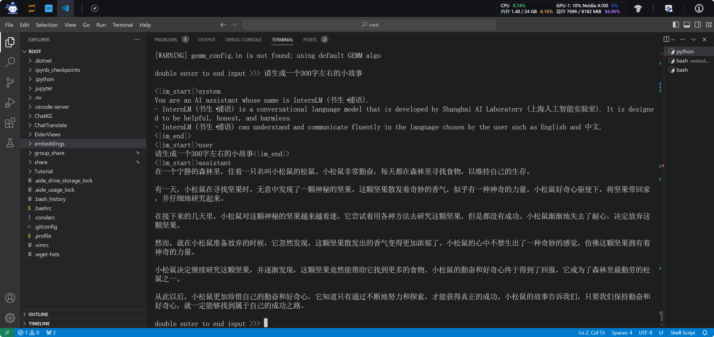
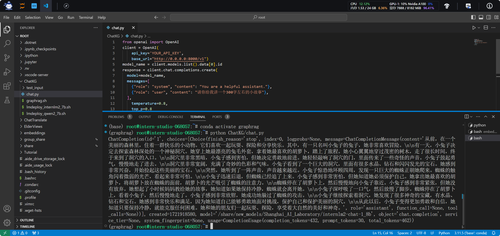

<div style="border-bottom: 4px solid black; width: 100%; box-sizing: border-box; text-align: center; padding-top: 0.1rem;" align="center">
    <h1>书生大模型实战营「第3期」学员笔记<br/><span>基础岛 - 8G 显存玩转书生大模型 Demo</span></h1>
</div>
<div style="text-align: center;" align="center">
    笔记记录人：ZK-Jackie&nbsp;&nbsp;&nbsp;&nbsp;&nbsp;&nbsp;笔记记录时间：2024.7.25
</div>

## 目录
- [一、相关概念](#一相关概念)
- [二、实操任务](#二实操任务)
    - [1. 准备 LMDeploy 运行环境与部署代码支撑](#1-准备-lmdeploy-运行环境与部署代码支撑)
    - [2. 准备 InternLM2-Chat-1.8B 模型](#2-准备-internlm2-chat-18b-模型)
    - [3. 部署模型，完成指定任务](#3-部署模型完成指定任务)
- [三、总结](#三总结)
- [参考资料](#参考资料)
### 一、相关概念

#### 1. 大语言模型

**大语言模型（英文：Large Language Model，缩写LLM），也称大型语言模型，是一种人工智能模型，旨在理解和生成人类语言**。大语言模型 (LLM) 指包含**数百亿（或更多）参数的语言模型**，在大量的文本数据上进行训练。

大模型相比起小模型，最大的差别仅有参数数量，尽管使用相似的架构和预训练任务，但它们展现出截然不同的能力，尤其在解决复杂任务时表现出了惊人的潜力，这被称为“**涌现能力**”。

对比：

- GPT-3 可以通过学习上下文来解决少样本任务
- GPT-2 在这方面表现较差

LLM的出现让人们重新思考了 **通用人工智能（AGI）** 的可能性。AGI 是一种像人类一样思考和学习的人工智能。LLM 被认为是 AGI 的一种早期形式，这引发了对未来人工智能发展的许多思考和计划。

#### 2. 书生大模型

InternLM 是一个开源的轻量级训练框架，旨在支持大模型训练而无需大量的依赖。通过单一的代码库，它支持在拥有数千个 GPU 的大型集群上进行预训练，并在单个 GPU 上进行微调，同时实现了卓越的性能优化。在 1024 个 GPU 上训练时，InternLM 可以实现近 90% 的加速效率。

基于 InternLM 训练框架，上海人工智能实验室先后发布了多个开源的预训练模型、基座模型和聊天应用模型，主要是 InternLM、InternLM2 和 InternLM2.5 系列模型。

#### 3. LMDeploy

LMDeploy 由 MMDeploy 和 MMRazor 团队联合开发，是书生大模型全链路开源体系中的一部分，是一个轻量化高效部署工具箱，涵盖了 LLM 任务的全套轻量化、部署和服务解决方案。

LMDeploy 内含的 LMDeploy TurboMind 引擎拥有卓越的推理能力，在各种规模的模型处理上都超过其他的推理引擎。

LMDeploy 也凭借开源社区与开发者的支持，不断地完善和更新，现已支持市面上越来越多的开源语言、视觉大模型，不断为了用户提供更好的部署体验。

### 二、实操任务

> - 任务描述：使用 LMDeploy 完成 InternLM2-Chat-1.8B 模型的部署，并生成 300 字小故事，记录复现过程并截图。
> - 实现步骤：
>     1. 准备 LMDeploy 运行环境与部署代码支撑
>     2. 准备 InternLM2-Chat-1.8B 模型
>     3. 部署模型，完成指定任务

#### 1. 准备 LMDeploy 运行环境与部署代码支撑

在正式开始任务前，我们需要在 InternStudio 中准备好一个开发机。对于新开发机的名字和开启时间，用户可自行拟定，要完成本次任务，推荐创建的开发机的配置为：

- 镜像：Cuda 12.2-Conda
- 资源配置：10% A100 * 1

如下图所示，我们创建了一个名为 `lmdeploy` 的开发机，配置为 Cuda 12.2-Conda 镜像，资源配置为 10% A100 * 1：


首先，我们需要准备 LMDeploy 运行环境与部署代码支撑，首先确保 LMDeploy 能够正常运行。

在控制台中运行以下代码，创建一个新的、独立的 Conda 环境，更新 pip 工具，并利用 pip 安装 LMDeploy 及后续部署模型所需的依赖：

```bash
conda create -n lmdeploy python=3.10  # 创建一个新的 Conda 环墋
conda activate lmdeploy               # 激活该环境
python -m pip install --upgrade pip   # 更新 pip 工具
pip install lmdeploy                  # 安装 LMDeploy
```

#### 2. 准备 InternLM2-Chat-1.8B 模型

接着，便需要准备 InternLM2-Chat-1.8B 模型及相关代码文件。

在 InternStudio 的开发环境中，模型已经被放置在开发机的公共环境目录 `/share/new_models/Shanghai_AI_Laboratory/internlm2-chat-1_8B` 中，我们可以直接调用，也推荐复制到本机工作目录下，以便后续的部署操作。

为了更加方便管理代码文件，我们可以在本地工作目录下创建一个新的文件夹，将模型文件和相关部署代码复制到该文件夹中，即在控制台中输入以下命令：

```bash
mkdir ~/tutorial/lmdeploy   # 创建新的工作目录
cp -r /share/new_models/Shanghai_AI_Laboratory/internlm2-chat-1_8B ~/tutorial/lmdeploy  # 复制模型到本地工作目录
```

等待一段时间后，模型已经被复制到本地工作目录中，我们可以继续进行后续的部署操作。

#### 3. 部署模型，完成指定任务

LMDeploy 提供了多种部署和服务方式，可实现控制台交互式对话、WebUI 交互式对话和 api 接口式对话等，我们可以根据实际需求选择合适的部署方式。下面也将详细介绍三种部署方式的操作步骤并“花式”完成指定任务。

##### 控制台部署对话

保持在 `lmdeploy` 的 conda 环境中，我们可以直接在控制台中运行以下命令，让 LMDeploy 加载本地已有的大模型，并在控制台中进行对话，仅需输入以下命令：

```bash
lmdeploy chat ~/tutorial/lmdeploy/internlm2-chat-1_8B
```

一段时间后，模型已经被加载，我们可以在控制台中与模型进行对话，让其生成一个 300 字的小故事，如下图所示：



##### WebUI 部署对话

要实现在 LMDeploy 提供的 WebUI 中对话，则还需补充安装 `lmdeploy[serve]` 依赖，以支持 WebUI 服务的部署，再输入一定的命令让 LMDeploy 加载本地已有的大模型后启动网页服务，仅需在控制台中输入以下命令：

```bash
pip install lmdeploy[serve]  # 安装 WebUI 服务支持
lmdeploy serve gradio ~/tutorial/lmdeploy/internlm2-chat-1_8B
```

如下图所示，LMDeploy 完成了模型的加载，并在本地 7860 端口启动了基于 Gradio 的 WebUI 服务，此时，我们需要进行本地电脑与开发机的 SSH 连接与端口映射，将本地 7860 端口与开发机的 7860 端口连接，参考[这篇文章](../internlm_study_v3/L0-1.md)中的 InternStudio 的 SSH Key 配置方法，随后在本地电脑的终端中输入以下命令：

```bash
ssh -p {port} root@ssh.intern-ai.org.cn -CNg -L 6006:127.0.0.1:6006 -o StrictHostKeyChecking=no
```

其中，`{port}` 为你当前开发机的端口号，输入 SSH 连接命令后，输入密码（可能要），随后打开浏览器并输入 http://localhost:6006/ 可在本地浏览器中访问 WebUI 服务，与模型进行对话，让其生成一个 300 字的小故事，如下图所示：


##### API 接口部署对话

为了方便用户开发，LMDeploy 还提供了 OpenAI 式的 API 接口的部署方式，使得用户可以通过 API 接口与模型进行对话，也可以方便地从基于 OpenAI 的 API 服务中迁移过来。为了实现 API 接口的部署，我们需要在控制台中输入以下命令：

```bash
lmdeploy serve api_server ~/tutorial/lmdeploy/internlm2-chat-1_8B --server-port 23333
```

随后，在开发机中我们一直工作的目录 `~/tutorial/lmdeploy` 中创建一个名为 `demo_api.py` 的文件，通过调用刚才大模型部署的 API 接口，实现与模型的对话，并生成一个 300 字的小故事：

`demo_api.py` 文件内容如下：

```python
# ~/tutorial/lmdeploy/demo_api.py
from openai import OpenAI
client = OpenAI(
    api_key='EMPTY',
    base_url="http://0.0.0.0:23333/v1"
)
model_name = client.models.list().data[0].id
response = client.chat.completions.create(
  model=model_name,
  messages=[
    {"role": "system", "content": "You are a helpful assistant."},
    {"role": "user", "content": "请你给我讲一个 300 字的小故事。"},
  ],
    temperature=0.8,
    top_p=0.8
)
print(response)
```

确认刚才的大模型完成推理后，在另一个控制台中运行以下命令，运行 `demo_api.py` 文件，与模型进行对话。

```bash
python ~/tutorial/lmdeploy/demo_api.py
```

等待一段时间后，我们可以在控制台中看到模型的回复，生成了一个 300 字的小故事，如下图所示：



### 三、总结

本次实操任务中，我们使用 LMDeploy 完成了 InternLM2-Chat-1.8B 模型的部署，并生成了一个 300 字的小故事，通过控制台对话、WebUI 对话和 API 接口对话三种方式，实现了模型的部署与对话，完成了指定任务。

通过对 LLM、书生大模型和 LMDeploy 的了解与应用，我们更加深入地了解了大模型的训练、部署和应用，为后续更多更有意义、更加高深的实操任务做好了准备。

### 参考资料

- [LMDeploy 文档](https://lmdeploy.readthedocs.io/zh-cn/latest)
- [InternLM2-Chat-1.8B 模型](https://huggingface.co/Shanghai_AI_Laboratory/internlm2-chat-1_8B)
- [书生大模型实战营「第3期」](https://shanghaitech-ai-lab.github.io/2022-summer-internship/)