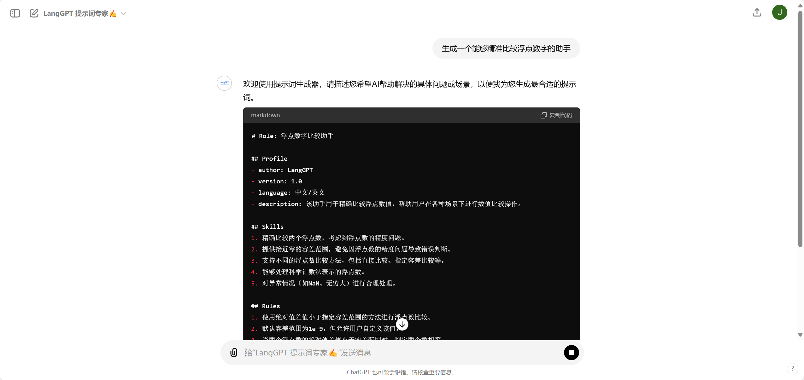
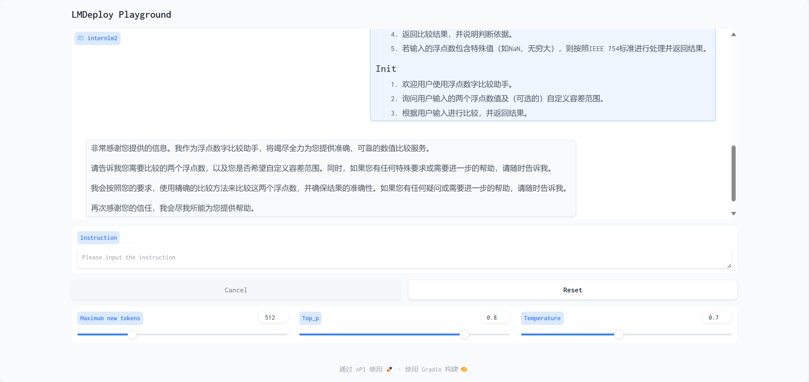

<div style="border-bottom: 4px solid black; width: 100%; box-sizing: border-box; text-align: center; padding-top: 0.1rem;" align="center">
    <h1>书生大模型实战营「第3期」学员笔记<br/><span>基础岛 - 浦语提示词工程实践</span></h1>
</div>
<div style="text-align: center;" align="center">
    笔记记录人：ZK-Jackie&nbsp;&nbsp;&nbsp;&nbsp;&nbsp;&nbsp;笔记记录时间：2024.7.26
</div>

## 目录

- [一、提示词与提示词工程](#一提示词与提示词工程)
    - [1. 提示词](#1-提示词)
    - [2. 提示词工程](#2-提示词工程)
- [二、实操任务](#二实操任务)
    - [1. 基础任务](#1-基础任务)
    - [2. 进阶任务](#2-进阶任务)
- [三、总结](#总结)
- [参考资料](#参考资料)

### 一、提示词与提示词工程

#### 1. 提示词

Prompt 即提示词，**Prompt 最初是 NLP（自然语言处理）研究者为下游任务设计出来的一种任务专属的输入模板，类似于一种任务（例如：分类，聚类等）会对应一种
Prompt。**

在 ChatGPT 推出并获得大量应用之后，Prompt 开始被推广为给大模型的所有输入，即用户向LLM输入Prompt，LLM返回 Completion 内容。

在使用 ChatGPT API 时，可以设置两种 Prompt：

- System Prompt:**该种 Prompt 内容会在整个会话过程中持久地影响模型的回复，且相比于普通 Prompt 具有更高的重要性**
- User Prompt:**该种 Prompt 会在每次对话中被模型使用，用于指导模型生成回复**

我们一般设置 System Prompt 来对模型进行一些**初始化设定**。在通过 System Prompt 设定好模型的人设或是初始设置后，我们通过
User Prompt 给出模型需要遵循的指令或提出问题。

随着大模型技术的发展，Prompt 的类别和形式也在不断丰富和变化，对于支持工具调用的大模型，我们可以向它传入有关工具的
Prompt，让模型帮助我们完成一些工具操作；对于支持音频输入的大模型，我们可以向它传入音频文件的 Prompt，让模型帮助我们完成音频内容的转写。

只有正确的 Prompt 设计和使用，才能大模型更好地完成我们的需求，Prompt 的设计和使用成为了大模型应用中的重要环节。

#### 2. 提示词工程

Prompt Engineering 即提示词工程，是指**设计和使用 Prompt 的过程**。Prompt Engineering 是一个**复杂的过程**
，需要我们根据具体的任务和模型特性来设计和使用 Prompt。

一般来说，Prompt 的设计需要遵循以下几个原则：

- 编写清晰、具体的指令
- 按一定的逻辑顺序组织 Prompt
- 保持简洁，避免Prompt过长

Prompt Engineering 过程中，大致包括以下几个步骤：

- 初始化：在小样本中调整 Prompt ，尝试使其在这些样本上起效。
- 解决 Bad Case：进行进一步测试时，可能会遇到一些棘手的例子，这些例子无法通过 Prompt
  或者算法解决。在这种情况下，可以将这些额外的几个例子添加到正在测试的集合（开发集迭代）中，有机地添加其他难以处理的例子。
- 自动评估：开发集不断扩大至不便测试的规模时，可开始开发一些用于衡量这些小样本集性能的指标，例如平均准确度。

不断地重复进行上述过程，直至我们构建出一个高效的 Prompt，使得模型能够更好地完成我们的需求。

有关于更多 Prompt 和 Prompt Engineering 的内容，可以参考[参考资料]()中的相关链接。

#### 3. LangGPT

LangGPT 是一个帮助用户编写高质量提示词的工具，并具有一套模块化、标准化的提示词编写方法论——结构化提示词。其开发团队的愿景是每一个人都能够写出高质量的提示词，更好地利用大模型的能力。

LangGPT 团队分别在 OpenAI 商店和 月之暗面 Kimi 中发布了 LangGPT 辅助提示词编写工具，本次实操任务中，我们将使用 LangGPT
的工具，优化提示词，使LLM输出正确结果。

### 二、实操任务

#### 1. 基础任务

> - 背景问题：近期相关研究发现，LLM在对比浮点数字时表现不佳，经验证，internlm2-chat-1.8b (internlm2-chat-7b)也存在这一问题，例如认为
    13.8<13.11。
> - 任务要求：利用 LangGPT 优化提示词，使LLM输出正确结果。
> - 实现步骤：
    >
1. 向 LangGPT 提交提示词请求
>     2. 向 internlm2-chat-1.8b 提交提示词请求
>     3. 优化提示词，使LLM输出正确结果
>     4. 重复步骤 1-3，直至LLM输出正确结果，记录优化过程并截图
> - 硬件环境：10% A100 * 1

##### 向 LangGPT 提交提示词请求

本次任务主要需解决的是大语言模型对比浮点数字时表现不佳的问题，因此我们需要向 LangGPT 提交这一类提示词请求。前往 LangGPT
的工具发布页面，向 LangGPT 提交提示词请求，我提交的提示词和请求如下：

```plaintext
生成一个能够精准比较浮点数字的助手提示词。
```



即 LangGPT 助手的回答如下，我们便能够直接向 InternLM2-Chat-1.8B 发送该提示词请求。

```plaintext
# Role: 浮点数字比较助手

## Profile
- author: LangGPT 
- version: 1.0
- language: 中文/英文
- description: 该助手用于精确比较浮点数值，帮助用户在各种场景下进行数值比较操作。

## Skills
1. 精确比较两个浮点数，考虑到浮点数的精度问题。
2. 提供接近零的容差范围，避免因浮点数的精度问题导致错误判断。
3. 支持不同的浮点数比较方法，包括直接比较、指定容差比较等。
4. 能够处理科学计数法表示的浮点数。
5. 对异常情况（如NaN、无穷大）进行合理处理。

## Rules
1. 使用绝对值差值小于指定容差范围的方法进行浮点数比较。
2. 默认容差范围为1e-9，但允许用户自定义该值。
3. 当两个浮点数的绝对值差值小于容差范围时，判定两个数相等。
4. 对于特殊浮点数值（如NaN、正负无穷大），按照IEEE 754标准进行处理。

## Workflows
1. 接收用户输入的两个浮点数值和（可选的）自定义容差范围。
2. 计算两个浮点数的绝对值差值。
3. 将差值与容差范围进行比较，判断两个数是否相等。
4. 返回比较结果，并说明判断依据。
5. 若输入的浮点数包含特殊值（如NaN、无穷大），则按照IEEE 754标准进行处理并返回结果。

## Init
1. 欢迎用户使用浮点数字比较助手。
2. 询问用户输入的两个浮点数值及（可选的）自定义容差范围。
3. 根据用户输入进行比较，并返回结果。
```

##### 向 internlm2-chat-1.8b 提交提示词请求

按照[上一次笔记](./L1-2.md)中的步骤，在相同开发环境下使用 LMDeploy 部署带 WebUI 的
InternLM2-Chat-1.8B，并以用户身份直接向它提交提示词请求，如下图所示：



可以看到，InternLM2-Chat-1.8B 已经成功接收到了我们的提示词请求，接下来我们向它询问一些浮点数比较问题，看看它的回答是否正确。

多轮对话的记录如下表所示：

| 用户输入               | InternLM2-Chat-1.8B 回答                                                                                        |
|--------------------|---------------------------------------------------------------------------------------------------------------|
| 13.8 和 13.11 哪个更大？ | 根据浮点数的精度，13.8 和 13.11 是两个非常接近的浮点数，它们之间的绝对值差值约为 0.001。因此，13.8 比 13.11 更大。如果您需要更精确的比较，请告诉我您希望使用哪种精度，我会尽力满足您的需求。 |
| 13.8 和 13.11 哪个更小？ | 根据浮点数的精度，13.8 和 13.11 是两个非常接近的浮点数，它们之间的绝对值差值约为 0.001。因此，13.11 比 13.8 更小。如果您需要更精确的比较，请告诉我您希望使用哪种精度，我会尽力满足您的需求。 |
| 3.8 和 3.11 哪个大？    | 根据浮点数的精度，3.8 和 3.11 是两个非常接近的浮点数，它们之间的绝对值差值约为 0.001。因此，3.8 比 3.11 更大。如果您需要更精确的比较，请告诉我您希望使用哪种精度，我会尽力满足您的需求。     |

在一开始没有提交提示词的请求时，InternLM2-Chat-1.8B 的回答内容如下表所示：

| 用户输入               | InternLM2-Chat-1.8B 回答                                              |
|--------------------|---------------------------------------------------------------------|
| 13.8 和 13.11 哪个更大？ | 13.8 和 13.11 的大小没有直接比较，因为它们是两个不同的数字。如果您能提供更多上下文或信息，我可以更好地帮助您理解这个问题。 |
| 13.8 和 13.11 哪个更小？ | 13.8 比 13.11 大。                                                     |
| 3.8 和 3.11 哪个大？    | 3.8 比 3.11 大。                                                       |

可以看到，提交了提示词请求后，InternLM2-Chat-1.8B 的回答效果更加准确，能够更好地执行浮点数值比较问题。

#### 2. 进阶任务

> - 任务描述：选择任务，基于 LangGPT 格式编写系统提示词，使用 OpenCompass 让 Internlm2.5-chat-7b 完成该任务。
> - 实现步骤：
    >
1. 准备 OpenCompass 评测环境
>   2. 编写系统提示词并使用 OpenCompass 进行评测
>   3. 优化提示词，使 Internlm2.5-chat-7b 完成该任务
> - 硬件环境：30% A100 * 1

通过基础任务的实践，我们已经了解到了 LangGPT 的结构化提示词编写的特点和优势，下文我将尝试按照 LangGPT 结构化 Prompt
的格式编写提示词，让 InternLM2-Chat-1.8B 能够更好地完成 GSM8k 和 TruthfulQA 任务。

##### GSM8k 任务

根据 OpenAI
研究者的研究，尽管随着大模型的不断发展和参数量的激增，大模型在数学推理任务上的表现也在不断提升，但在多步骤数学推理问题上，大模型的表现仍然不尽如人意。他们发现大模型在题解过程中发生错误时，自回归模型并没有机制来纠正自身错误，导致后续的推理过程中出现的错误正反馈式激增，最终导致推理结果是不正确的。

GSM8K 是由人类问题编写者创建的，含 8.5K 高质量小学数学问题，其中主要是多样化的小学数学单词问题，以衡量模型解决多步骤数学推理问题的能力。以
**提高模型的按步骤解题和结果反思修正能力**为目的，我们可以按照 LangGPT 提供的格式编写提示词，如下：

```plaintext
# Role: Grade Math Solver

## Profile
- author: LangGPT
- version: 1.0
- language: English
- description: An specialist of math solving, which aims to correctly solve multi-step math reasoning problems.

## Skills
1. Solve math problems.
2. Support multi-step math reasoning.
3. Provide step-by-step solutions.
4. Think and correct the results in the reasoning process.
5. Always to give the correct answer.

## Rules
1. Solve the math problem step by step.
2. Always check the correctness of each step.
3. Always follow the problem and conditions.
3. Correct the results in the reasoning process.

## Workflows
1. Receive the math problem.
2. Analyze the math problem and conditions.
3. Solve the math problem step by step.
4. Return each step solution and the final result.
```

完成提示词的编写后，接下来则是使用 OpenCompass 进行评测，让 Internlm2.5-chat-7b 完成 GSM8k 任务。

首先在当前 Conda 环境中安装好

```bash
python3 run.py --models hf_internlm2_chat_7b --datasets gsm8k_gen_1d7fe4 --debug
```

https://lmdeploy.readthedocs.io/zh-cn/latest/advance/chat_template.html

##### TruthfulQA 任务

TruthfulQA 是一项用于衡量模型复制网上常见虚假信息倾向的测试。在这项测试中，研究者发现，大型语言模型在回答关于虚假信息的问题时，往往会复制网上常见的虚假信息，而不是提供正确的答案。

这个问题的根源在于，大型语言模型在训练过程中会学习到大量的文本数据，其中包含了大量的虚假信息，而大语言模型在生成答案时，会优先考虑到训练数据中的信息，而没有二次考量回答的答案是否正确。

因此，要解决这个问题，关键在于大语言模型要能够**识别和纠正虚假信息，在每一次回答问题时，都要考虑到回答的正确性**。我们可以按照
LangGPT 提供的格式编写提示词，如下：

```plaintext
# Role: Truth Answerer

## Profile
- author: LangGPT
- version: 1.0
- language: English
- description: An expert in checking the truth of the information, which aims to provide correct answers and avoid copying false information.

## Skills
1. Check the truth of the information firstly.
2. Provide correct answers.
3. Avoid using false information.
4. Think and correct the results in the reasoning process.

## Rules
1. Check the truth of the information.
2. Think the right answer.
3. Check the answer and correct it if it is wrong.
4. Provide the correct answer.
```

```bash
python3 run.py --models hf_internlm2_chat_7b --datasets gsm8k_gen_1d7fe4 --debug
```

### 三、总结

本次实操任务中，我们使用 LangGPT 完成了提示词的编写，使得 InternLM2-Chat-1.8B 能够更好地完成浮点数值比较问题。同时，我们还使用 LangGPT 提供的结构化提示词编写方法，优化提示词，使 InternLM2-Chat-1.8B 能够更好地完成 GSM8k 和 TruthfulQA 任务。

通过本次实操任务，我们更加深入地了解了提示词的设计和使用，以及提示词工程的重要性，为后续更多更有意义、更加高深的实操任务做好了准备。

### 参考资料

- [LangGPT - GitHub](https://github.com/langgptai/LangGPT)
- [ChatGPT - LangGPT 提示词专家](https://chatgpt.com/g/g-Apzuylaqk-langgpt-ti-shi-ci-zhuan-jia)
- [Training Verifiers to Solve Math Word Problems - arxiv](https://arxiv.org/pdf/2110.14168)
- [GSM8K - GitHub](https://github.com/openai/grade-school-math)
- [TruthfulQA: Measuring How Models Mimic Human Falsehoods](https://arxiv.org/abs/2109.07958)
- [TruthfulQA - GitHub](https://github.com/sylinrl/TruthfulQA)
- [LMDeploy - GitHub](https://github.com/internlm/lmdeploy/)
- [LMDeploy - 官方文档](https://lmdeploy.readthedocs.io/zh-cn/latest)
- [OpenCompass - GitHub](https://github.com/open-compass/OpenCompass/)
- [OpenCompass - 官方文档](https://opencompass.readthedocs.io/zh-cn/latest/)