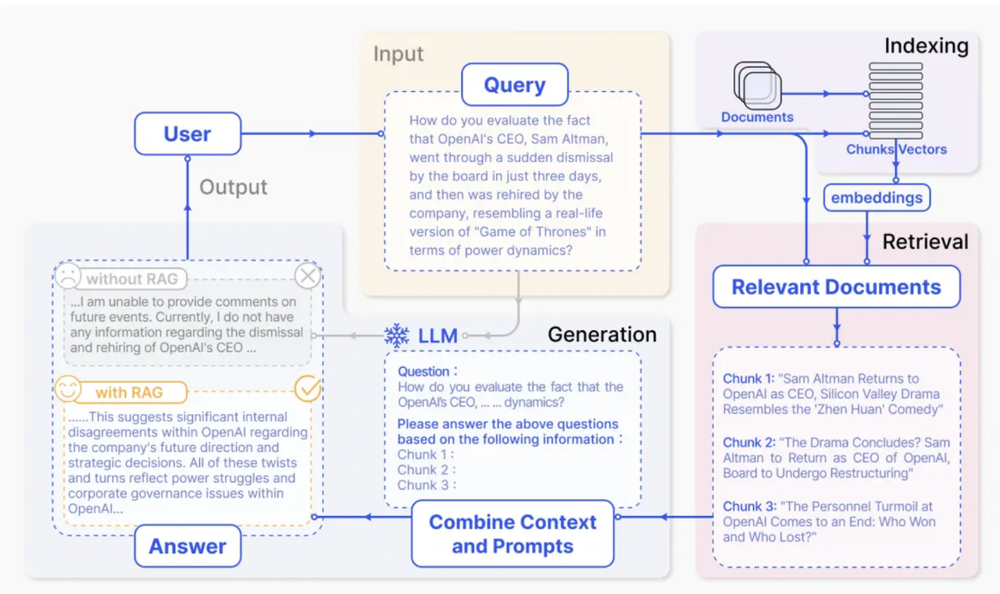
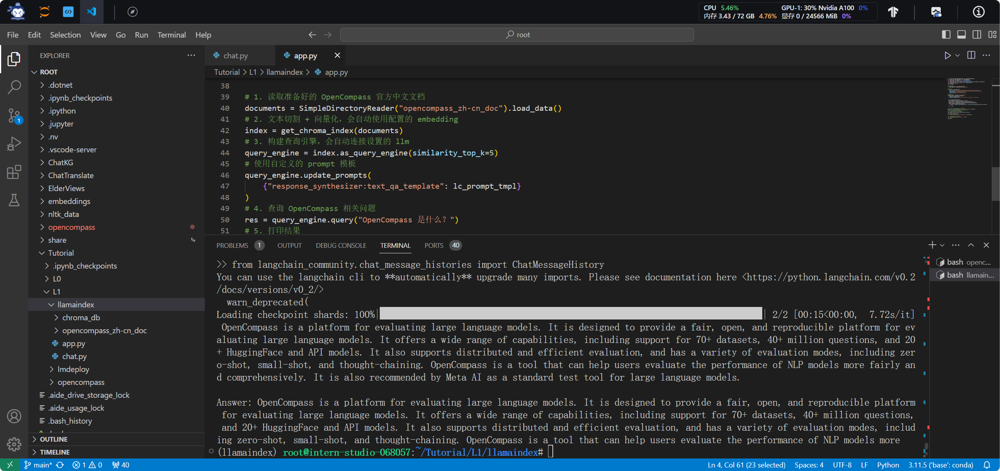

<div style="border-bottom: 4px solid black; width: 100%; box-sizing: border-box; text-align: center; padding-top: 0.1rem;" align="center">
    <h1>书生大模型实战营「第3期」学员笔记<br/><span>基础岛 - InternLM + LlamaIndex RAG 实践</span></h1>
</div>
<div style="text-align: center;" align="center">
    笔记记录人：ZK-Jackie&nbsp;&nbsp;&nbsp;&nbsp;&nbsp;&nbsp;笔记记录时间：2024.7.30
</div>

## 目录

- [1 相关概念](#1-相关概念)
    - [1.1 RAG 技术](#11-rag-技术)
    - [1.2 LlamaIndex](#12-llamaindex)
- [2 实操任务](#2-实操任务)
    - [2.1 准备 LlamaIndex 运行环境与部署代码支撑](#21-准备-llamaindex-运行环境与部署代码支撑)
    - [2.2 编写、运行代码](#22-编写运行代码)
- [3 总结](#3-总结)
- [参考资料](#参考资料)
- [备注](#备注)

## 1 相关概念

### 1.1 RAG 技术

RAG（Retrieval-Augmented Generation）是一种基于检索的生成式模型，结合了检索式和生成式的优点，可以实现更加准确和高效的问答系统，主要由两部分组成：

- **Retriever**：检索器，用于从大量的文本数据中检索出与问题相关的文本片段。
- **Generator**：生成器，用于根据检索到的文本片段生成答案。

RAG 模型的基本原理是，首先使用检索器从大量的文本数据中检索出与问题相关的文本片段，然后使用生成器根据检索到的文本片段生成答案。这也意味着必须使用一定的模型，将数据整理成检索器可以处理的格式，然后再使用检索器从中检索出相关的文本片段。

在这些过程中，都依赖于 Embedding 技术。Embedding 技术是一种将文本数据转换为数字向量表示的技术，可以将文本数据转换为向量表示，然后使用向量表示进行检索和生成。

要实现 RAG 应用，首先需要采用 Embedding 技术将文本信息向量化，随后可以采用向量数据库的方式，将向量化的文本信息存储在数据库中，然后使用检索器从数据库中检索出相关的文本片段，最后使用生成器根据检索到的文本片段生成答案。

整体过程如 `图 1` 所示。

<div class="image-box" style="text-align: center;" align="center">
    
    <br/>
    <div class="caption" style="border-bottom: 1px solid #d9d9d9;
    display: inline-block;
    color: #999;
    padding: 2px;">图 1 RAG</div>
    <br/>
</div>

总的来说，构建这样一个 RAG 应用主要需要实现三部分内容：

#### 1.1.1 文本向量化

文本向量化是将文本数据转换为数字向量表示的过程，当下，已有多种开源的词向量化库，如 sentence-transformers、transformers 等，可以直接使用这些库来实现文本向量化。

直接调用这些库，实现了文本向向量的转变后，还需将这些内容存储到向量数据库中存储起来。向量数据库也有多种好用的开源库，如 Chroma、Faiss 等，参考相关文档，可以实现向量数据库的搭建。

#### 1.1.2 文本检索

在构建了向量数据库后，可以使用检索器从数据库中检索出相关的文本片段。检索器可以使用当下热门的 LangChain 框架内部提供的对应的检索器模块，也可以使用各向量数据库提供的检索器模块。

向检索器输入一段文字，检索器会返回与输入文字相关的文本片段，这些文本片段可以用于生成器生成答案。

#### 1.1.3 文本生成

生成器综合用户输入的问题，综合检索器检索到的文本片段，便能够总体分析、生成答案。在本次实战营任务中，我们将使用 LlamaIndex 框架，借助开源的 InternLM 模型来构建 RAG 应用，实现文本向量化、文本检索和文本生成的功能。

### 1.2 LlamaIndex

LlamaIndex 是一个 AI 框架，用于简化将私有数据与公共数据集成到大型语言模型（LLM）中的应用程序中。它提供了数据 ingestion、 indexing 和查询的工具，使其成为生成式 AI 需求的可靠解决方案。

LlamaIndex 主要包括以下几个组件:
- 数据连接器：帮助连接现有数据源和数据格式（如 API、PDF 等），并将这些数据转换为 LlamaIndex 可用的格式。
- 数据索引：帮助结构化数据以适应不同的用例。加载了来自不同数据源的数据后，如何将它们分割、定义关系和组织，以便无论您想要解决的问题（问答、摘要等），都可以使用索引来检索相关信息。
- 查询接口：是输入查询并从 LLM 中获取知识增强输出的接口。

对于使用 LlamaIndex 框架实现一个 RAG 应用，核心在于把握好 LlamaIndex 中的几个高层次抽象数据结构。

#### 1.2.1 Indexing

Indexing 是 LlamaIndex 中的一个重要组件，用于将数据结构化以适应不同的用例。在构建 RAG 应用时，需要将文本数据转换为向量表示，并将这些向量表示存储在向量数据库中。Indexing 将数据存储在Node对象（代表原始文档的 chunk ）中，支持额外配置和自动化的Retriever接口，可以帮助将这些向量表示分割、定义关系和组织，以便检索器可以从中检索出相关的文本片段。

#### 1.2.2 Vector Stores

Vector Stores 是 LlamaIndex 中的另一个重要组件，用于存储向量化的文本信息。在构建 RAG 应用时，需要将文本数据转换为向量表示，并将这些向量表示存储在向量数据库中。Vector Stores 提供了向量数据库的功能，可以帮助将向量化的文本信息持久化，存储在数据库中，然后我们可以使用检索器从数据库中检索出相关的文本片段。

#### 1.2.3 Query Engine

Query Engine 也是 LlamaIndex 中的一个重要组件，用于处理用户的查询请求。在构建 RAG 应用时，用户输入问题，Query Engine 会将问题转换为向量表示，然后使用检索器从向量数据库中检索出相关的文本片段，最后使用生成器根据检索到的文本片段生成答案。

通过 index 、vector store、 query engine 的构建，我们可以很容易针对不同抽象组织的 chunk 进行我们想要的检索、查询操作，最终得到高质量的 RAG 系统。

#### 1.2.4 总结实战

在实际应用中，我们可以使用 LlamaIndex 框架构建一个 RAG 应用，主要包括以下几个步骤：

- 初始化所有资源：嵌入模型（Embedding）、LLM、LlamaIndex组件
- 文档准备：将文档载入，并使用 LlamaIndex 的 Indexing 组件将文档转换为向量表示，使用 Vector Stores 将其持久化于本地磁盘中
- 向量检索：接受用户交互，将用户输入的问题转换为向量表示，使用 Query Engine 从 Vector Stores 中检索出相关的文本片段
- LLM 生成：综合所有文本内容，包括用户问题和检索结果，让 LLM 生成特定答案

通过这些步骤，我们可以构建一个完整的 RAG 应用，实现检索式问答系统的功能。

## 2 实操任务

在本次实操当中，我们将利用好理论知识，使用 LlamaIndex 框架构建一个 RAG 应用。

> - 任务描述：基于 LlamaIndex 构建自己的 RAG 知识库，寻找一个问题 A 在使用 LlamaIndex 之前 InternLM2-Chat-1.8B 模型不会回答，借助 LlamaIndex 后 InternLM2-Chat-1.8B 模型具备回答 A 的能力，截图保存。
> - 实现步骤：
>   1. 准备 LlamaIndex 运行环境与部署代码支撑
>   2. 准备 InternLM2-Chat-1.8B 模型
>   3. 准备相关代码数据
>   4. 部署模型，完成指定任务
> - 硬件环境：30% A100 * 1
> - 软件环境：Cuda12.2-conda

### 2.1 准备 LlamaIndex 运行环境与部署代码支撑

为避免与环境其他软件包冲突，此处建议新建一个 conda 环境以完成任务。假定新创建的环境将命名为 llamaindex，随后我们在控制台中输入相关命令，创建环境，并安装 LlamaIndex 及相关 python 软件包依赖：

```bash
conda create -n llamaindex python=3.10  # 创建一个新的 Conda 环墋
conda activate llamaindex               # 激活该环境
python -m pip install --upgrade pip     # 更新 pip 工具
pip install torch==2.2.2 torchvision==0.17.2 torchaudio==2.2.2 --index-url https://download.pytorch.org/whl/cu121
pip install llama-index llama-index-llms-huggingface llama-index-embeddings-huggingface llama-index-vector-stores-chroma llama-index-llms-langchain # 安装 LlamaIndex
pip install huggingface_hub sentence-transformers sentencepiece langchain langchainhub einops langchain-community # 安装相关依赖
```

构建词向量过程中需要使用到嵌入模型，此处我选择在中文任务中表现较好的 `bge-large-zh-v1.5` 模型，并将他下载至 /root/embeddings 文件夹中，只需在终端中输入以下命令：

```bash
mkdir /root/embeddings
cd /root/embeddings
export HF_ENDPOINT=https://hf-mirror.com
huggingface-cli download --resume-download BAAI/bge-large-zh-v1.5 --local-dir gte-large-en-v1.5 --local-dir-use-symlinks False
```

后续过程中构建词向量模型时还会有用到 NLTK 模型，且由于 NLTK 依赖包较大，建议在本地环境中安装，以避免网络问题，只需运行以下命令：

```bash
cd /root
git clone https://gitee.com/yzy0612/nltk_data.git  --branch gh-pages
cd nltk_data
mv packages/*  ./
cd tokenizers
unzip punkt.zip
cd ../taggers
unzip averaged_perceptron_tagger.zip
```

至此，LlamaIndex 的基本运行环境就准备好了！

### 2.2 编写、运行代码

下面，将主要准备好有关与 InternLM2-Chat-1.8B 模型使用 LlamaIndex 完成 RAG 和对话的相关代码数据。

根据 LlamaIndex 的官方文档，我们可以快速编写一个推理本地 HuggingFace 类型模型的，执行对话任务的代码，即：

```python
from llama_index.llms.huggingface import HuggingFaceLLM
from llama_index.core.llms import ChatMessage

llm = HuggingFaceLLM(
    model_name="/root/share/new_models/Shanghai_AI_Laboratory/internlm2-chat-1_8b",
    tokenizer_name="/root/share/new_models/Shanghai_AI_Laboratory/internlm2-chat-1_8b",
    model_kwargs={"trust_remote_code":True},
    tokenizer_kwargs={"trust_remote_code":True}
)

res = llm.chat(messages=[ChatMessage(content="请你介绍一下 OpenCompass")])
print(res)
```

其回答如下 `图 2` 所示：

<div class="image-box" style="text-align: center;" align="center">
    
    <br/>
    <div class="caption" style="border-bottom: 1px solid #d9d9d9;
    display: inline-block;
    color: #999;
    padding: 2px;">图 2 InternLM2-Chat-1.8B</div>
    <br/>
</div>

很明显，由于 InternLM2-Chat-1.8B 模型的限制，它并不能回答有关 OpenCompass 的相关内容，接下来我们将使用 LlamaIndex 框架，构建一个含 OpenCompass 相关内容的 RAG 应用，使 InternLM2-Chat-1.8B 模型具备回答 OpenCompass 的能力。

开始之前，整理 OpenCompass 相关中文文档到一个文件夹中，我这里将其命名为 `opencompass_zh-cn_doc`，并将其放置在与代码相同的文件目录下。随后编写代码。代码中，首先配置了 LlamaIndex 框架的嵌入模型和LLM 模型，为增强对话效果，我们还使用了 Langchain 框架提供的 prompt 模板。

代码中，为实现 RAG，构建了基于 Chroma 的检索器。检索器首先载入文档，然后将文档切割并向量化，最后构建查询引擎，连接设置的 LLM 模型，并使用自定义的 prompt 模板。最终，我们可以使用查询引擎查询 OpenCompass 相关问题，总体代码如下，最后提问效果见图 3：

```python
from llama_index.embeddings.huggingface import HuggingFaceEmbedding
from llama_index.llms.huggingface import HuggingFaceLLM
from llama_index.core.node_parser import SentenceSplitter
from llama_index.core.prompts import LangchainPromptTemplate
from llama_index.core import Settings, VectorStoreIndex, SimpleDirectoryReader, StorageContext
from llama_index.vector_stores.chroma import ChromaVectorStore
from langchain import hub
import chromadb

# 配置嵌入模型
Settings.embed_model = HuggingFaceEmbedding(
    model_name="/root/embeddings/bge-large-zh-v1.5"
)
# 配置 LLM
Settings.llm = HuggingFaceLLM(
    model_name="/root/share/new_models/Shanghai_AI_Laboratory/internlm2-chat-1_8b",
    tokenizer_name="/root/share/new_models/Shanghai_AI_Laboratory/internlm2-chat-1_8b",
    model_kwargs={"trust_remote_code":True},
    tokenizer_kwargs={"trust_remote_code":True}
)
# 配置prompt
langchain_prompt = hub.pull("rlm/rag-prompt")
lc_prompt_tmpl = LangchainPromptTemplate(
    template=langchain_prompt,
    template_var_mappings={"query_str": "question", "context_str": "context"},
)

def get_chroma_index(documents):
  db = chromadb.PersistentClient(path="./chroma_db")
  chroma_collection = db.get_or_create_collection("opencompass")
  vector_store = ChromaVectorStore(chroma_collection=chroma_collection)
  storage_context = StorageContext.from_defaults(vector_store=vector_store)
  index = VectorStoreIndex.from_documents(
      documents, storage_context=storage_context, transformations=[SentenceSplitter(chunk_size=256)]
  )
  return index


# 1. 读取准备好的 OpenCompass 官方中文文档
documents = SimpleDirectoryReader("opencompass_zh-cn_doc").load_data()
# 2. 文本切割 + 向量化，会自动使用配置的 embedding
index = get_chroma_index(documents)
# 3. 构建查询引擎，会自动连接设置的 llm
query_engine = index.as_query_engine(similarity_top_k=5)
# 使用自定义的 prompt 模板
query_engine.update_prompts(
    {"response_synthesizer:text_qa_template": lc_prompt_tmpl}
)
# 4. 查询 OpenCompass 相关问题
res = query_engine.query("OpenCompass 是什么？")
# 5. 打印结果
print(res)
```

提问效果，如下 `图 3` ：

<div class="image-box" style="text-align: center;" align="center">
    
    <br/>
    <div class="caption" style="border-bottom: 1px solid #d9d9d9;
    display: inline-block;
    color: #999;
    padding: 2px;">图 3 OpenCompass 问题回答</div>
    <br/>
</div>

可能由于从 langchain hub 中拉取的提问模板是使用英文编写的，LLM 在参考了原有的中文文本后又用英文表述出来。但从它的表述上看，在外部知识库的作用下，它已认识了有关 OpenCompass 的内容，且我们也已经构造了一个有关于 OpenCompass 相关知识的 Chroma 持久化向量数据库，可以被开发人员更好地被管理和利用起来。至此，本任务完成。

## 3 总结

本次实操任务中，我们使用 LlamaIndex 框架构建了一个 RAG 应用，使 InternLM2-Chat-1.8B 模型具备回答 OpenCompass 相关问题的能力。通过构建 RAG 应用，我们实现了检索式问答系统的功能，更深入了解了 RAG 技术的应用。

后续，我们可以继续深入学习 LlamaIndex 框架，探索更多有趣的应用场景；也可以深入了解 Gradio、Streamlit 等框架，制作一个更加成熟的 demo 应用，提供更好的用户体验。

## 参考资料

- [LlamaIndex 官方文档](https://docs.llamaindex.ai/en/latest/)
- [LlamaIndex - GitHub](https://github.com/run-llama/llama_index/)
- [书生大模型实战营「第3期」llamaindex+Internlm2 RAG实践](https://github.com/InternLM/Tutorial/tree/camp3/docs/L1/LlamaIndex)

## 备注

由于本次实操任务开始及完成较早，部分内容可能与最新的实操任务要求和执行步骤有所出入，仅供参考。
