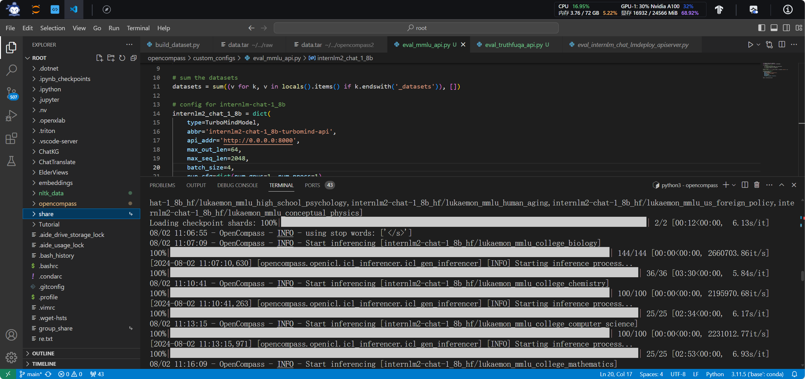
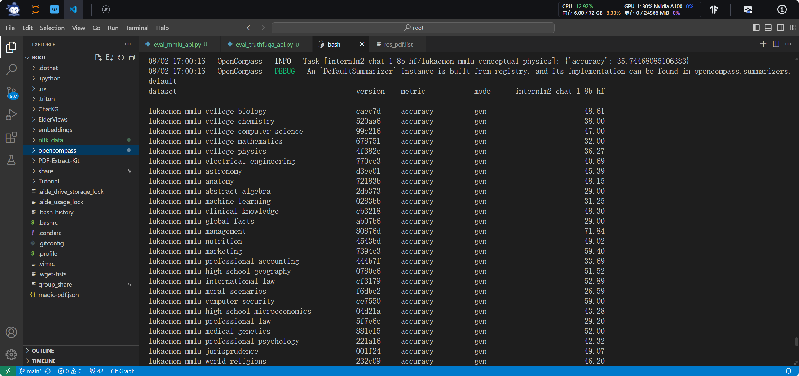
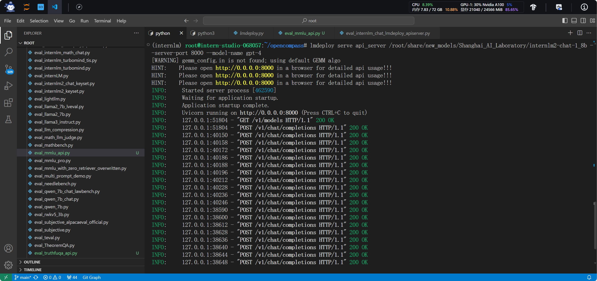
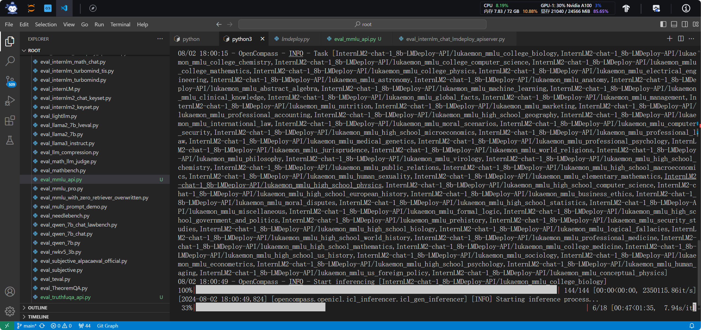

<div style="border-bottom: 4px solid black; width: 100%; box-sizing: border-box; text-align: center; padding-top: 0.1rem;" align="center">
    <h1>书生大模型实战营「第3期」学员笔记<br/><span>基础岛 - OpenCompass 评测 InternLM-1.8B 实践</span></h1>
</div>
<div style="text-align: center;" align="center">
    笔记记录人：ZK-Jackie&nbsp;&nbsp;&nbsp;&nbsp;&nbsp;&nbsp;笔记记录时间：2024.8.2
</div>

## 目录
- [1 大模型评测简介](#1-大模型评测简介)
    - [1.1 大模型评测](#11-大模型评测)
    - [1.2 OpenCompass](#12-opencompass)
- [2 实操任务](#2-实操任务)
    - [2.1 基础任务](#21-基础任务)
    - [2.2 进阶任务](#22-进阶任务)
- [3 总结](#3-总结)
- [参考资料](#参考资料)
- [备注](#备注)

## 1 大模型评测简介

### 1.1 大模型评测

大模型评测对于模型的性能评估至关重要。只有通过一定的、公正的评测，我们才能够了解一款模型的性能、能力方面的表现，这不仅有助于我们更好地了解模型的优劣，也有助于我们更好地选择模型、优化模型，帮助、激励开发者开发出更加优秀的模型作品。不仅仅是对于开发者，对于普通用户、管理机构、产业界等，大模型评测都有着重要的意义。

- 对于普通用户：了解模型的特色能力和实际效果
- 对于管理机构：减少大模型带来的社会风险
- 对于产业界：找出最适合产业应用的模型，赋能真实场景

当下有多种多样的大模型，也有多种多样的评测方法。一般来说，主要有以下几种评测手段：

- 客观评测
  - 问答题
  - 多选题
  - 判断题
  - 分类题
  - ……
- 主观评测
  - 人工评价
  - 模型评价
  - ……
- Prompt Engineering（提示词工程）
  - 生成式评测
  - ……

而对于模型回答的内容和答案的准确性、流畅性等，我们也常用 BLEU、ROUGE、Perplexity 等指标来进行评测。

在模型和评测方法层出不穷的情况下，一个全面、公正、权威的评测体系，来帮助我们更好地评测大模型是十分关键的，OpenCompass 便是这样一个评测体系
、工具和平台。

### 1.2 OpenCompass

OpenCompass 是一个开源的大模型评测框架，致力于打造全球领先的大模型开源评测体系。OpenCompass 通过提供统一的评测标准、评测方法、评测工具，帮助用户更好地评测大模型的性能、能力等，帮助用户更好地选择、优化模型。

OpenCompass “集百家之长”，在各个方面都有着很高的实力。OpenCompass 的实力也成功令其用户遍及国内外知名企业与科研机构，成为 Meta 官方推荐的唯一由国内开发的大模型评测体系，与 HuggingFace、Stanford 和 Google 推出的评测体系齐名。

在 OpenCompass 中评估一个模型通常包括以下几个阶段：配置 -> 推理 -> 评估 -> 可视化。

- 配置：这是整个工作流的起点。您需要配置整个评估过程，选择要评估的模型和数据集。此外，还可以选择评估策略、计算后端等，并定义显示结果的方式。
- 推理与评估：在这个阶段，OpenCompass 将会开始对模型和数据集进行并行推理和评估。推理阶段主要是让模型从数据集产生输出，而评估阶段则是衡量这些输出与标准答案的匹配程度。这两个过程会被拆分为多个同时运行的“任务”以提高效率。
- 可视化：评估完成后，OpenCompass 将结果整理成易读的表格，并将其保存为 CSV 和 TXT 文件。

## 2 实操任务

### 2.1 基础任务

> - 任务描述：使用 OpenCompass 评测 internlm2-chat-1.8b 模型在 MMLU 数据集上的性能，记录复现过程并截图。
> - 实现步骤：
>   1. 准备 MMLU 数据集
>   2. 准备 OpenCompass 运行环境
>   3. 启动评测任务
>   4. 总结评测结果
> - 硬件环境：30% A100 * 1
> - 软件环境：Cuda 12.2-Conda

#### 2.1.1 准备 MMLU 数据集

MMLU 数据集是一个用于评测大型语言模型性能的数据集，包含了大量的对话文本数据。在本次任务中，我们需要使用 MMLU 数据集对 internlm2-chat-1.8b 模型进行评测。

在次之前，我们应当准备一个新的环境用于下载数据集，并对模型进行评测。根据实测，我们应当先在环境中安装 openxlab python cli，以便下载 MMLU 数据集。假定我们创建一个名为 `opencompass` 的 conda 环境，我们可以使用以下命令创建 conda 环境并安装 openxlab python 软件包：

```bash
conda create -n opencompass python=3.10
conda activate opencompass
python -m pip install --upgrade pip
pip install openxlab
```

完成安装后，我们需确保已经注册了 OpenXLab，并已经拥有 [OpenXLab SDK 密钥](https://sso.openxlab.org.cn/usercenter?lang=zh-CN&code=false&tab=secret?lang)。记录下自己的 AK、SK 信息，随后我们需要从 OpenXLab 中下载 MMLU 数据集。依照 [OpenXLab 中 MMLU 数据集的下载说明](https://openxlab.org.cn/datasets/OpenDataLab/MMLU/cli/main)，我们可以使用下载的 openxlab python cli 命令下载 MMLU 数据集。仅需在控制台中输入以下命令后依照指引输入内容即可：

```bash
openxlab login #进行登录，输入对应的AK/SK
openxlab dataset get --dataset-repo OpenDataLab/MMLU #数据集下载
```

随后，我们解压下载的数据集文件，为后续评测任务做准备。

```bash
tar -xvf OpenDataLab___MMLU/raw/data.tar
```

#### 2.1.2 准备 OpenCompass 运行环境

接下来，我们就可以开始准备评测环境了，我们需要在开发环境中安装 OpenCompass python 软件包以进行评测任务。经验证，上一步骤中下载的 openxlab 与现在即将下载的 OpenCompass 会发生不可解决的依赖冲突，因此，建议在新的 conda 环境中安装 OpenCompass 或卸载本环境中的 openxlab 软件包。本文选择卸载 openxlab 软件包，以便安装 OpenCompass。

建议从源码安装 OpenCompass，安装过程如下：

```bash
pip uninstall openxlab
git clone https://github.com/open-compass/opencompass.git /root/opencompass
pip install -e /root/opencompass
```

经过半小时左右，OpenCompass 在当前环境下安装完成。随后便将我们上一步骤中下载的 MMLU 数据集放置在 `opencompass` 目录下，以便后续评测任务的进行。

```bash
mkdir /root/opencompass/data/mmlu
mv data/* /root/opencompass/data/mmlu
```

#### 2.1.3 启动评测任务

在 `opencompass` 最外层目录下，我们可以使用 OpenCompass 评测工具对 internlm2-chat-1.8b 模型在 MMLU 数据集上进行评测。观察数据集的输入和答案输出长度，可大致确定 `max-seq-len` 和 `max-out-len` 的值；也可以观察启动评测后 GPU 显存和占用率确定 `batch-size` 的值。经实测，可在控制台中输入以下命令即可启动评测任务：

```bash
cd /root/opencompass
python3 run.py --datasets mmlu_gen_4d595a \
--hf-path /root/share/new_models/Shanghai_AI_Laboratory/internlm2-chat-1_8b \
--tokenizer-path /root/share/new_models/Shanghai_AI_Laboratory/internlm2-chat-1_8b \
--tokenizer-kwargs padding_side='left' truncation='left' trust_remote_code=True \
--model-kwargs trust_remote_code=True device_map='auto' \
--max-seq-len 1024 \
--max-out-len 64 \
--batch-size 4 \
--hf-num-gpus 1 \
--debug
```

评测启动如下 `图 1` 所示：

<div class="image-box" style="text-align: center;" align="center">
    
    <br/>
    <div class="caption" style="border-bottom: 1px solid #d9d9d9;
    display: inline-block;
    color: #999;
    padding: 2px;">图 1 启动评测任务</div>
    <br/>
</div>

#### 2.1.4 总结评测结果

评测任务完成后，我们可以在控制台中查看评测结果。根据评测结果，我们可以得到 internlm2-chat-1.8b 模型在 MMLU 数据集上的性能表现，包括 BLEU、ROUGE、Perplexity 等指标。OpenCompass 评测工具还会生成评测报告，我们可以查看报告中的详细信息。

部分评测分数、报告如下 `图 2` 所示：

<div class="image-box" style="text-align: center;" align="center">
    
    <br/>
    <div class="caption" style="border-bottom: 1px solid #d9d9d9;
    display: inline-block;
    color: #999;
    padding: 2px;">图 2 评测报告</div>
    <br/>
</div>

详细的报告结果见[附录](#附录)。

### 2.2 进阶任务

> - 任务描述：使用 OpenCompass 进行调用API评测
> - 实现步骤：
>   1. 探索 OpenCompass API 评测方式
>   2. 使用 LMDeploy API 部署 internlm2-chat-1.8b 模型服务
>   3. OpenCompass 调用 API 进行评测
> - 硬件环境：30% A100 * 1
> - 软件环境：Cuda 12.2-Conda

#### 2.2.1 探索 OpenCompass API 评测方式

在模型部署和正式评测开始之前，我们需要了解 OpenCompass 对于 API 评测的方式。我们可以在 [OpenCompass 的官方文档](https://opencompass.org.cn/doc)中看到 OpenCompass 对于评测启动的方式包括**命令行**和**配置文件**两种，而其中只有配置文件方式中提到了 API 评测的方式。则需要重点关注如何编写 OpenCompass 启动评测的配置文件的编写方法。

在深入研究 OpenCompass 配置文件[准备模型](https://opencompass.readthedocs.io/zh-cn/latest/user_guides/models.html)的编写方法后，我们便可以初步确定我们可以启动 OpenAI 式的 LLM 推理服务，让 OpenCompass 通过 OpenAI 式 API 调用internlm2-chat-1.8b 模型的方法来推进评测。

#### 2.2.2 使用 LMDeploy API 部署 internlm2-chat-1.8b 模型服务

本文将选用 LMDeploy API 作为部署工具，通过 LMDeploy API 部署 internlm2-chat-1.8b 模型服务。则需要在当前环境中再次安装 LMDeploy，也可以在以往的 conda 环境中启用 LMDeploy 的推理服务。具体的启用方式可参考[L1-2笔记](./L1-2.md)中有关 `API 接口部署对话` 的部分启动服务。

仅需在有安装 LMDeploy 的环境中输入以下命令即可启动服务：

```bash
lmdeploy serve api_server /root/share/new_models/Shanghai_AI_Laboratory/internlm2-chat-1_8b --server-port 8000
```

#### 2.2.3 OpenCompass 调用 API 进行评测

随后，我们需要编写 OpenCompass 的配置文件，以便 OpenCompass 调用 API 进行评测。我编写的配置文件如下：

```python
# ~/opencompass/custom_configs/eval_mmlu_api.py
from mmengine.config import read_base
from opencompass.models.turbomind import TurboMindModel

with read_base():
    # choose a list of datasets
    from .datasets.mmlu.mmlu_gen_4d595a import mmlu_datasets
    # and output the results in a choosen format
    from .summarizers.medium import summarizer

# sum the datasets
datasets = sum((v for k, v in locals().items() if k.endswith('_datasets')), [])

# config for internlm-chat-1_8b
internlm2_chat_1_8b = dict(
    type=TurboMindModel,
    abbr='internlm2-chat-1_8b-turbomind-api',
    api_addr='http://0.0.0.0:8000',
    max_out_len=100,
    max_seq_len=2048,
    batch_size=32,
    run_cfg=dict(num_gpus=1, num_procs=1),
)

models = [internlm2_chat_1_8b]
```

在配置文件中，我们指定了 internlm2-chat-1.8b 模型的参数，包括 API 地址、最大输出长度、最大序列长度、batch 大小等。随后，我们可以在控制台中输入以下命令启动评测任务：

```bash
cd /root/opencompass
python3 run.py --models custom_configs/eval_mmlu_api.py --debug
```

可以看到，OpenCompass 可以正常地调用 LMDeploy API 进行评测，如下 `图 3` 所示：

<div class="image-box" style="text-align: center;" align="center">
    
    <br/>
    <div class="caption" style="border-bottom: 1px solid #d9d9d9;
    display: inline-block;
    color: #999;
    padding: 2px;">图 3 OpenCompass 调用 API 进行评测</div>
    <br/>
</div>

最终使用 API 的评测结果如下 `图 4` 所示：

<div class="image-box" style="text-align: center;" align="center">
    
    <br/>
    <div class="caption" style="border-bottom: 1px solid #d9d9d9;
    display: inline-block;
    color: #999;
    padding: 2px;">图 4 API 评测报告</div>
    <br/>
</div>

## 3 总结

本文记录了使用 OpenCompass 评测 internlm2-chat-1.8b 模型在 MMLU 数据集上的性能，以及使用 OpenCompass 进行调用 API 评测的过程。通过本次实操任务，我们了解了 OpenCompass 的评测方式、评测工具、评测流程，以及如何使用 OpenCompass 进行大模型的评测。

也希望随着 OpenCompass 的继续发展，为大模型评测提供更多的帮助，真正成为开发者、用户心中的权威“指南针”。

## 参考资料

- [OpenXLab python 数据集SDK - 官方文档](https://openxlab.org.cn/docs/developers/%E6%95%B0%E6%8D%AE%E9%9B%86/%E6%95%B0%E6%8D%AE%E9%9B%86Python%20SDK.html)
- [OpenCompass - GitHub](http://github.com/open-compass/opencompass)
- [OpenCompass - 官方文档](https://opencompass.org.cn/doc)
- [LMDeploy - GitHub](http://github.com/InternLM/lmdeploy)

## 附录

- [评测报告文件](../../res/internlm_study_v3/L1-6)

## 备注

由于本次实操任务开始及完成较早，部分内容可能与最新的实操任务要求和执行步骤有所出入，仅供参考。
