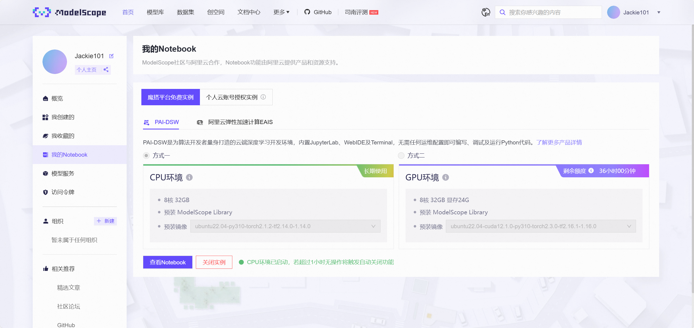
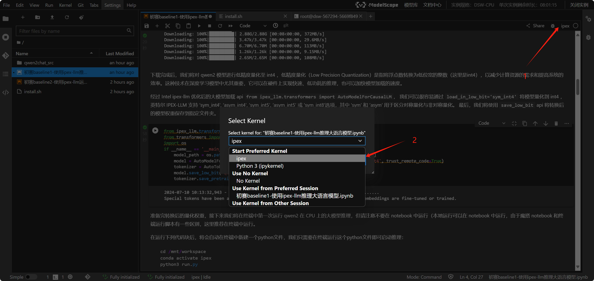
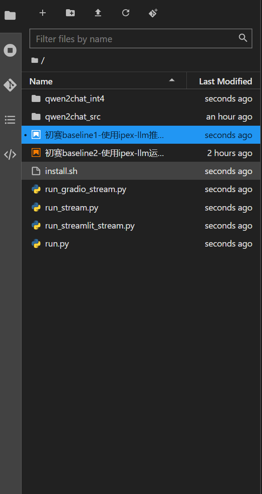
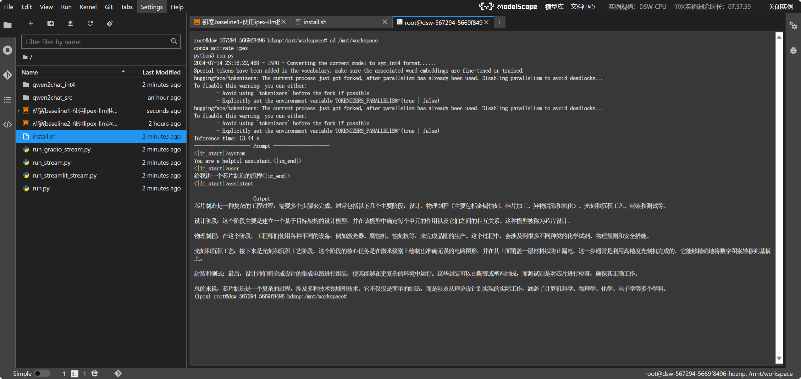
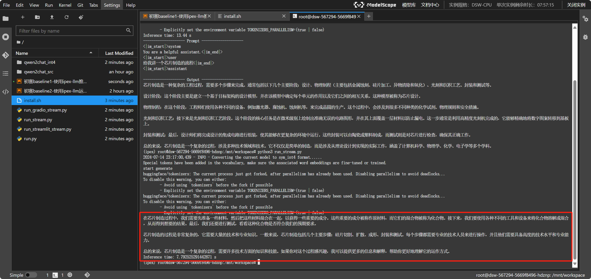

<div style="border-bottom: 4px solid black; width: 100%; box-sizing: border-box; text-align: center; padding-top: 0.1rem;" align="center">
    <h1>Datawhale AI夏令营 LLM 应用开发实战笔记<br/><span>Task1：了解模型获取和 IPEX-LLM 部署工具</span></h1>
</div>
<div style="text-align: center;" align="center">
    笔记记录人：ZK-Jackie&nbsp;&nbsp;&nbsp;&nbsp;&nbsp;&nbsp;笔记记录时间：2024.7.14
</div>

## 目录
- [一、赛题分析](#一赛题分析)
  - [1. 赛题背景](#1-赛题背景)
  - [2. 赛题要求](#2-赛题要求)
  - [3. 评测指标](#3-评测指标)
- [二、模型获取](#二模型获取)
  - [1. 模型获取方式](#1-模型获取方式)
  - [2. 模型部署方式](#2-模型部署方式)
- [三、IPEX-LLM 部署工具](#三ipex-llm-部署工具)
  - [1. IPEX-LLM 简介](#1-ipex-llm-简介)
  - [2. 使用 IPEX-LLM 部署 LLM 步骤](#2-使用-ipex-llm-部署-llm-步骤)
- [四、总结](#四总结)
- [参考文章](#参考文章)

## 一、赛题分析

### 1. 赛题背景

LLM 是一种基于大规模预训练语言模型的语言生成模型，具有强大的生成能力和泛化能力。本次赛题旨在通过 LLM 模型生成文本，实现对话系统的功能。近年来，随着深度学习技术的发展，基于 LLM 的对话系统在自然语言处理领域取得了显著的进展，成为了对话系统研究的热点之一。

但是，由于 LLM 模型参数庞大、计算资源消耗大、部署复杂等，常常需占用较大的 GPU 资源，且 GPU 的使用成本较高。因此，如何高效地利用有限的计算资源，提高 LLM 模型的部署效率，成为了当前研究的热点问题之一。Intel 为了解决这一问题，推出了能使大模型在CPU上进行推理的 IPEX-LLM 部署工具，旨在提高 LLM 模型的部署效率，降低部署成本。

### 2. 赛题要求

本次赛题要求使用指定的开源大模型，采用基于 Intel 的部署及优化工具，并结合多种多样的工具，完成具有创新型、实用性的应用开发。具体要求如下：

> 1. 可用的大模型
>    1. 通义千问Qwen系列
>    2. 智谱ChatGLM及GLM4系列
>    3. 百川2系列
>    4. 其他经过 Intel 发布的各种模型的微调版本
> 2. 部署及优化工具（至少使用一个）
>    1. OpenVINO™ Toolkit
>    2. ++IPEX-LLM (Intel® LLM Library for PyTorch)
>    3. Intel® Extension for Transformers ++或其组件 (Neural Chat)++
>    4. xFasterTransformer
>    5. Intel Extension for Pytorch
> 3. 可选开发工具
>    1. 权重调整
>    2. 低精度量化
>    3. RAG
>    4. 其他各种模型微调及优化技术

### 3. 评测指标

本次赛题的评测指标主要包括模型的生成质量、生成速度、部署效率等。具体评测指标如下：

> 初赛评选标准：
> 创意和应用价值：
> - 创意性： 作品的创新性和独特性，包括对大语言模型的应用创意和解决方案的独特性。
> - 应用价值： 作品对特定领域的应用潜力和价值，如健康服务、适老服务、教育等，是否满足社会发展需要，以及是否能够在行业快速落地。
> 
> 技术实现和优化利用：
> - 技术特点和工具使用： 作品中使用的技术特点和工具，包括是否有效地利用了英特尔的开源软件优化工具（参见推荐使用的部署及优化工具）。

## 二、模型获取

### 1. 模型获取方式

本次赛题要求使用指定的开源大模型，可通过以下方式获取：

- 从 huggingface 获取模型
  - 通过 huggingface-cli 软件工具，终端输入命令下载模型
  - 通过 python huggingface SDK，使用 snapshot 下载
- 从 modelscope 获取模型
  - 通过 modelscope 软件工具，终端输入命令下载模型
  - 通过 python modelscope SDK，使用 snapshot 下载

### 2. 模型部署方式

本次赛题要求使用指定的部署及优化工具，可通过以下工具部署模型，详细使用说明可参考下面给定的链接：

<table>
    <tr>
        <th>部署工具</th>
        <th>详细介绍</th>
    </tr>
    <tr>
        <td>OpenVINO™ Toolkit</td>
        <td>https://github.com/openvinotoolkit/openvino</td>
    </tr>
    <tr>
        <td>++IPEX-LLM (Intel® LLM Library for PyTorch)</td>
        <td>https://github.com/intel-analytics/ipex-llm/</td>
    </tr>
    <tr>
        <td>Intel® Extension for Transformers ++或其组件 (Neural Chat)++</td>
        <td>https://github.com/intel/intel-extension-for-transformers
        <p>https://medium.com/intel-analytics-software/accelerating-qwen2-models-with-intel-extension-for-transformers-99403de82f68</p>
        </td>
    </tr>
    <tr>
        <td>xFasterTransformer</td>
        <td>https://github.com/intel/xFasterTransformer</td>
    </tr>
</table>

## 三、IPEX-LLM 部署工具

### 1. IPEX-LLM 简介

IPEX-LLM 是 Intel 推出的一款能使大模型在 CPU 上进行推理的部署工具，旨在提高 LLM 模型的部署效率，降低部署成本。使用 IPEX-LLM 进行模型部署需要经过以下步骤：

- 准备工具、模型及其环境
- 模型加载
- 模型部署推理

下文将详细介绍使用 IPEX-LLM 量化并部署 Qwen2-1.5B-Instruct 步骤。

### 2. 使用 IPEX-LLM 部署 LLM 步骤

#### （0）准备工作
首先进入 Modelscope 社区，在个人主页中选中左侧导航栏中的 `我的Notebook`，在`魔搭平台免费实例`的`PAI-DSW`环境中，使用`方式一`创建一个含以下配置的开发机环境：
- 8核 32GB 
- 预装 ModelScope Library
- 预装镜像 ubuntu22.04-py310-torch2.1.2-tf2.14.0-1.14.0

静待一段时间后，机器初始化完成，出现 `查看Notebook` 按钮，如所示。



点击 `查看Notebook` 按钮，进入 JupyterLab 界面，点击右上角的 `New` 按钮，选择 `Terminal`，进入终端界面。


#### （1）下载 IPEX-LLM 及 Qwen2-1.5B-Instruct 模型

在终端中输入以下命令，下载并解压已经配置好的 IPEX-LLM Jupyter Kernel 环境：

```bash
mkdir ipex
wget https://s3.idzcn.com/ipex-llm/ipex-llm-2.1.0b20240410.tar.gz
tar -zxvf ipex-llm-2.1.0b20240410.tar.gz -C ipex/ && rm ipex-llm-2.1.0b20240410.tar.gz
```

在等待的过程中，我们可以安装 ipykernel，并将 IPEX-LLM 环境添加到 JupyterLab 中，只需运行以下代码：

```bash
pip install ipykernel
ipykernel install --name=ipex
```

同时，可以运行 `baseline1` 中的第二段代码，下载 Qwen2-1.5B-Instruct 模型。

#### （2）加载模型

在 Jupyter 界面中，点击右上角的 `Kernel`，选择 `Change Kernel`，选择 `ipex`，即可加载 IPEX-LLM 环境，如所示。



该环境下，直接运行 `baseline1` 中的剩余代码，进行 Qwen2-1.5B-Instruct 的量化与文件准备。运行结束后，当前目录的文件结构应为所示。



> 此处提到的量化，即低精度量化（Low Precision Quantization）——将浮点数转换为低位宽的整数（这里是 int4 ），以减少计算资源的需求和提高系统的效率。这种技术在深度学习模型中尤其重要，它可以在硬件上实现快速、低功耗的推理，也可以加快模型加载的速度。
> 
> 通过 IPEX-LLM 中用预训练模型的 int4 量化加载
> 
> ```python
> model = ipex_llm.transformers.AutoModelForCausalLM.from_pretrained(model_path, load_in_low_bit='sym_int4', trust_remote_code=True)
> tokenizer = AutoTokenizer.from_pretrained(model_path, trust_remote_code=True)
> ```
> 
> 又用模型的保存工具进行保存，即可获得量化后的模型文件。
> 
> ```python
> model.save_low_bit('qwen2chat_int4')
> tokenizer.save_pretrained('qwen2chat_int4')
> ```
> 
> 要想采用不同的量化方式，可参考[官方文档](https://github.com/intel-analytics/ipex-llm/tree/main/python/llm/example/CPU/HF-Transformers-AutoModels/Advanced-Quantizations)
> 
> <table>
>     <tr>
>         <th>量化方式</th>
>         <th>描述</th>
>     </tr>
>     <tr>
>         <td>int4</td>
>         <td>4位整数量化</td>
>     </tr>
>     <tr>
>         <td>sym_int4</td>
>         <td>4位整数量化，对称量化</td>
>     </tr>
>     <tr>
>         <td>int8</td>
>         <td>8位整数量化</td>
>     </tr>
> </table>


#### （3）部署推理

##### 单次对话
在终端中输入以下命令，进行 Qwen2-1.5B-Instruct 的部署推理：

```bash
cd /mnt/workspace
conda activate ipex
python3 run.py
```

运行结束后，即可查看 Qwen2-1.5B-Instruct-Int4 对于一个问题的回答结果，如所示。




##### 流式对话

再在终端中输入以下命令，又能够实现进行 Qwen2-1.5B-Instruct-Int4 在控制台中流式输出，如所示，生成完毕共花费约 7.79s。

```bash
python3 run_stream.py
```



##### Gradio 中多轮对话

在终端中输入以下命令，即可实现 Qwen2-1.5B-Instruct-Int4 在 Gradio 中的与用户的对话，如所示。

```bash
pip install gradio
python3 run_gradio.py
```


## 四、总结

本次笔记主要介绍了 Datawhale AI 夏令营 LLM 应用开发实战笔记 Task1 的内容，包括赛题的理解、模型获取、IPEX-LLM 部署工具的使用等。通过学习和实践，我们可以更好地理解模型获取和部署工具的使用方法，提高模型的性能，实现更加准确、高效的应用开发。

后续，我们也将继续开展学习，深入研究模型获取和部署工具的方法和技术，提高模型的性能，实现更加准确、高效的应用开发。希望通过不断的学习和实践，我们可以掌握更多的知识和技能，提高自己的能力，实现更好的学习效果。

## 参考文章

- [从零入门CPU部署大模型&应用开发 - Datawhale AI 夏令营](https://datawhaler.feishu.cn/wiki/SuppwSfFZi5KvYkiffUcygVNnPe)
- [Task1：了解模型获取和IPEX-LLM部署工具 - Datawhale AI 夏令营](https://datawhaler.feishu.cn/wiki/Gka7wVHxziP4fKkgDwXcdiZxnah)


