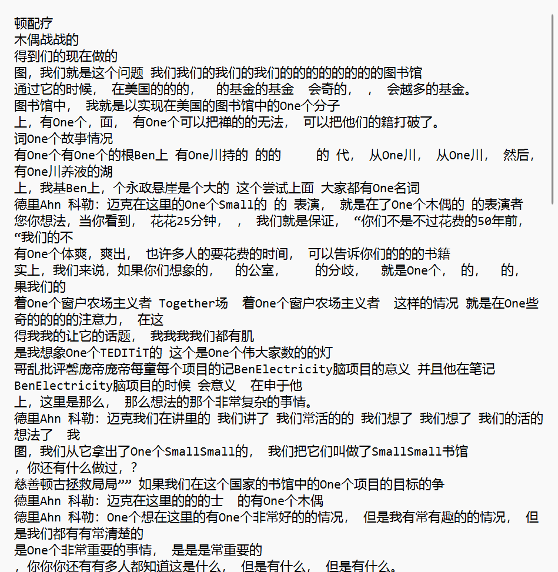

    <h1>Datawhale AI 夏令营机器翻译实战笔记 Task1：了解机器翻译 & 理解赛题</h1>

    笔记记录人：ZK-Jackie&nbsp;&nbsp;&nbsp;&nbsp;&nbsp;&nbsp;笔记记录时间：2024.7.13

## 目录
- [一、机器翻译概述](#一机器翻译概述)
  - [1. 机器翻译的定义](#1-机器翻译的定义)
  - [2. 机器翻译的发展历程](#2-机器翻译的发展历程)
  - [3. 机器翻译的应用领域](#3-机器翻译的应用领域)
  - [4. 机器翻译的评价指标](#4-机器翻译的评价指标)
- [二、赛题理解](#二赛题理解)
  - [1. 赛题数据](#1-赛题数据)
  - [2. 评测指标](#2-评测指标)
- [三、baseline](#三baseline)
  - [1. baseline介绍](#1-baseline介绍)
  - [2. baseline运行结果](#2-baseline运行结果)
  - [3. baseline总结](#3-baseline总结)
- [四、总结](#四总结)
- [参考文章](#参考文章)

## 一、机器翻译概述

### 1. 机器翻译的定义

机器翻译（Machine Translation, MT）是指利用计算机自动将一种自然语言文本（源语言）翻译成另一种自然语言文本（目标语言）的过程。

### 2. 机器翻译的发展历程

机器翻译的发展历程可分为三个历史阶段，分别是基于规则的机器翻译、基于统计的机器翻译和基于神经网络的机器翻译。

#### 基于规则的机器翻译

基于规则的机器翻译是早期的机器翻译方法，其核心思想是通过**人工编写规则**来实现翻译。这种方法的优点是可以精确控制翻译过程，但缺点是需要大量的人力和时间来编写规则，且无法处理**语言的灵活性和多义性**。

由于每一种语言都有自己的语法规则，因此需要针对不同的语言编写不同的规则，这导致了基于规则的机器翻译方法的局限性。

所以，基于规则的机器翻译方法在实际应用中受到了一定的限制，随着数据驱动的方法的兴起，基于统计的机器翻译方法逐渐成为主流。

#### 基于统计的机器翻译

基于统计的机器翻译是在规则翻译的基础上引入统计模型，通过统计方法学习源语言和目标语言之间的对应关系。这种方法的优点是可以自动学习翻译规则，但缺点是对数据依赖性强，且无法处理长距离依赖关系。

其核心思想是通过统计方法学习源语言和目标语言之间的映射关系，然后根据这种映射关系进行翻译。

基于统计的机器翻译方法在2000年代取得了一定的突破，如IBM模型、短语翻译模型等，但由于其无法处理长距离依赖关系，因此在处理复杂的语言现象时表现不佳。

#### 基于神经网络的机器翻译

基于神经网络的机器翻译是近年来发展起来的一种机器翻译方法，其核心思想是通过神经网络模型学习源语言和目标语言之间的映射关系。这种方法的优点是可以处理长距离依赖关系，且可以端到端地学习翻译规则。

基于神经网络的机器翻译方法在2014年取得了突破性进展，如Google的Seq2Seq模型、Transformer模型等，这些模型在翻译质量和效率上都取得了显著的提升。

基于神经网络的机器翻译方法在处理长距离依赖关系和多义性方面表现优异，因此成为当前机器翻译领域的主流方法。

#### 未来发展趋势

未来机器翻译的发展趋势是结合多种方法，如基于神经网络的深度学习方法、迁移学习方法和强化学习方法，实现更加准确和高效的翻译。

### 3. 机器翻译的应用领域

机器翻译在各个领域都有广泛的应用，如跨语言通信、文档翻译、语音翻译、在线翻译等。

- 在跨语言通信方面，机器翻译可以帮助人们跨越语言障碍，实现不同语言之间的交流和合作。
- 在文档翻译方面，机器翻译可以帮助人们快速翻译大量的文档，提高工作效率。
- 在语音翻译方面，机器翻译可以将语音信号转换成文本，然后再进行翻译，实现语音翻译的功能。
- 在在线翻译方面，机器翻译可以帮助人们快速翻译网页、邮件、聊天记录等内容，提供即时翻译服务。

未来，随着机器翻译技术的不断发展，其在各个领域的应用将会越来越广泛，为人们的生活和工作带来更多的便利。

### 4. 机器翻译的评价指标

机器翻译的评价指标主要包括BLEU、METEOR、TER等，其中BLEU是最常用的评价指标之一，用于评估机器翻译系统的翻译质量。

不同的评价指标有不同的优缺点，如BLEU评价指标简单易用，但无法完全反映人类的翻译质量；METEOR评价指标考虑了多种因素，但计算复杂度较高；TER评价指标可以捕捉翻译错误，但对于长句子的评价效果不佳。

在实际应用中，我们可以根据具体的需求选择合适的评价指标，综合考虑多个指标来评估机器翻译系统的性能。

## 二、赛题理解

### 1. 赛题数据

在深度学习模型中，数据是非常重要的一部分，数据的质量和数量直接影响模型的性能。在本次比赛中，我们需要使用的数据是中英文之间的翻译数据，包括训练数据、验证数据和测试数据。

其中，训练数据用于训练模型，其作用是通过大量的数据来学习源语言和目标语言之间的映射关系，提高模型的泛化能力；我们需要利用好训练数据，调整模型的参数，提高模型的性能，以构建一个准确、高效的翻译模型。

验证数据用于调整模型的参数，其作用在于模型训练过程中调整超参数、选择模型架构以及防止过拟合。它作为独立于训练集的数据，用于评估模型在未见过的数据上的表现；我们需要利用验证数据来调整模型的参数，避免模型在训练数据中的过度拟合，提高模型的泛化能力。

测试数据用于评估模型的性能，其作用在于评估模型在未见过的数据上的表现，检验模型的泛化能力；它是最接近真实世界数据的评估标准，我们需要利用训练好的模型在该数据集合中评估模型的性能，了解模型在实际应用中的表现。

赛方提供的数据集均为中英文之间的翻译数据，训练数据集中含中英14万余双语句对；开发集和测试集中各含英中1000双语句对。 此外，赛方还提供了含英中2226条的术语词典。

我们需要利用这些数据来训练、验证和测试模型，构建一个准确、高效的翻译模型。

### 2. 评测指标

在本次比赛中，我们需要使用BLEU评价指标来评估模型的翻译质量。BLEU评价指标是一种常用的机器翻译评价指标，其核心思想是通过比较机器翻译结果与参考翻译之间的相似度来评估翻译质量。

BLUE评价指标的核心思想是通过比较机器翻译结果与参考翻译之间的相似度来评估翻译质量，其计算方法是通过计算n-gram的精确匹配率来得到一个综合的评分。

其中，n-gram是指连续n个词组成的序列，BLEU评价指标通过计算n-gram的精确匹配率来评估机器翻译系统的翻译质量，得到一个0到1之间的分数，分数越高表示翻译质量越好。这也是本次比赛中重要的评价指标之一。因此，我们在训练模型时需要注重BLEU评价指标来调整、优化模型的参数，提高翻译质量。

## 三、baseline

### 1. baseline介绍

本次比赛的baseline是一个基于Seq2Seq模型的翻译模型，其核心思想是通过编码器-解码器结构来学习源语言和目标语言之间的映射关系，实现中英文之间的翻译。

更加详细的分析介绍详见个人笔记[Task2：从baseline代码详解入门深度学习个人笔记](./2.md)

### 2. baseline个人运行结果

<table>
    <tr>
        <th>测试次数</th>
        <th>BLEU得分</th>
        <th>翻译结果</th>
    </tr>
    <tr>
        <td>1</td>
        <td>0.3004</td>
        <td></td>
    </tr>
    <tr>
        <td>2</td>
        <td>0.8132</td>
        <td></td>
    </tr>
</table>

### 3. baseline总结

通过运行baseline代码，我们可以得到不同测试模型构建下的BLEU得分和翻译结果。显然，我们可以通过调整模型的参数、优化模型的结构，进一步提高模型的性能，提高翻译质量。

两份代码中，有改变的参数仅为 `N_EPOCHS`，分别为 `10` 和 `50`。

`N_EPOCHS` 为训练的轮数，训练的轮数越多，模型的性能可能会有所提升，但也可能会导致过拟合。因此，我们需要根据实际情况调整 `N_EPOCHS` 的值，找到一个合适的训练轮数，以提高模型的性能。

## 四、总结

本次笔记主要介绍了机器翻译的概念、发展历程、应用领域和评价指标，以及赛题的理解、baseline的介绍和运行结果。通过学习和实践，我们可以更好地理解机器翻译的原理和方法，提高翻译模型的性能，实现更加准确、高效的翻译。

后续，我们也将继续开展学习，深入研究机器翻译的方法和技术，提高模型的性能，实现更加准确、高效的翻译。希望通过不断的学习和实践，我们可以掌握更多的知识和技能，提高自己的能力，实现更好的学习效果。

## 参考文章

- [从零入门NLP竞赛 - Datawhale AI 夏令营](https://datawhaler.feishu.cn/wiki/TObSwHZdFi2y0XktauWcolpcnyf)
- [Task1：了解机器翻译 & 理解赛题 - Datawhale AI 夏令营](https://datawhaler.feishu.cn/wiki/FVs2wAVN5iqHMqk5lW2ckfhAncb)

