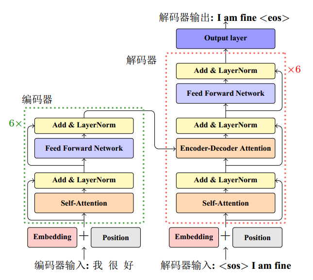

    <h1>Datawhale AI 夏令营机器翻译实战笔记 Task3：基于Transformer解决机器翻译任务</h1>

    笔记记录人：ZK-Jackie&nbsp;&nbsp;&nbsp;&nbsp;&nbsp;&nbsp;笔记记录时间：2024.7.18

## 目录

- [一、Transformer 模型介绍](#一transformer-模型介绍)
  - [1. Transformer 模型结构](#1-transformer-模型结构)
- [二、优化机器翻译模型](#二优化机器翻译模型)
- [三、总结](#三总结)
- [参考文章](#参考文章)

## 一、Transformer 模型介绍

Transformer 是一种基于注意力机制的深度学习模型，由 Vaswani 等人于 2017 年提出，用于解决序列到序列的学习问题，如机器翻译、文本摘要等。Transformer 模型的核心思想是**自注意力机制（self-attention）**，通过自注意力机制实现了对序列数据的建模，避免了传统 RNN 和 LSTM 模型中存在的长距离依赖问题。

> 传统的基于循环或卷积神经网络的序列到序列建模方法是现存机器翻译任务中的经典方法。然而，它们在建模文本长程依赖方面都存在一定的局限性。
> - RNN 模型：由于 RNN 模型的隐藏状态是通过循环计算得到的，因此在处理长序列时，会出现梯度消失或梯度爆炸的问题，导致模型无法捕捉到长距离的依赖关系。
> - LSTM 模型：LSTM 模型通过门控机制解决了 RNN 模型的梯度消失问题，但仍然存在长距离依赖问题，且模型参数较多，训练时间较长。
> 
> 也由于这些问题，研究者们开始探索新的序列到序列建模方法，其中 Transformer 模型便是其中的代表之一。

Transformer 被提出时，提到的第一个应用就是执行机器翻译任务。它摒弃了循环结构，并完全通过注意力机制完成对源语言序列和目标语言序列全局依赖的建模。在抽取每个单词的上下文特征时，Transformer 通过自注意力机制衡量上下文中每一个单词对当前单词的重要程度，而不是像 RNN 模型那样逐个单词地处理。

现在，Transformer 模型已经成为了自然语言处理领域的标准模型，被广泛应用于机器翻译、文本摘要、对话生成等任务中。下面我们将详细介绍 Transformer 模型的结构和原理。

### 1. Transformer 模型结构

Transformer 模型主要由以下几个部分组成：

- **编码器**：用于对输入序列进行编码，提取输入序列的特征表示。
- **解码器**：用于对编码器的输出进行解码，生成目标序列。
- **注意力层**：用于计算序列中每个单词的注意力权重，衡量单词之间的依赖关系。

Transformer 模型的整体结构如`图 1`所示。

    
     
    
图 1 Transformer

宏观上看，Transformer 模型的编码器由多个相同的层叠加而成，每个层都包含两个子层：

- **多头自注意力机制**：用于计算序列中每个单词的注意力权重，衡量单词之间的依赖关系。
- **前馈神经网络**：用于对序列中每个单词的特征进行非线性变换。

在每个子层中，都会对输入进行残差连接和层归一化处理，以便更好地训练深层网络。此外，编码器的输出会传递给解码器，解码器也由多个相同的层叠加而成，每个层也包含两个子层：

- **多头自注意力机制**：用于计算序列中每个单词的注意力权重，衡量单词之间的依赖关系。
- **多头交叉注意力机制**：用于计算编码器输出和解码器输出之间的注意力权重，实现对编码器输出的利用。
- **前馈神经网络**：用于对序列中每个单词的特征进行非线性变换。

在每个子层中，都会对输入进行残差连接和层归一化处理，以便更好地训练深层网络。整体来看，Transformer 模型通过多层堆叠的编码器和解码器实现了对序列数据的建模，避免了传统 RNN 和 LSTM 模型中存在的长距离依赖问题。

以上就是 Transformer 模型的基本结构，有关于 Transformer 的更多细节，我们将在后续的学习中逐步展开。

## 二、优化机器翻译模型

在前面的学习过程当中，我们已经了解了常用于执行机器翻译任务的 Seq2Seq 模型，以及 Transformer 模型的基本结构，通过给定的 baseline，我们也体验到使用这些模型进行机器翻译任务的过程。在实际应用中，我们可能会遇到一些问题，例如模型训练时间过长、模型翻译效果不佳等。为了解决这些问题，我们可以尝试以下几种优化方法：

- **模型结构优化**：调整模型的结构，如增加层数、调整隐藏单元数等，以提升模型的表达能力。
- **超参数调优**：调整模型的超参数，如学习率、批大小、训练轮数等，以提升模型的训练效果。
- **数据增强**：数据扩充，对数据进行扩充处理，如采用回译、数据重复、数据旋转、同义词替换等。

通过以上优化方法，我们可以提升机器翻译模型的性能，实现更好的翻译效果。在后续的学习中，我们将逐步实践这些优化方法，提升机器翻译模型的性能。

## 三、总结

本次学习中，我们了解了 Transformer 模型的基本结构和原理，以及优化机器翻译模型的方法。通过学习 Transformer 模型，我们可以更好地理解其在机器翻译任务中的应用，为后续的实践提供基础。在接下来的学习中，我们将逐步实践 Transformer 模型，优化机器翻译模型，提升翻译效果。

## 参考文章

- [Attention is All You Need](https://arxiv.org/abs/1706.03762)
- [从零入门NLP竞赛 - Datawhale AI 夏令营](https://datawhaler.feishu.cn/wiki/TObSwHZdFi2y0XktauWcolpcnyf)
- [Task3：基于Transformer解决机器翻译任务](https://datawhaler.feishu.cn/wiki/OgQWwkYkviPfpwkE1ZmcXwcWnAh)
